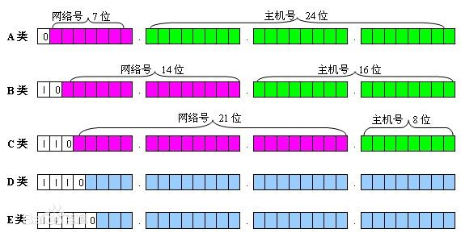

#网络地址

---

基本的IP地址是分成8位一个单元(成为8位位组)的32位二进制数. IP地址中的每一个8位位组用0~255之间的一个十进制数表示.这些数之间用点(.)隔开,这是所谓的点十进制格式. 因此最小的IPV4地址为 0.0.0.0, 最大的地址为255.255.255.255, 然后这两个值是保留的,没有分配各私人的端系统.

##A类地址

---

网络号为1个字节，定义最高比特为`0`，余下`7`比特为网络号，主机号则有24比特编址。用于超大型的网络.

一个A类IP地址仅使用第一个8位位组表示网络地址。剩下的3个8位位组表示主机地址。A类地址的第一个位总为0，这一点在数学上限制了A类地址的范围小于 127,127是64+32+16+8+4+2+1的和(`7位`)。最左边位表示128，在这里空缺。因此仅有127个可能的A类网络。A类地址后面的24位(3个点-十进制数)表示可能的主机地址，A类网络地址的范围从**1.0.0.0**到**126.0.0.0**。`注意，数字0和 127不作为A类地址，数字127保留给内部回送函数，而数字0则表示该地址是本地宿主机，不能传送`。

		技术上讲，127.0.0.0 也是一个A类地址，但是它已被保留作闭环（look back ）测试之用而不能分配给一个网络。
		用于网络软件测试以及本地机进程间通信，叫做回送地址（loopback address）。无论什么程序，一旦使用回送地址发送数据，协议软件立即返回之，不进行任何网络传输。含网络号127的分组不能出现在任何网络上。
		
注意只有第一个8位位组表示网络地址，剩余的3个8位位组用于表示第一个8位位组所表示网络中惟一的主机地址，当用于描述网络时这些位置为0。

每一个A类地址能支持`16777214`个不同的主机地址，这个数是由2的24次方再减去2得到的。减2是必要的，因为IP把`全0`保留为`表示网络`而`全1`表示`网络内的广播地址`。其中10.0.0.0 和10.255.255.255保留。

**私有地址**

10.0.0.0～10.255.255.255

##B类地址

---

网络号为2字节，定义最高比特为`10`，余下`14`比特为网络号，主机号则可有16比特编址。B类网是中型规模的网络.

B类网络地址范围从**128.1.0.0**到**191.254.0.0**。B 类地址蕴含的数学逻辑是相当简单的。一个B类IP地址使用两个8位位组表示网络号，另外两个8位位组表示主机号。B类地址的第1个8位位组的前两位总置为 10，剩下的6位既可以是0也可以是1，这样就限制其范围小于等于191，由128+32+16+8+4+2+1得到。最后的16位( 2个8位位组)标识可能的主机地址。每一个B类地址能支持`64534` 个惟一的主机地址，这个数由2的16次方减2得到。B类网络仅有`16382`个，其中172.16.0.0和172.31.255.255保留。

**私有地址**

172.16.0.0～172.131.255.255

##C类地址

---

网络号为3字节，定义最高三比特为`110`，余下`21`比特为网络号，主机号仅有8比特编址。C类地址适用的就是较小规模的网络了.

C类地址用于支持大量的小型网络。这类地址可以认为与A类地址正好相反。A类地址使用第一个8位位组表示网络号，剩下的3个表示主机号，而C类地址使用三个8位位组表示网络地址，仅用一个8位位组表示主机号。C类地址的前3位数为110，前两位和为192(128+64)，这形成了C类地址空间的下界。第三位等于十进制数32,这一位为0限制了地址空间的上界。不能使用第三位限制了此8位位组的最大值为255-32等于223。因此C类网络地址范围从 `192.0.1.0` 至 `223.255.254.0`。最后一个8位位组用于主机寻址。每一个C类地址理论上可支持最大256个主机地址(0～255)，但是仅有`254`个可用，因为0和255不是有效的主机地址。可以有2097150个不同的C类网络地址，其中192.168.0.0和192.168.255.255保留。

**私有地址**

192.168.0.0～192.168.255.255

##D类地址

---

D类地址用于在IP网络中的组播( multicasting ，又称为多目广播)。D类地址的前4位恒为1110 ，预置前3位为1意味着D类地址开始于128+64+32等于224。第4位为0意味着D类地址的最大值为128+64+32+8+4+2+1为239，因此D类地址空间的范围从224.0.0.0到239. 255. 255.254。

D类地址是一个专门保留的地址。它并不指向特定的网络，目前这一类地址被用在多点广播（Multicast）中。多点广播地址用来一次寻址一组计算机，它标识共享同一协议的一组计算机。 

##E类地址

---

E 类地址保留作研究之用。因此Internet上没有可用的E类地址。E类地址的前4位恒为1，因此有效的地址范围从240.0.0.0 至255.255.255.255。

##广播地址

---

 TCP/IP规定，主机号全为"1"的网络地址用于广播之用，叫做广播地址。所谓广播，指同时向同一子网所有主机发送报文。

##网络地址

---

 TCP/IP协议规定，各位全为"0"的网络号被解释成"本"网络。由上可以看出：一、含网络号127的分组不能出现在任何网络上；二、主机和网关不能为该地址广播任何寻径信息。由以上规定可以看出，主机号全"0"全"1"
的地址在TCP/IP协议中有特殊含义，一般不能用作一台主机的有效地址。

##子网掩码

---

子网掩码的作用就是和IP地址与运算后得出网络地址，子网掩码也是32bit，并且是一串1后跟随一串0组成，其中1表示在IP地址中的网络号对应的位数，而0表示在IP地址中主机对应的位数。

*  A类网络（1 - 126） 缺省子网掩码：255·0·0·0
*  B类网络（128 - 191） 缺省子网掩码：255·255·0·0
*  C类网络（192 - 223） 缺省子网掩码：255·255·255·0

`子网掩码`为了**把一个网络划分成多个网络**(子网).

		192·168·0·1和192·168·0·200如果是默认掩码255.255.255.0两个地址就是一个网络的，如果掩码变为255.255.255.192这样各地址就不属于一个网络了

与运算:

		子网掩码与IP地址结合使用，可以区分出一个网络地址的网络号和主机号。例如：有一个C类地址为：192.9.200.13，按其IP地址类型，它的缺省子网掩码为：255.255.255.0，则它的网络号和主机号可按如下方法得到：
		1. 将IP地址192.9.200.13转换为二进制11000000 00001001 11001000 00001101
		2. 将子网掩码255.255.255.0转换为二进制11111111 11111111 11111111 00000000
		3. 将以上两个二进制数逻辑进行与（AND）运算，得出的结果即为网络部分。“11000000 00001001 11001000 00001101”与“11111111 11111111 11111111 00000000”进行“与”运算后得到“11000000 00001001 11001000 00000000”，即“192.9.200.0”，这就是这个IP地址的网络号，或者称“网络地址”。
		4. 将子网掩码的二进制值取反后，再与IP地址进行与（AND）运算，得到的结果即为主机部分。如将“00000000 00000000 00000000 11111111（子网掩码的取值）反”与“11000000 00001001 11001000 00001101”进行与运算后得到“00000000 00000000 00000000 00001101”，即“0.0.0.13”，这就是这个IP地址主机号（可简化为“13”）。
		
应用:
	
		我们再来看看这个改为默认子网掩码的B类IP
		如IP：188.188.0.111，188.188.5.222，子网掩码都设为255.255.254.0，在同一网段吗？
		先将这些转换成二进制
		188.188.0.111 10111100.10111100.00000000.01101111
		188.188.5.222 10111100.10111100.00000101.11011010
		255.255.254.0 11111111.11111111.11111110.00000000
		分别AND，得
		10111100.10111100.00000000.00000000
		10111100.10111100.00000100.00000000
		网络标识不一样，即不在同一网段。 
##总结

--

ip地址`分类`由`第一个八位组`的值来确定。任何一个`0到127`间的网络地址均是一个A类地址。任何一个`128到191`间的网络地址是一个B类地址。任何一个`192到223`间的网络地址是一个C类地址。任何一个第一个八位组在`224到239`间的网络地址是一个组播地址即D类地址。E类保留。

全零（“0．0．0．0”）地址对应于当前主机。全“1”的IP地址（“255．255．255．255”）是当前子网的广播地址。 

**网络地址的唯一性与网络内主机地址的唯一性确保了IP地址的全球唯一性**