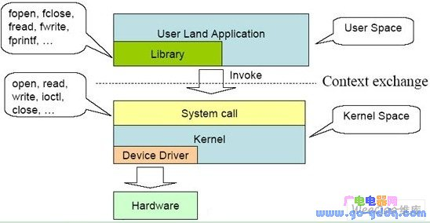

###内核空间和用户空间

---

在`32位的x86机器`,Linux的虚拟地址空间也为0~4G.分为两部分:

1. 将最高的1G字节(从虚拟地址0xC0000000到0xFFFFFFFF),供`内核`使用,称为"`内核空间`".所有进程以及内核所共享.映射到物理内存却总是从最低地址(0x00000000)开始.地址映射是很简单的线性映射,`0xC0000000`就是物理地址与线性地址之间的位移量,在Linux代码中就叫做`PAFE_OFFSET`.
2. 较低的3G字节(从虚拟地址 0x00000000到0xBFFFFFFF),供各个`进程`使用,称为"`用户空间`".这个空间对系统中的其他进程是不可见的.

因为每个进程可以通过系统调用进入内核,`Linux内核由系统内的所有进程共享`.从具体进程角度来看,每个进程可以拥有4G字节的虚拟空间.

内核态和用户态有自己的内存映射,即`自己的地址空间`.

用户空间的应用程序,如果想要请求系统服务,比如操作一个物理设备,或者映射一段设备空间的地址到用户空间,就必须通过系统调用来(操作系统提供给用户空间的接口函数)实现.如下图:

通过系统调用,用户空间的应用程序就会进入内核空间,由内核代表该进程运行于内核空间,这就涉及到**`上下文的切换`**,用户空间和内核空间具有不同的地址映射,通用或专用的寄存器组,而用户空间的进程要传递很多变量,参数给内核,内核也要保存用户进程的一些寄存器,变量等,以便系统调用结束后回到用户空间继续执行,所谓的进程上下文,就是一个进程在执行的时候,CPU的所有寄存器中的值,进程的状态以及堆栈中的内容,当内核需要切换到另一个进程时,它需要保存当前进程的所有状态,即保存当前进程的进程上下文,以便再次执行该进程时,能够恢复切换时的状态,继续执行.(`什么是进程上下文的切换`)

**用户空间不是进程共享**

用户空间不是进程共享的,而是`进程隔离`的.每个进程最大都可以有3GB的用户空间.一个进程对其中一个地址的访问,与其它进程对于同一地址的访问绝不冲突.

		一个进程从其用户空间的地址0x1234ABCD处可以读出整数8,而另外一个进程从其用户空间的地址0x1234ABCD处可以读出整数20,到了一定程度上的冲突避免.

**内核空间 和 用户空间 的存放数据**

内核空间中存放的是`内核代码和数据`.

进程的用户空间中存放的是`用户程序的代码和数据`.