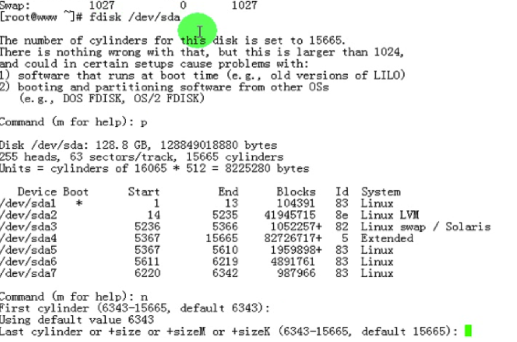
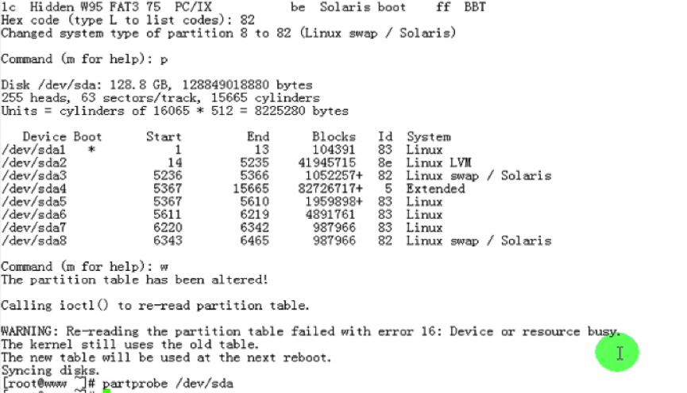

#09_03 磁盘及文件系统管理详解之五

###笔记

---

**swap分区**

* 内存数据 -> 磁盘 : page out
* 磁盘 -> 内存数据 : page in

`free` : 显示内存使用情况

**buffers**

* `缓冲`: 避免慢的设备受到传输快的设备的冲击. `快`设备 -> `慢`设备.

**cached**

* `缓存`: 重复使用. `慢`设备 -> `快`设备.

**创建交换分区**

1. `创建分区`(`fdisk`):

	
	
2. `调整类型`:
	
	
	
	
	
`mkswap` 格式化交换分区

`mkswap` `路径`

* `-L LABEL`

`swapon` `路径` `启动`交换分区

* `-a`: 启用所有的定义在`/etc/fstab`文件中的交换设备.

`swapoff` `路径` `关闭`交换分区

**回环设备**

`loopback` 使用软件来模拟实现硬件.

`dd`: 转换并复制文件

* `if(input file)`: 数据来源
* `of(output file)`: 数据存储目标

`copy`: 文件先通过`vfs`以文件为代为读取到内存中.在保存到另外一个文件所对应的位置.

`dd`: 直接复制`0101`的代码到数据存储目标

* `bs(block size)` = #字节
* `count` = # 一共复制多少`bs`
* `seek` = # 创建数据文件时,跳过的空间大小

举例:

`复制 mbr`

	dd if=/dev/sda of=/mnt/usb/mbr.backup bs=512 count=1
	
`还原 mbr`

	dd if=/mnt/usb/mrb.backup of=/dev/sda bs=512 count=1
	
**mount**

`mount` `DEVICE MOUNT_POINT` (可以挂载iso镜像)

* `-o loop`: 挂载本地回环设备
* `-a`: 挂载`/etc/fstab`文件中定义的所有文件系统

**/etc/fstab** 

OS 在初始化时,会自动挂载此文件中定义的每个文件系统

		cat /etc/fstab
		
		/dev/sda5	/data 	  ext4	  defaults	  0     0
		tmpfs		/dev/shm  tmpfs	  defaults	  0     0
		...
		
		
		A			B			C		D	      E     F		
* `A`: 要挂载的设备(可以使用label,uuid,直接使用设备文件)
* `B`: 挂载点
* `C`: 文件系统类型
* `D`: 挂载选项
* `E`: 转储频率(跟文件系统备份相关,多少天对次文件系统做一次完全备份.`0`表示不备份.`1`表示每天一次. `2`表示每二天一次)
* `F`: 文件系统检测次序(开机时检测文件系统,只有根可以为1. `0`表示不检查)

`交换分区挂载点是swap.不是任何目录`

		LBAEL=SWAP-sda3	 swap  swap  defaults  0  0

**fuser**

`验证`进程正在使用的`文件`或`套接字`.

* `-v`: 查看某文件上正在运行的进程

`fuser -km MOUNT_POINT`: `终止`正在访问此挂载点的所有进程. 	

###整理知识点

---