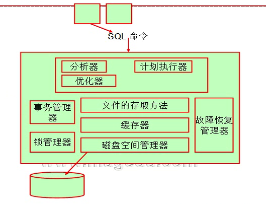

#23_03_MySQL初步_数据类型及SQL语句

---

###笔记

---

####DBMS

**数据管理独立性**

数据表达的抽象性和存储分开

**有效地完成数据存取**

不要每次操作对整个数据进行扫描

**数据的完整性和安全性**

**数据集中管理**

**并发存储和故障恢复**

**减少应用程序开发时间**

####DBMS基本结构

**分析器**

`sql`命令首先要进行词法分析,语法分析.

**计划执行器**

分析器分析的结果生成N个执行方法.计划执行器分析有多少种路径可以执行.

		比如 select 一张表.
		1. 可以使用全表扫描
		2. 使用第一种索引
		3. 使用第2种索引
		
**优化器**

分析结束后,在N种路径中选择一种最优方法.可能会对整个查询语句做改写,只要结果一致.

**文件存取**

优化器分析结束后,要执行语句(操作数据),需要从磁盘中读取文件(数据).

**缓存器**

文件要先读取到缓存器中.

如果缓存器满了,还需要放入新的数据,则需要置换.

需要策略管理缓存器当中的内容.
		
**磁盘空间管理器**

把缓存器中的数据置换到文件当中.

**故障恢复管理器**

崩溃了恢复数据.

**事物管理器**	

**锁管理器**

####DDL,DML,DCL

* DDL : 数据定义语言
* DML : 数据操作语言
* DCL : 数据控制语言
		
####mysql,mysql-server

`mysql`客户端rpm包, 编译二进制对应 `mysql`.

`mysql-server`服务端rpm包, 编译后二进制对应 `mysqld`(-safe).

mysqld 监听在 3306 端口, 以mysql用户,mysql组的身份运行.
		
默认情况下保存在`/var/lib/mysql/`目录下.

默认安装完又一个**初始化**动作.		
		
**mysql数据库**		
		
mysql的元数据放在mysql数据库,mysql元数据存在这里.		
初始化会建立这个数据库.

####mysql

* `-u` 用户名, -uroot or -u root, 可以加空格也可以不加. 不指用户默认就是root
* `-p` 密码,不指密码就是空密码 
* `-h` 地址,默认localhost
		
mysql用户包含用户名和允许该用户能够登陆的主机(客户端主机).允许该用户在哪些客户端登陆.

创建用户时需要指定用户可以在哪些客户端登陆.

		USERNAME@HOST
				
**链接方式**
		
基于`tcp`协议.如果客户端和服务器端在同一台主机时(-h 127.0.0.1 或 locahost)

* `Linux`下,使用socket方式链接.`/var/lib/mysql.sock`,基于这个链接,本机进程间通信.
* `Windows`,使用共享内存方式链接(memory).	
	
如果不在同一台主机时候需要使用`TCP/IP`链接.	
	
mysql客户端:

* 交互式模式(输入一个命令执行命令)
* 批处理模式(执行mysql脚本,放了一堆mysql命令)
	
**交互式模式中的命令类别**

* 客户端命令(mysql 中 `\h` 查看客户端命令)
* 服务端命令
	* 必须使用语句结束符,默认是分号.因为要送到服务器执行,必须要明白语句到哪结束了.
	
####sql接口

RDBMS实现sql接口必须能遵循ansi规范,但是一般数据库都扩展了.

* Oracle, 扩展了PL/SQL
* SQL Server, T-SQL

####information_schema

mysql运行过程当中运行时的信息,关机后是空的.

####每个数据库对应一个文件目录

####是否区分大小写,取决文件系统

####关系数据库对象

数据库定义语言,定义一下对象

* 库
* 表(存在库里)
* 索引
* 视图
* 约束(也是索引)
* 存储过程
* 存储函数
* 触发器
* 游标
* 用户

数据放在表中,表是由行和列组成.

一个表称为一个实体,实体集,某一类实体的集合.

* 行: row
* 列: 表示各种属性, field,column
	
字段名称,数据类型.必须要给对应的字段定义数据类型,类型修饰符(限制).
	
		INT A=10 一个字节
		CHAR A=10 2个字节
		
**数据类型**

* 字符,默认不区分大小写
	* CHAR(字符长度,最多多少字符)
	* VARCHAR(字符长度),可变.实际存储 n+1(1是结束修饰符)
	* BINARY(n),区分大小写的字符
	* VARBINARY(n)
	* TEXT
	* BLOB 二进制大对象
* 数值
	* 精确数值(整型,十进制数值型)
		* 整型
			* TINYINT,1个字节(-128-127, 0-255)
			* SMALLINT,2个字节
			* MEDIUMINT,3个字节
			* INT,4个字节
			* BIGINT,8个字节
			* 修饰符
				* UNSIGNER, 无符号,正数或0
				* NOT NULL 不允许为空
		* 十进制
			* DECIMAL
	* 近似数值(浮点型)
			* FLOAT
			* DOUBLE
* 日期
	* DATE,日期
	* TIME,时间
	* DATETIME,日期时间
	* TIMESTAMP,时间戳
* 布尔
* 内置

####DDL

* CREATE,创建
* ALTER,修改
* DROP,删除

####DML

* INSERT
* UPDATE
* DELETE

####DCL

* GRANT,授权
* REVOKE,撤销授权
	
**创建用户**

		CREATE USER `USERNAME`@`HOST` [IDENTIFIED BY `PASSWORD`];
		DROP USER 'USERNAME'@'HOST';
		
**HOST**

* IP
* HOSTNAME
* NETWORK
* 通配符
	* `_`: 匹配任意单个字符, 172.16.0.__ (两个下划线 10-99).
	* `%`: 匹配任意长度的任意字符. 	
	
			jerry@'%' 从所有主机登陆
			
	
**GRANT**

		GRANT pri1,pri2,... ON DB_NAME.TB_NAME	TO 'USERNAME'@'HOST' [IDENTIFIED BY 'PASSWORD'];
		
		如果用户不存在则自动创建用户,并授权.
		
		权限: select,update...
	
**ALL PRIVILEGES**	
	
		ALL PRIVILEGES 所有权限
		GRANT ALL PRIVILEGES ON mydb.* TO 'jerry'@'%';
		
**USAGE**

		无权限
	
**REVOKE**

		REVOKE pri1,pri2,... ON DB_NAME FROM 'USERNAME'@'HOST';	
**查看用户授权**

		SHOW GRANTS FOR 'USERNAME'@'HOST';		
		
####选择 和 投影

**选择**

指定以某字段作为搜索码,与某值做逻辑比较运算,筛选符合条件的`行`.	
**投影**	

针对列的
		
		查询所有列
		SELECT *
		
		查询名字列
		SELECT name 
	
###整理知识点

---

####文件元数据

文件的大小,类型这些不属于文件信息的都是文件元数据.

磁盘格式化后分为两个区域:

* 元数据区域,靠inode保存
* 数据区域(划分磁盘块)