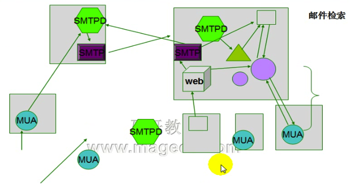

# 25_01_邮件服务系列之基础原理

---

### 笔记

---

#### SMTP

邮件服务协议,`S`imple `M`ail `T`ransfer `P`rotocol. 仅仅负责把邮件从发送端到目的端.

`ESMTP`, 简单邮件服务扩展协议.

`POP3`, `P`ost `O`ffice `P`rotocol, 邮局协议第三版.

`IMAP4`: `I`nternet `M`ail `A`ccess `P`rotocol,比`POP3`功能强大.

`UUCP`: `U`nix to `U`inx `C`o`P`y. 多个Unix主机之间传输文件的协议.

`SMTP`: 将文件从一个主机传送到另一个主机.(25/tcp),监听tcp协议的25号端口.

 **发送邮件示例**
 
 `tom@magedu.com` 发送邮件到 `jerry@a.org`,使用`smtp`协议.
 
 现在从`DNS`查找`a.org`中的`MX`记录,加入找到`mail.a.org`,在解析为`A`记录,假设解析位`2.2.2.2`.如果一个域内有多个`MX`记录,找优先级高的主机.
 
 找到`2.2.2.2`主机,服务器链接`2.2.2.2`主机监听的端口(25).
 
 客户端端口: 随机的,本机尚未占用的,大于5000.
 
 客户端进程与服务端进程通信了.
 
 对方主机接收到邮件后,不能直接放入到用户家目录.服务器通常又一个目录,有每个用户的"邮筒(邮件中转站)",信件会放到这个里面去.是用户同名的`文件(不是目录)`,当有后续邮件继续追加到文件内.
 
 用户看过的邮件都保存在家目录下的`mbox`文件夹.

**两段式**

* smtp 仅仅负责邮件传送,是邮件`传输`的过程.`M`ail `T`ransfer
* 把邮件放到用户的邮箱,是邮件`投递`的过程.`M`ail `D`eliver

**回复邮件,跨主机**

为了可以互相发送邮件, 每个主机都必须拥有

* 客户端, 发送邮件
* 服务端, 接收邮件

**传说邮件,同一主机 本地邮件**

* tom@magedu.com
* bob@magedu.com

还是走邮件传输系统,本地客户端链接本地服务端.不用走网路,直接送到本机用户的邮筒内.

**服务器传送**

* 本地邮件
* 外部邮件

邮件分拣: 本地在本地内部解决, 远程的通过DNS

**投递和接收过程**

邮件用户代理.是一个统称.

MTA 邮件传输代理(`SMTPD`)

用户需要发邮件,首先需要有一个`MUA`编写邮件.写好邮件后,邮件不是直接发到目标服务器,任何`MUA`都有一个自己所允许提交的目标服务器,一般在本机,`SMTPD`服务器.

邮件被传送给`SMTPD`,由邮件服务器来进行`分拣`(本地还是远程)

* 本地就直接放到用户家目录去.(l(local)mtp)
* 如果是远程,`SMTPD`调用`SMTP(客户端)`(每一封远程邮件,都会调用一次本地的客户端),由`SMTP(客户端)`向对方服务器端(`SMTPD`)传送.

MUA 到 SMTPD(MTA) 的传输过程是`smtp`协议.

当对方`SMTPD`接收到邮件后,进行邮件投递,`MDA(邮件投递代理)`进行邮件投递,投递到对方邮筒.

对方用户接收邮件使用`MUA`,接收后保存到用户家目录(`mbox`).

这么复杂是因为`smtp`协议太简单.

**邮件转发 Open Relay(开放式中继)**

magedu.com -> a.org -> b.net

如果`SMTPD`发现不是本地邮件,调用本地客户端,再次链接目标服务器的服务端.

发件人是`magedu.com`, 发件主机是`a.org`. 发件人和主机没有必然联系.

这样自己的主机因为转发,可能会被认为是垃圾邮件服务器.

发了邮件就向外转发的机制叫做`Open Relay`,开放式中继.是本地就接收,不是本地就转发.

一般情况下,关闭开放式中继.

**中继**

MUA -> SMTPD 分拣就是中继.

需要允许本地用户中继

**用户认证**

如果本地中继,是基于IP的,那么任意一个用户只要连入到内网都可以随便发垃圾邮件.所以需要提供账号和密码,基于用户来认证.

但是`SMTPD`只管收件人是谁,不管发件人是谁.

`smtp`没有认证功能,借助于额外的认证工具来实现,认证工具需要`SASL`协议来实现.

`S`imple `A`uthintication `S`ecure `L`ayer 简单认证安全层.

**MRA**

邮件(检索)取回代理. `M`ail `R`etrieval `A`gent

这个过程是`POP3`协议.

发邮件是`TCP`协议, 收邮件是`POP3`协议.

**WebMail**

**ldap协议**

在用户检索上比mysql还要快一个量级.因为用户登录,把用户信息不能存放在`shadow`文件中(文件太大加载入内存中),放mysql数据库比ldap慢.

把用户账户放在ldap.

`L`ightweight `D`irectory `A`ccess `P`rorocol

把数据按照目录的结构组织,检索数据快.读的速度快,写的速度慢.

适合一次场景,一次写入,多次读取.

Windows 支持 ldap 好.  WindowsAD(活动目录,就是ldap).

**虚拟用户**

用户不是存在的,可以访问系统的用户,仅用于访问某服务的标示.

pop3服务器自身有mysql,ldap访问驱动.访问数据库完成账号密码的验证.

但是smtpd没有驱动,必须使用sasl验证,但是sasl是假设用户是系统账户到`shadow`文件验证,为了到数据库验证,需要在额外添加一个组件(帮助sasl访问数据库)进行验证.

**垃圾邮件分拣器**

**病毒邮件过滤器**

### 整理知识点

---

#### OSI

smtp, ssl 是 osi7