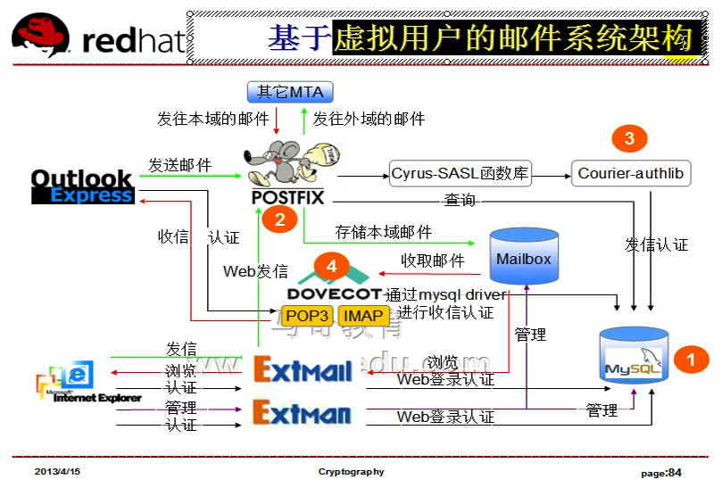

# 26_01_邮件服务系列之 postifx+sasl+dovecot及虚拟域相关概念

---

### 笔记

---

#### Postfix

`/etc/aliases` -> `/etc/aliases.db`

**一些配置参数**

* myorigin: 发件人地址伪装
* inet_interfaces: 定义 postfix 进程监听的IP地址(本机有多个IP地址,可以选择一个)
		
		如果只监听 127.0.0.1 只能做为本机客户端地址访问
		0.0.0.0 本机所有可用地址

#### devel 包

使用`rpm`安装的时候如果需要依赖其他软件,主要都是依赖该软件的`devel`包.

编译的时候找这个软件的`开发库`和`头文件`.

**RHEL自身提供的rpm包**

头文件一般在`/usr/include`下.

库文件一般在`/usr/lib`或`/lib`下.

**第三方rpm包**

安装路径:

* `/usr/local`
* `/opt`

头文件一般在:

* `/usr/include`
* `/usr/local/include`

库文件:

* `/usr/local/lib`(系统不会自动检索该目录)

把库文件复制到`/etc/ld.so.conf.d/`下即可(因为`/etc/ld.so.conf`内会引用该目录下的配置文件`include ld.so.conf.d/*.conf`),系统即会自动加载.

手工运行`ldconfig`命令更新缓存.

#### procmail

邮件投递代理

#### mutt

mutt -f PROTOCOL://username@magedu.com@172.16.100.1

* sername@magedu.com 是用户名(虚拟域会用到该机制)
* 172.16.100.1 主机

		mutt -f 协议://用户名@服务器地址
		
#### SASL

cyrus-sasl

服务脚本: saslauthd

postfix --> /usr/lib/sasl2/smtpd.cnf(配置文件,是否使用sasl认证)

* pwcheck_method: saslauthd (使用什么来检查密码,这里使用saslauthd)
* meth_list: PLAIN LOGIN (使用哪种方法认证)

**编辑配置文件**
		
		vim /etc/sysconfig/saslauthd
		
		...
		MECH=shadow (pam支持不好)
		
**启动服务**

		service saslauthd start
		
		chkconfig saslauthd on
		
**测试**

		testsaslauthd -uxxx -pxxxx

#### 基于虚拟用户的邮件系统架构

一台服务器为多个域收发邮件.

### 整理知识点

---

#### ldconfig

**ldconfig**命令的用途主要是在默认搜寻目录`/lib`和`/usr/lib`以及动态库配置文件`/etc/ld.so.conf`内所列的目录下,搜索出可共享的动态链接库(格式如`lib*.so*`),进而创建出动态装入程序(ld.so)所需的连接和缓存文件.缓存文件默认为`/etc/ld.so.cache`,此文件保存已排好序的动态链接库名字列表,为了让动态链接库为系统所共享,需运行动态链接库的管理命令ldconfig,此执行程序存放在/sbin目录下.

ldconfig通常在系统启动时运行,而当用户安装了一个新的动态链接库时,就需要手工运行这个命令.

**示例**

	比如安装了一个mysql到/usr/local/mysql,mysql有一大堆library在/usr/local/mysql/lib下面,这时就需要在/etc/ld.so.conf下面加一行/usr/local/mysql/lib,保存过后ldconfig一下,新的library才能在程序运行时被找到.

#### hwclock

		hwclock -s (同步硬件时间到系统时间)
		        -w (同步系统时间到硬件时间 )
		
可以使用`crontable`自动每几分钟同步一次时间.

		*/5 * * * * /sbin/hwclock -s
