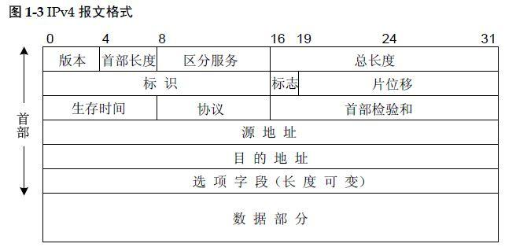
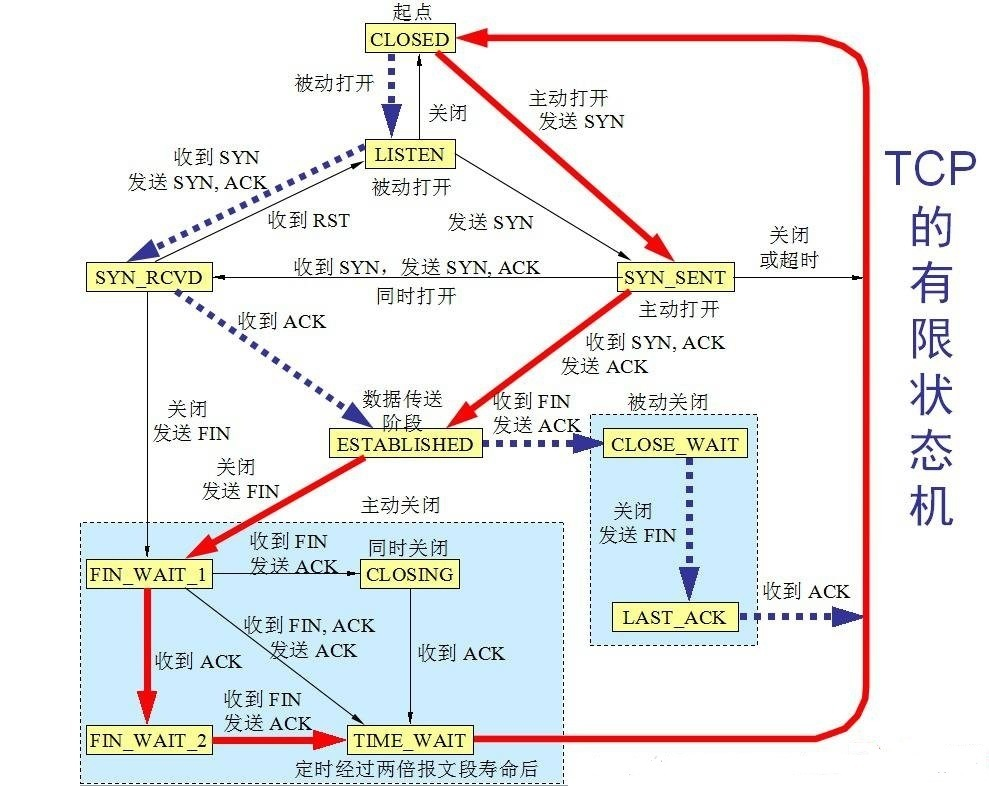
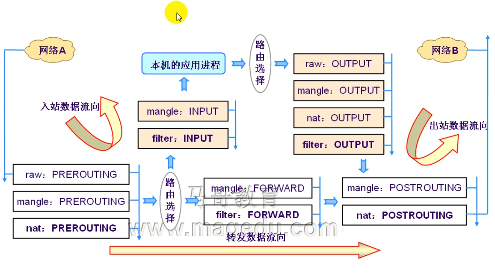

# 28_01_iptables系列之基础原理

---

### 笔记

---

#### iptables/netfilter

工作在内核中的网络防火墙.

其防火墙作用的是`netfilter`, `netfilter`是一个过滤(规则)框架.

`iptables`: 生成规则, 并附加于`netfilter`, 数据报文过滤, `NAT`, `mangle`等规则生成工具.

#### 网络

* `IP`报文首部
* `TCP`报文首部

防火墙是根据这些首部来实现的.



如果封装的是`HTTP`协议, 则`IP`报文当中还包含`TCP`首部和`HTTP`首部, 但是对`IP`来讲一律将其识别为数据(`数据部分`).

**标识**

段表示, `Identification (Fragment ID)`.

段标识一样, 需要合并成一段报文.

和`标志`, `片偏移` 一起使用.

`标志`:

* `R`: 0 为使用
* `DF`:
	* `0`: 可以分片
	* `1`: 不能分片
* `MF`:
	* `0`: 最后一个分片的包
	* `1`: 分片中段的包

`片偏移`: 被分片的每一个分段相对于原始数据的位置.

**ICMP**

互联网网络控制协议.

`3层半`协议, 利用`IP`报文实现发送数据报文 , 不是实现`报文控制`的协议, 只能用来传输`网络控制`的协议. 

一般划分在网络层中.

**协议**

标记数据段协议类型.

**转换为能够通过网络发送的数据格式**

* 文本
* 二进制

但是最终都会转换为`二进制的01`代码.

#### 接收请求

**三次握手**

默认双方都是关闭的, 要想让一端能接收另外一端的请求, 必须接收端监听到一个端口上, 这个叫做`被动打开`.

`closed` -> `listen` 状态.

客户端发起请求报文给服务器端, 客户端也从 `closed` -> `主动打开`. 这个叫做 `主动打开`. 也可以理解为转换为`SYN-SENT`状态(即已经发送`SYN`). 对应的服务端也从 `LISTEN` 转换为 `SYN-RECD`(`SYN`收到)状态.

第一次握手(`SYN-SENT`): 这个就是`TCP`的第一次握手. 即`SYN = 1`, `ACK = 0`.

第二次握手(`SYN-RECD`): 服务器端接受到请求, 需要响应. 但是也是第一次和对方通信. `SYN = 1`, `ACK = 客户端seq + 1`(`seq`是序列号).

第三次握手(`ESTABLISHED`): 客户端发送 `ACK =  服务端seq + 1`.

**有限状态机**




**四次挥手**

`主动关闭方`: 发送关闭请求的一方. `被动关闭方`: 接受关闭请求的一方.

1. 主动关闭方发送关闭请求(`FIN`), `ESTABLISHED` -> `FIN_WAIT_1`
2. 服务端回应`ACK`, 状态为 `CLOSE_WAIT`.
3. 服务端发送断开请求`FIN`,等待客户端确认.状态为`LAST_ACK`.
4. 客户端接受请求,发送`ACK`, 先是`CLOSING`, 然后开始等待`TIME_WAIT`(2 x MSL 一次报文传输的时间x2), 等待后状态为`CLOSED`. 

其中对于客户端`1,2`为`FIN_WAIT_1`. `3,4`为`FIN_WAIT_2`.

客户端需要先`TIME_WAIT`, 再`CLOSED`. 因为如果客户端关闭连接了, 则`ACK`无法发送出去. 此时的客户端不用再等待服务器端的响应.

服务器在收到最后的`ACK`后状态先是`CLOSED`(可以立即关闭), 然后在变为`LISTEN`.

#### 防火墙

工作在主机或网络的边缘, 数据报文进出的地方. 对于进出的数据报文, 进行检查,监控并且能够根据事先定义好的规则中的标准进行检查, 如果符合规则则按照规则事先定义好的动作处理.

规则:

* 匹配标准
* 处理办法

是个框架, 可以是硬件或软件.

如果一个报文没有被任何一个规则匹配到, 需要有默认规则.

规则:

* 开放: 只截获匹配规则的报文.`堵`, 默认情况下是开放的.
* 关闭: 只有令牌的才可出去.`通`, 默认情况下是关闭的.

##### 规则

* 匹配标准
* 处理办法

**匹配标准**

数据报文的特征作为评判标准.

IP:

* IP源地址, SIP
* IP目标地址, DIP

TCP/UDP:

* 源端口, SPORT
* 目标端口, DPORT
* SYN=1, FIN=0, RST(RST标示复位,用来异常的关闭连接)=0, ACK=0 TCP三次握手的第一次
* SYN=1, ACK=1, FIN=0, RST=0 TCP第二次握手
* SYN=0, ACK=1, FIN=0, RST=0 TCP第三次握手(ESTABLISHED, 已经建立的链接)

ICMP:

* icmp-type

**数据报文过滤**

Linux 内核当中实现了网络功能.

在内核中`TCP/IP`模块上选了几个位置(位置是开放的,只开放给用户空间的某一个应用(通过系统调用),这些命令可以生成规则. 命令所写的规则可以放置到模块上).

用这种办法是写操作内核.

这套组件是:

* `Linux2.0` ipfw/firewall
* `Linux2.2` ipchain/firewall
* `Linux2.4-2.6`: iptables(工作在用户空间生成规则,通过系统调用写入规则)/netfilter(工作在内核当中可以放规则的位置)

`iptables` 只是一个规则生成器, 写完规则就没用了.

**`TCP/IP`协议栈的五个位置**

`netfilter`设计者补充在`tcp/ip`协议栈的三个钩子函数(`hook function`).


这五个位置是`iptables`放规则的地方.

* 本地入(`input`). `LOCAL_IN`
* 本地出(`output`). `LOCAL_OUT`
* 转发(`forward`). `FORWARD`
* 报文刚到达本地网卡, 还没到路由表, 路由决策做出之前(`prerouting`). `PRE_ROUTING`.
* 路由决策做出之后, 准备离开本机, 在网卡发出去之前(`postrouting`). `POST_ROUTING`.

当网卡数据进来, 进到`TCP/IP`协议栈要先进行`路由决策`, 才知道是到`本地`还是`转发`.

```shell
示例1: 本机地址是 172.16.100.7
生成一条规则: 只要源地址是1.1.1.1目标地址是172.16.100.7都拒绝访问172.16.100.7.
这条规则放置在 "本地入".

示例2: 当前主机服务部允许任何主机访问.源是任何主机 0.0.0.0 目标地址是 172.16.100.7
```

一个位置有多个规则, 自上而下逐个检查. 匹配到了就停. 所以上下顺序也很重要. 

如果规则没有关联, 范围大的应该放到上面. 

```shell
web 访问规则
ssh 访问规则

如果 ssh 访问规则放置在上面, web 访问规则多每次都要匹配 ssh 规则.
```

如果规则有关联, 范围小的放到上面.

```shell
1.1.1.2 拒绝访问 ssh
1.0.0.0 都允许访问 ssh

如果1.0.0.0 放在上面, 则1.1.1.2会通过了.不会再匹配到1.1.1.2.
```

**`PRE_ROUTING` 和 `POST_ROUTING`**

主要用于`地址转换`.

```shell
多台电脑上网, 但是只有一个公网地址.

主机A 内网IP: 172.16.100.7(网卡1) 公网IP: 12.1.1.6(网卡2)
主机B 内网IP: 172.16.100.6
访问: 12.1.1.7

主机B 访问 12.1.1.7 通过 12.1.1.6 转发到 12.1.1.7.
12.1.1.17 接收到但是响应不到 172.16.100.6(互联网访问不到)
需要通过地址转换

主机B 访问 12.1.1.7 通过 12.1.1.6 转发到 12.1.1.7, 源地址改为 12.1.1.6.
12.1.1.6 网卡的主机还需要把服务端响应的信息回送到 主机B.
主机A 内部需要维护一个nat会话表, 源地址是什么, 目标地址是什么, 请求什么报文时 把 源地址改为 12.1.1.6.
有本机在收到响应的时候负责改回去.
```

目标地址转换(`DNAT`)应该在`PRE_ROUTING`上面改.

源地址转换(`SNAT`)应该在`POST_ROUTING`上面改.

**表**

* `filter`
* `nat`
* `mangle`
* `raw` 优先级最高


**规则链**

每个钩子上的多个规则称为规则链.

规则链:

* PREROUTING
* INPUT
* FORWARD
* OUTPUT
* POSTROUTING

* `filter`表过滤功能: 
	* `INPUT`
	* `OUTPUT`
	* `FORWARD`
* `nat`表地址转换: 
	* `PREROUTING`
	* `OUTPUT`
	* `POSTROUTING`
* `mangle`表(拆开,修改,封装 报文首部): 
	* 功能:
		* 修改`ttl`值
		* 修改服务类型
	* 链:
		* `PREROUTING`
		* `INPUT`
		* `FORWARD`
		* `OUTPUT`
		* `POSTROUTING`
* `raw`表:
	* `PREROUTING`
	* `OUTPUT`

`iptables`.

```shell
IPUT 上即可以放 filter 也可以放 mangle. 但是不能混着放, 即一条 input 一条 mangle
```

#### 数据包过滤匹配流程(一个链上的多个功能的优先次序)



`PREROUTING`中:

* `raw`
* `mangle`
* `nat`

以上到下的顺序. 

`iptables` 主要是往这些表的链上生成规则.

#### 自定义链

内核中`tcp/ip`每个钩子函数都是一个链.

自定义链只能被调用时才会发生作用, 如果没有被任何一条规则匹配到, 还应该有返回机制. 是一个`跳转`的过程.

用于精简报文链的结构.

将同类的, 又不能被其他规则所匹配的, 独立出来.

**删除**

用户可以删除自定义空链, 如果非空不能删除.

默认链无法删除.

#### 内置计数器

每个规则都有两个内置计数器:

* 记录被匹配到的报文个数
* 记录被匹配到的报文体积之合

#### 写规则

`iptables [-t TABLE] COMMAND CHAIN [num(链的第几条规则)] 匹配标准 -j 处理办法`

规则:

* 匹配标准
* 处理动作

**匹配标准**

* 通用(普通)匹配
	* `-s, --src`: 指定源地址
	* `-d, --dst`: 指定目标地址
	* `-p {tcp|udp|icmp}`: 指定协议
	* `-i INTERFACE`: 指定数据报文流入的接口(从哪个网卡).`PREROUTING` 一般指定 `-i`.
		* `PRE_ROUTING`
		* `INPUT`
		* `FORWARD`
	* `-o INTERFACE`: 指定数据报文流出的接口(从哪个网卡).`POSTROUTING` 一般指定 `-o`.
		* `OUTPUT`
		* `POSTROUTING`
		* `FORWARD` 
* 扩展匹配(使用`netfilter`扩展模块)
	* 隐含扩展: 不用特别指明由哪个模块进行的扩展, 因为此时使用 `-p {tcp|udp|icmp}` 已经指定了协议.
	* 显示扩展: 必须指明由哪个模块进行的扩展.

```shell
[root@iZ944l0t308Z ~]# rpm -ql iptables
...
/usr/lib64/xtables/libxt_mac.so
...
```
这些`so`文件就是扩展模块.

**处理方式**

`-j TARGET` 跳转

* `ACCPET` 允许
* `DROP` 拒绝,丢弃 (一般使用较多)
* `REJECT` 拒绝,回复 (特定测试目的)

**示例**

```shell
iptables -t filter -A INPUT -s 172.16.0.0/16 -j DROP
来自于172.16.0.0/16网段的报文一律都丢弃.

```

* `-A` 添加规则


### 整理知识点

---

**本机转发**

`/proc/sys/net/ipv4/ip_forward` 设置本机是否可以转发.