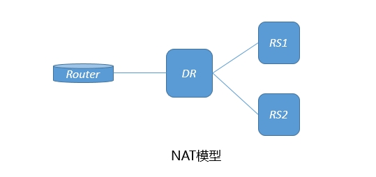

# 36_03_Linux集群系列之三——LVS调度方法及NAT模型的演示

---

## 笔记

---

### 集群类型

* LB: 负载均衡
* HA: 高可用
* HP: 高性能集群,解决复杂问题

### NAT模型



### 调度方法

如果权重或者计算值一样, 按照规则自上而下挑选服务器.

* 固定(静态)调度方法, 不考虑当前服务器的活动链接和非活动链接.
	* `rr`: 论调.
	* `wrr`: `Weight`,加权. 以权重之间的比例作为轮询的标准.
	* `sh`: `source hash`, 源地址`hash`. 来在同一个客户端的请求都发送至同一个`real server`. 用于解决`session`绑定, 如果有`session`共享就不需要`sh`机制了.
	* `dh`: `destinartion hash`, 目标地址`hash`. 将同样的请求发送同一个`ip`地址. 和`sh`功能近似.
* 动态调度方法, 考虑活动链接数和非活动链接数.
	* `lc`: `least-connection`最少链接. 通过计算当前后端`server`的活动连接数和非活动连接数在的总数, 并进行比较, 哪一个数字小就挑选哪一个. 公式`active*256+inactive`. 挑选比较而言最空闲的服务器.
	* `wlc`: 加权最少链接.`(active*256+inactive)/weight`谁的小挑谁.
	* `sed`: 最短期望延迟. 不在考虑非活动链接, 是对`wlc`的一点点改进. (`(active+1)*256/weight`). 缺点是刚开始的时候权重小的服务器一直挑不上.
	* `nq`(永不排队): 一开始每个服务器都按照权重发一个, 然后在按照权重排队计算. 对`sed`的改进.
	* `lblc`: 基于本地的最少链接. 类似`wlc`,这个算法主要实现目标和`dh`一样. 动态的`dh`对同一个资源的请求发送给同一个`real server`.
	* `lblcr`: 基于本地的带复制功能的最少链接. 缓存服务器内容共享, 不是所有内容共享, 而是一台没有的话, 在另一台问, 如果有则获取并共享.

`lc`和`wlc`刚开始都是0, 挑选服务器都是按照规则的自上而下挑选. 无法实现第一次挑的时候, 如果大家都没链接尽可能挑选性能较强的服务器.

默认调度方法: `wlc`, 非活动连接数数量非常大的时候不能忽略, 所以默认`wlc`最理想.

### ipvsadmin

* 管理集群服务
	* 添加: `-A`
		* `-t|u|f service-address [-s scheduler](默认 wlc)`
			* `-t`: TCP协议集群,`service-address=ip:port`
			* `-u`: UDP协议集群,`service-address=ip:port`
			* `-f`: `FireWallMark(FWM)`防火墙标记,`service-address=防火墙标记号码`
	* 修改: `-E`: 和`-A`方法一致
	* 删除: `-D`: `-D -t|u|f service-address`
* 管理集群服务的RS
	* 添加: `-a`
		* `-t|u|f service-address -r server-address [-g|i|m] [-w weight]`. 
			* `service-address` 事先定义好的某集群服务
			* `-r server-address` 某`real server`的地址, 在`NAT 模型`可以使用`IP:PORT`做端口映射.
			* `[-g|i|m]`: LVS 类型
				* `-g`: DR, 默认`DR`模型.
				* `-i`(internet): TUN
				* `-m(masquerade)`(地址伪装): NAT
	* 修改: `-e` 和`-a`方法一致.
	* 删除: `-d`, `-d -t|u|f service-address -r server-address`
* 查看
	* `-L|l`
		* `-n`: 数字格式显示IP地址和端口号
		* `--stats`: 统计信息, 整体统计, 从开始到现在
			* `Conns`: 连接数
			* `InPkts`: 入站报文个数
			* `OutPkts`: 出站报文个数
			* `InBytes`: 入站字节数
			* `OutBytes`: 出站字节数
		* `--rate`: 速率信息, 每秒的链接数, 每秒入站的报文个数, ...
		* `--timeout`: 显示会话超时时长
			* `tcp`
			* `tcpfin`, 结束
			* `udp` 
		* `--sort`: 排序, 默认根据协议地址端口做升序 
		* `-c`: 显示当前`ipvs`的连接状况
		* `--daemon`: 显示同步守护进程状态
 * `-Z`: 清空统计信息
 * `-C`: 清空`ipvs`规则, 删除所有集群服务
 * `-S`: 保存规则, 使用输出重定向保存
 	* `ipvsadm -S > /path/to/somefile`
 * `-R`: 载入此前的规则
 	* `ipvsadm -R < /path/to/somefile`

#### 时间同步

各节点之间的时间偏差不应超出1秒钟.

使用`ntpd`同步时间.

`NTP`: `N`etwork `T`time `P`rotocol.

#### 示例

```shell
[ansible@rancher-server ~]$ sudo ipvsadm -L
IP Virtual Server version 1.2.1 (size=4096)
Prot LocalAddress:Port Scheduler Flags
  -> RemoteAddress:Port           Forward Weight ActiveConn InActConn
[ansible@rancher-server ~]$ sudo ipvsadm -L --timeout
Timeout (tcp tcpfin udp): 900 120 300
[ansible@rancher-server ~]$ sudo ipvsadm -L -c
IPVS connection entries
pro expire state       source             virtual            destination
```

我本机演示准备的`real server`

* `192.168.0.179`(虚拟机内网地址是:192.168.56.101)监听`8088`端口的`nginx`, 主要为了测试端口映射
* `192.168.0.180`(虚拟机内网地址是:192.168.56.103)监听`80`端口的`nginx`
* 两台主机页面输出不一样
* `ipvsadm`所在主机的地址`192.168.0.178`(内网地址:192.168.56.102)

```shell
添加集群服务地址
[root@rancher-server ansible]# ipvsadm -A -t 192.168.0.178:80 -s rr
[root@rancher-server ansible]# ipvsadm -L -n
IP Virtual Server version 1.2.1 (size=4096)
Prot LocalAddress:Port Scheduler Flags
  -> RemoteAddress:Port           Forward Weight ActiveConn InActConn
TCP  120.24.3.210:80 wlc

[root@rancher-server ansible]# ipvsadm -a -t 192.168.0.178:80 -r 192.168.56.101:8088 -m 
[root@rancher-server ansible]# ipvsadm -a -t 192.168.0.178:80 -r 192.168.56.103 -m 
[root@localhost ~]# ipvsadm -L -n
IP Virtual Server version 1.2.1 (size=4096)
Prot LocalAddress:Port Scheduler Flags
  -> RemoteAddress:Port           Forward Weight ActiveConn InActConn
TCP  192.168.0.178:80 rr
  -> 192.168.56.101:8088          Masq    1      0          1
  -> 192.168.56.103:80            Masq    1      1          0
  
确认主机转发已经打开,如果没有打开可在/etc/sysctl.conf添加net.ipv4.ip_forward=1, sysctl -p 使其生效
[ansible@rancher-server ~]$ cat /proc/sys/net/ipv4/ip_forward
1

因为real server的默认网关必须指向dip, 即192.168.56.102,因为现在real server有两块网卡. 多块网卡需要设置路由策略优先级, 这里暂时先关闭外网的网卡

ifconfig 网卡名称 down
默认网关设置:
[root@localhost network-scripts]# cat ifcfg-enp0s8
...
GATEWAY=192.168.56.102
...

现在在外网访问, 已经可以正常访问了:

curl 192.168.0.178
server-1 is 8888
curl 192.168.0.178
server-2 is 80
...
```

保存设置

```shell
[root@localhost ~]# ipvsadm -S > ./ipvsadm.web
[root@localhost ~]# cat ipvsadm.web
-A -t 192.168.0.178:80 -s rr
-a -t 192.168.0.178:80 -r 192.168.56.101:radan-http -m -w 1
-a -t 192.168.0.178:80 -r 192.168.56.103:http -m -w 1

清空
[root@localhost ~]# ipvsadm -C
[root@localhost ~]# ipvsadm -L -n
IP Virtual Server version 1.2.1 (size=4096)
Prot LocalAddress:Port Scheduler Flags
  -> RemoteAddress:Port           Forward Weight ActiveConn InActConn
  
还原
[root@localhost ~]# ipvsadm -R < ./ipvsadm.web
[root@localhost ~]# ipvsadm -L -n
IP Virtual Server version 1.2.1 (size=4096)
Prot LocalAddress:Port Scheduler Flags
  -> RemoteAddress:Port           Forward Weight ActiveConn InActConn
TCP  192.168.0.178:80 rr
  -> 192.168.56.101:8088          Masq    1      0          0
  -> 192.168.56.103:80            Masq    1      0          0
```

#### real server双网卡通过配置路由表优先级来设置

当我们开启双网卡后, 如果按照上述例子关闭外网网卡, 则所有根据网络的操作不能实现. 且数据返回地址也不会通过我们指定的网关.

```shell
Kernel IP routing table
Destination     Gateway         Genmask         Flags Metric Ref    Use Iface
0.0.0.0         192.168.0.1     0.0.0.0         UG    100    0        0 enp0s3
0.0.0.0         192.168.56.102  0.0.0.0         UG    101    0        0 enp0s8
```

两台主机依次设置即可进行访问.

```shell
echo "200 inside" >> /etc/iproute2/rt_tables
ip rule add from 192.168.56.101(本机局域网ip) table inside
ip route add default via 192.168.56.102 dev enp0s8 table inside
```

但是我这里还暂时没有设置永久保存.

## 整理知识点

---

### cookie

`web`服务协议是无状态的, 无状态协议. 同一个客户端发起第一个请求, 在发一个另外一个请求服务器是不知道来自同一个客户端.

`cookie`服务器端追踪客户端的标记.

### 活动链接 和 非活动链接

* 活动链接: 用户请求进来, 正在实现数据传输.
* 非活动链接: 链接建立, 数据传输已经结束, 但是会话尚未断开. 比如有些长链接.

### 多网卡路由策略设置

在演示中`real server`有多块网卡, 我们默认关闭了一块, 使其默认反馈的路由通过`dip`. 现在我们通过路由策略设置, 在多网卡的场景下测试`nat`模式.

