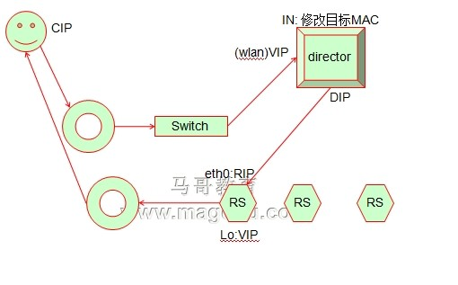

# 37_01_Linux集群系列之四——LVS DR详解及配置演示

---

## 笔记

---

### DR模型



路由器和`director`通信的时候需要识别`vip`的`mac`地址, 使用`arp`广播, 但是`real server`不会响应广播. 因为如果`real server`和`director`对寻找`mac`地址的`arp`广播都响应, 可能谁返回最快, 谁就是`vip`对应的`mac`地址, 所以不能让`real server`不能对`mac`地址的广播请求响应.

如何屏蔽`real server`不响应, 让前端路由设备(网关)把报文对`vip`地址直接发送给`director`.

* 在路由接口上绑定解析地址. `VIP: director 的 mac`.
* `arptables`基于`mac`地址做访问控制. 屏蔽`real server`, 只让`director`出去.
* 内核参数(通常使用, 不依赖外部组件), 限定linux主机对arp广播请求的响应级别, 以及向外通告自己`ip`地址的通告级别:
	* `arp_ignore`,设定请求的目标地址为本地ip时,对其arp的查询作不同的应答模式.(定义接收到`ARP`请求时的响应级别) 
		* `0`: 只要本地配置的有响应地址就给予响应, 无论在哪个接口上.
		* `1`: 仅仅目标`ip`是本地地址, 并且是配置在这个请求进来的接口上才响应(请求的目标地址, 配置在请求到达的接口上的时候, 才给予响应).
		* `2`: 在`1`的基础上, 并且`arp`请求的源`IP`必须和接收网卡同网段.
		* `3`: 如果ARP请求数据包所请求的`IP`地址对应的本地地址其作用域(`scope`)为主机（`host`),则不回应ARP响应数据包，如果作用域为全局(global)或链路(link), 则回应`ARP`响应数据包.
		* `4-7`: 保留未使用.
		* `8`: 不回应所有的`arp`请求.
	* `arp_announce`,设定了网卡在向外部宣告自己IP-MAC时的级别, 定义将自己地址向外通告时的通告级别. 默认`0`.
		* `0`: 默认, 将本机任何接口上的任何地址向外通告. 
		* `1`: 图例中, 在和`1.2`中, 仅仅通告`1.1`而不通告`2.1`和`3.1`.**尽可能,试图**向目标网路通告与其网络匹配的地址.
		* `2`: **仅向**与本地接口上地址匹配的网络进行通信. 和`1.2`只会是`1.1`.


一个网络中有多台主机, linux认为地址是属于`os`(主机)的, 而非接口. 为了保证不同网络的主机通信. 假如一台主机有两块网卡, 分别连在两台交换机上, 每个交换机都连着每个主机, 这台主机会告诉两个网络自己有两个ip地址, 并且对应的`mac`地址是什么. **地址是配置在网卡上的**

#### dr配置方案

将`rip`配置在`eth0`上因为要通信.

将`vip`配置在`lo`的别名上`lo:0`.

`lo`和`eth0`接入的网络不一致, 当广播请求过来, 服务器会响应`eth0`的`mac`地址. 限定广播请求进来的网卡, 所请求的目标地址没有配置在进来的网卡上就不进行响应.`arp_ignore`配置对什么级别的网卡请求响应.

##### `vip`,`dip`,`rip` 在同一个网段内

* `vip`: 172.16.100.1
* `dip`: 172.16.100.2
* `rip`: 172.16.100.8, 172.16.100.9, 172.16.100.10

Linux中有一种行为, 报文从哪个接口出去, 就尽可能使用这个接口的`ip`地址, 如果这个接口的`ip`地址和网关不在同一个网段内, 则使用该接口别名上的地址. (接口上一定要有一个地址和网关在同一个网段内).

所以上述网卡配置会使用`rip`, 因为`vip`,`dip`,`rip`都在同一个网段内, 但是`eth0`的ip地址优先级高(在同一个网段). 但是我们必须要让`vip`地址响应. 添加一个路由条目, 用户的请求报文, 响应报文一定要使用对应接口地址响应(这里需要`lo`的`vip`响应, 不设置是用`eth0`响应).

##### `vip`和`dip`,`rip`不在同一个网段内

路由接口和`vip`在同一网段, `rip`不在. 所以需要保证`rip`使用其他网关(路由器)向外出去.

#### 实验规划

* `Director`
	* `eth0`, DIP: 172.16.100.2
	* `etho0:0`, VIP: 172.16.100.1
* `RS1`:	
	* `eth0`: rip1: 172.16.100.7
	* `lo:0`: vip: 172.16.100.1
* `RS2`:
	* `eth0`: rip1: 172.16.100.8
	* `lo:0`: vip: 172.16.100.1

##### 实验示例

根据我虚拟机网段设置

* `Director`
	* `enp0s3`, DIP: 192.168.0.178
	* `enp0s3:0`, VIP: 192.168.0.101
* `RS1`:	
	* `enp0s3 `: rip1: 192.168.0.179
	* `lo:0`: vip: 192.168.0.101
* `RS2`:
	* `eth0`: rip1: 192.168.0.180
	* `lo:0`: vip: 192.168.0.101

```
关掉我虚拟机多余网卡
ifconfig enp0s8 down
```

```
在 192.168.0.178主机上, 配置 director
[root@localhost ~]# ifconfig
enp0s3: flags=4163<UP,BROADCAST,RUNNING,MULTICAST>  mtu 1500
        inet 192.168.0.178  netmask 255.255.255.0  broadcast 192.168.0.255
        inet6 fe80::a00:27ff:fe4f:4fda  prefixlen 64  scopeid 0x20<link>
        ether 08:00:27:4f:4f:da  txqueuelen 1000  (Ethernet)
        RX packets 259  bytes 30834 (30.1 KiB)
        RX errors 0  dropped 1  overruns 0  frame 0
        TX packets 129  bytes 18395 (17.9 KiB)
        TX errors 0  dropped 0 overruns 0  carrier 0  collisions 0

enp0s3:0: flags=4163<UP,BROADCAST,RUNNING,MULTICAST>  mtu 1500
        inet 192.168.0.101  netmask 255.255.255.0  broadcast 192.168.0.255
        ether 08:00:27:4f:4f:da  txqueuelen 1000  (Ethernet)

lo: flags=73<UP,LOOPBACK,RUNNING>  mtu 65536
        inet 127.0.0.1  netmask 255.0.0.0
        inet6 ::1  prefixlen 128  scopeid 0x10<host>
        loop  txqueuelen 1  (Local Loopback)
        RX packets 0  bytes 0 (0.0 B)
        RX errors 0  dropped 0  overruns 0  frame 0
        TX packets 0  bytes 0 (0.0 B)
        
开启转发
[root@localhost ~]# sysctl -w net.ipv4.ip_forward=1
net.ipv4.ip_forward = 1
[root@localhost ~]# route add -host 192.168.0.101 dev enp0s3:0
```

```
在192.168.0.179的real server上
关闭 arp 请求响应, 配置 all 和 enp0s3 接口
[root@localhost ~]# cd /proc/sys/net/ipv4/conf
可见 arp_announce 和 arp_ignore
[root@localhost conf]# ls all/
accept_local         arp_accept    arp_ignore   disable_policy      forwarding     medium_id            proxy_arp_pvlan  secure_redirects  src_valid_mark
accept_redirects     arp_announce  arp_notify   disable_xfrm        log_martians   promote_secondaries  route_localnet   send_redirects    tag
accept_source_route  arp_filter    bootp_relay  force_igmp_version  mc_forwarding  proxy_arp            rp_filter        shared_media
[root@localhost conf]# ls enp0s3/
accept_local         arp_accept    arp_ignore   disable_policy      forwarding     medium_id            proxy_arp_pvlan  secure_redirects  src_valid_mark
accept_redirects     arp_announce  arp_notify   disable_xfrm        log_martians   promote_secondaries  route_localnet   send_redirects    tag
accept_source_route  arp_filter    bootp_relay  force_igmp_version  mc_forwarding  proxy_arp            rp_filter        shared_media

如果不关闭, arp 会混乱, 可能ping vip, 则该主机会响应
[root@localhost conf]# sysctl -w net.ipv4.conf.enp0s3.arp_announce=2
net.ipv4.conf.enp0s3.arp_announce = 2
[root@localhost conf]# sysctl -w net.ipv4.conf.all.arp_announce=2
net.ipv4.conf.all.arp_announce = 2
[root@localhost conf]# sysctl -w net.ipv4.conf.enp0s3.arp_ignore=1
net.ipv4.conf.enp0s3.arp_ignore = 1
[root@localhost conf]# sysctl -w net.ipv4.conf.all.arp_ignore=1
net.ipv4.conf.all.arp_ignore = 1

开始配置vip,配置广播地址为自己地址, 掩码地址为255.255.255.255(全是网络地址, 自己只和自己在同一个网段内)
[root@localhost conf]# ifconfig lo:0 192.168.0.101 broadcast 192.168.0.101 netmask 255.255.255.255 up

如果目标主机是vip, 必须通过 lo:0 进来和出去
[root@localhost ~]# route add -host 192.168.0.101 dev lo:0
[root@localhost ~]# route -n
Kernel IP routing table
Destination     Gateway         Genmask         Flags Metric Ref    Use Iface
0.0.0.0         192.168.0.1     0.0.0.0         UG    100    0        0 enp0s3
192.168.0.0     0.0.0.0         255.255.255.0   U     100    0        0 enp0s3
192.168.0.101   0.0.0.0         255.255.255.255 UH    0      0        0 lo
```

```
同理配置另外一台real server
```

``` 
以另外一台主机测试
arp -a
? (192.168.0.1) at f4:83:cd:b5:da:e3 on en0 ifscope [ethernet]
? (192.168.0.101) at 8:0:27:4f:4f:da on en0 ifscope [ethernet]
? (192.168.0.102) at f0:db:e2:3d:6d:21 on en0 ifscope [ethernet]
? (192.168.0.104) at 34:e2:fd:73:e1:75 on en0 ifscope [ethernet]
? (192.168.0.105) at a8:6b:ad:15:1b:c7 on en0 ifscope [ethernet]
? (192.168.0.108) at 88:25:93:d5:77:b4 on en0 ifscope [ethernet]
? (192.168.0.177) at (incomplete) on en0 ifscope [ethernet]
? (192.168.0.178) at 8:0:27:4f:4f:da on en0 ifscope [ethernet]
? (192.168.0.179) at 8:0:27:cb:a8:8 on en0 ifscope [ethernet]
? (192.168.0.180) at 8:0:27:3c:51:27 on en0 ifscope [ethernet]
? (192.168.0.255) at (incomplete) on en0 ifscope [ethernet]
? (192.168.56.1) at a:0:27:0:0:0 on vboxnet0 ifscope permanent [ethernet]
? (192.168.56.101) at 8:0:27:47:27:7c on vboxnet0 ifscope [ethernet]
? (192.168.56.102) at 8:0:27:47:27:7c on vboxnet0 ifscope [ethernet]
? (192.168.56.103) at 8:0:27:47:27:7c on vboxnet0 ifscope [ethernet]
? (192.168.56.255) at (incomplete) on vboxnet0 ifscope [ethernet]
? (224.0.0.251) at 1:0:5e:0:0:fb on en0 ifscope permanent [ethernet]

可见192.168.0.101对应的mac是 8:0:27:4f:4f:da 和 178 主机一致
```

在`director`上测试两台`realserver`的`nginx`

```
[root@localhost ~]# curl 192.168.0.180
server-2 is 80
[root@localhost ~]# curl 192.168.0.179
server-1

配置 ipvs

清除掉旧的配置
[root@localhost ~]# ipvsadm -C
[root@localhost ~]# ipvsadm -A -t 192.168.0.101:80 -s wlc

-g 省略, 因为默认是 dr
[root@localhost ~]# ipvsadm -a -t 192.168.0.101:80 -r 192.168.0.179 -g -w 2
[root@localhost ~]# ipvsadm -a -t 192.168.0.101:80 -r 192.168.0.180 -g -w 1
[root@localhost ~]# ipvsadm -L -n
IP Virtual Server version 1.2.1 (size=4096)
Prot LocalAddress:Port Scheduler Flags
  -> RemoteAddress:Port           Forward Weight ActiveConn InActConn
TCP  192.168.0.101:80 wlc
  -> 192.168.0.179:80             Route   2      0          0
  -> 192.168.0.180:80             Route   1      0          0
```

测试

```
在外面主机访问 192.168.0.101 或者 curl 192.168.0.101
server-1
server-1
server-2 is 80
... 依次出现
```

#### 问题`route add -host 192.168.0.101 dev lo:0` 什么意思

如果目标地址是`192.168.0.101`(vip), 指定网络接口(网卡)是 `lo:0`

#### 问题`sysctl -w net.ipv4.conf.all.xx` 设置 `all`为什么

即对所有的物理网卡设置arp仰制. 对仰制所有的物理网卡设置arp仰制是为了让CIP发送的请求顺利转交给DIR以及防止整个LVS环境arp表混乱, 不然容易导致整个lvs不能工作.

设置`enp0s3`是因为万一系统里上面两条默认的值不是0，那有可能是会出问题、

**all/ 和{interface}/下两者同时比较,取较大一个值生效**

## 整理知识点

---

### linux 路由转发

`net.ipv4.ip_forward=1`

内网主机向公网发送数据包时, 由于**目的主机跟源主机不在同一网段**, 所以数据包暂时发往内网默认网关处理, 而本网段的主机对此数据包不做任何回应. 由于源主机ip是私有的, 禁止在公网使用, 所以必须将数据包的源发送地址修改成公网上的可用ip, 这就是网关收到数据包之后首先要做的工作**ip转换**. 然后网关再把数据包发往目的主机. 目的主机收到数据包之后, 只认为这是网关发送的请求. 并不知道内网主机的存在, 目的主机处理完请求, 把回应信息发还给网关. 网关收到后, 将目的主机发还的数据包的目的ip地址修改为发出请求的内网主机的ip地址, 这就是网关的**数据包的路由转发**. 内网的主机只要查看数据包的目的ip与发送请求的源主机ip地址相同, 就会回应，这就完成了一次请求.

Linux系统默认是禁止数据包转发的. 所谓转发即当主机拥有多于一块的网卡时, 其中一块收到数据包, 根据数据包的目的ip地址将包发往本机另一网卡, 该网卡根据路由表继续发送数据包. 这通常就是路由器所要实现的功能.