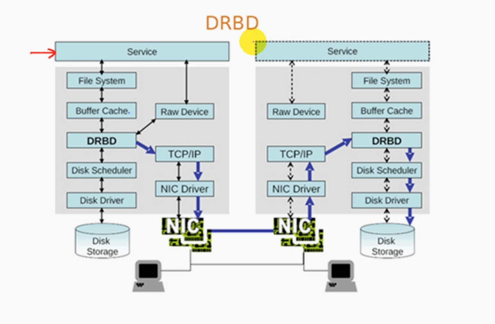

# 40_01_Linux集群系列之十五——分布式复制块设备drbd的基础概念及配置

---

## 笔记

---

### rsync

* Server: rsync + inotify
* Client: rsync + sersync

### DAS 共享

直接附加存储, 链接到总线, 块设备. **块级别共享**

锁级别是在本地处理, 无法共享另外一个设备.

scsi: 
 
* 发起数据存取请求: `initiator`
* 服务器端接收数据: `target`

有些scsi允许多个`initiator`

每个`target`可以链接多个`line`(逻辑单元号, logic unit number `LUN`), 可以链接多块硬盘. 

#### 硬盘写文件

不是直接在硬盘读写, 把数据加载到内存完成写操作, 写完以后在同步到硬盘. 内存`buffer`空间同步到硬盘.

### NAS 共享

网络附加存储. 文件服务器. 将本地存储空间共享给其他主机使用, 在**应用层**将存储能力提供给前端. 前端和后端使用`CS`架构来共享使用. 

**文件级别共享**, 共享文件.

将网络模拟成`scsi`总线使用, 每个主机的网卡可以当做`initiator`. 

借助客户端的`scsi`驱动和服务器端`scsi`驱动并借助网络隧道来完成`scsi`报文的传输.

客户端请求时以`scsi`的方式向服务器端发起请求.

#### nfs

* nfs 客户端
* nfs 服务端

## DRBD

内核中的一个模块.

Distributed Replicated Block Device

分布式复制块设备. 将位于两个系统的大小一样的磁盘分区, 做成镜像设备.

在底层通过`tcp/ip`按位同步到备份节点.

工作在内核当中, 是内核的一个功能.

当内核发现有写入到`drdb`分区, 将数据通过网卡像另外一个主机发送.

另外一个主机要运行一个服务, 随时接收数据.

* RAID 1: mirror 镜像卷
	* 磁盘相同大小, 两块磁盘按位逐一对应. 一定在同一个主机上



**主从**

* primary: 可执行读, 写操作
* secondary: 文件系统不能挂载(不能读写)

主从角色可以切换.

同一时间只能一个节点活动.

做成高可用器群资源, 主故障后自动切换.

**双主**

一般不能双主的原因是. 一台服务器像一个文件写入数据的时候会:

* 把数据加载到内存
* 给文件加锁

加锁这个步骤不能通知到其他服务器, 所以会产生问题.

DRBD将锁通知给其他服务器内核. 在分布式文件系统添加`DLM(Distributed Lock Manager, 分布式锁管理器)`.

集群文件管理系统:

* GFS2
* OCFS2

只允许两个节点.

### 数据同步协议

* `A`模型(异步Async): 只要交给本地`TCP/IP`并且准备发送的时候就算完成. **性能更好**
* `B`模型(半同步semi sync): 发给对方的`TCP/IP`协议栈就算完成.
* `C`模型(同步sync): 对方必须存储完成以后才算完成. **更靠谱**

### 磁盘调度器

合并读请求, 合并写请求. 节约寻道. 随机读写->顺序读写. 对于机械硬盘性能提升明显.

固态硬盘没有机械臂, 不需要.

### DRBD资源

DRBD Source:

* 资源名称(Resource name): 可以是除了空白字符外的任意`ASCII`码.
* DRBD设备(DRBD device): 在双方节点上, 此DRBD设备的设备文件. 一般为`/dev/drbdN`, 其主设备号.
* 磁盘配置(Disk configuration): 在双方节点上各自提供的存储设备. 可以是任何类型的块设备.
* 网络配置(Network configuration): 网络配置. 双方数据同步时所使用的网络属性.

### 管理工具

* dbrdadm
* drbdsetup
* drbdmeta

### drbd

`2.6.33`起, 整合进内核.

**PAE**, 物理内核扩展. 让`32`位可以扩展使用大于`4G`内存.

### 跳板机批量部署

```shell
for I in {1..2}; do ssh node$I '命令'; done


node$I 这里主机名是按照 node1, node2 区分的
```

## 整理知识点

---