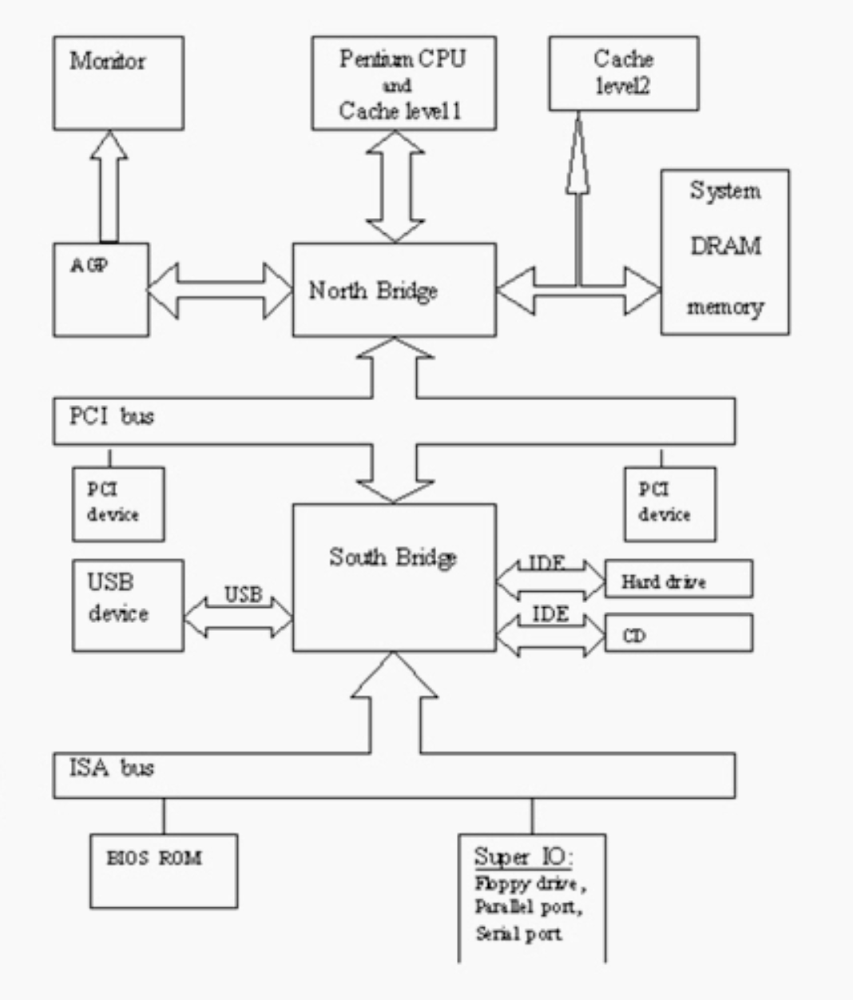
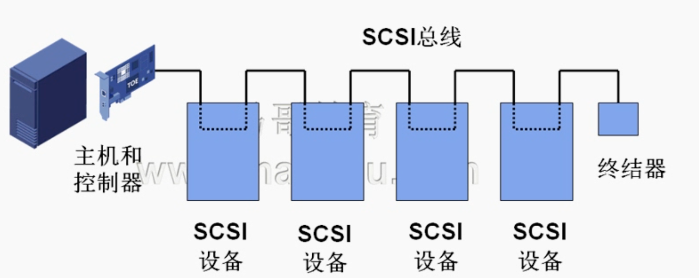
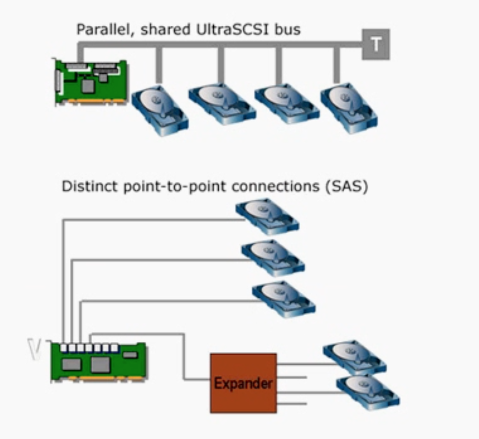
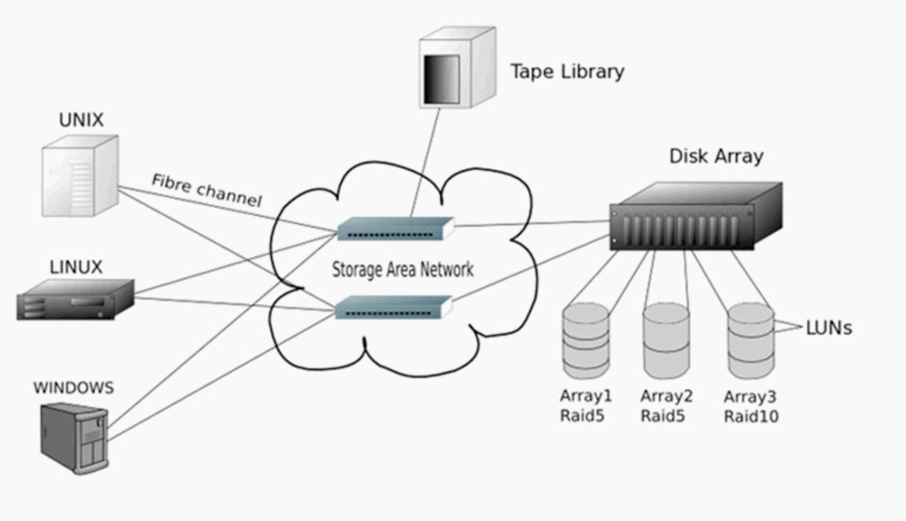
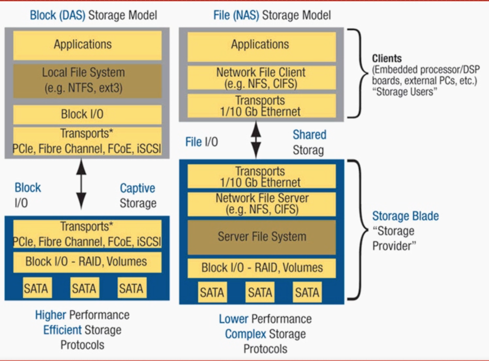
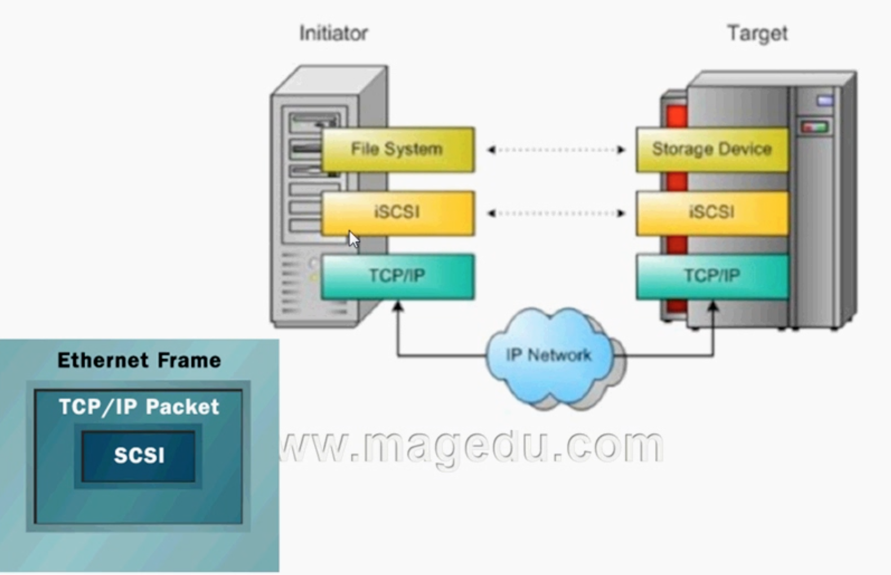
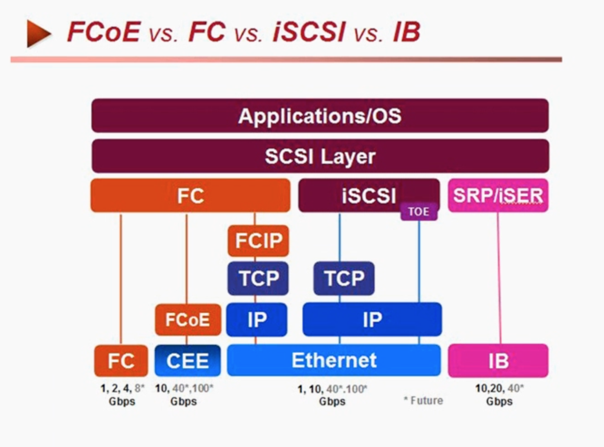
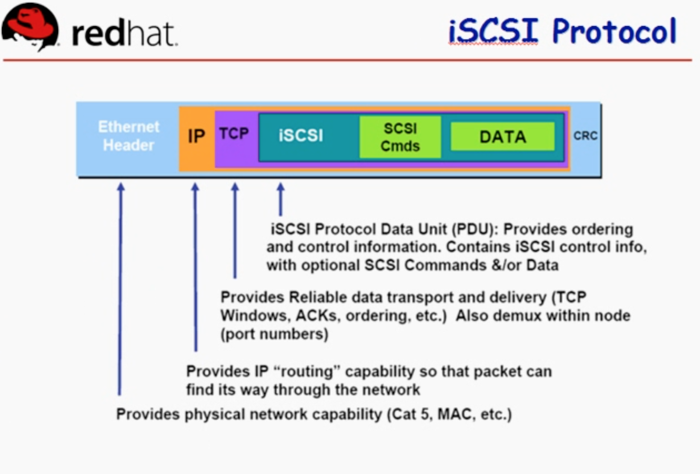

# 41_01_Linux集群系列之十九——iSCSI协议、架构及其安装配置

---

## 笔记

01:20:23

### 电脑体系



CPU - 北桥 - PCI - 南桥 

链接持久性存储的总线叫做持久性总线

* IDE
	* 链接设备少
	* 一个`IDE`总线最多只能链接一主一从两个设备
	* 报文协议封装不好, 需要大量CPU始终周期参与
* SCSI(Small Computer System Interface)
	* 是一种`I/O`技术
	* 规范了一种并行的`I/O`总线和相关的协议 
	* 数据传输是以块的方式传输
	* 主机卡(总线适配器, 主机适配器 HBA)
		* 自己在芯片上有控制芯片, 可以完成数据封装, 解决大量`CPU`时间的占用(低系统开销)
	* 设备无关性
	* 多设备并行
	* 高带宽
	* 低系统开销
	


### SCSI总线

* 宽总线
	* 16个设备
* 窄总线
	* 连8个设备

### SAS总线



* SCSI 并行口
* SAS, 每个口连接多个, 串行. 通过`Expander`扩展.

### 存储区域网络



将`SCSI`协议报文, 经过另外一种非`SCSI`线缆传输, 传输完成以后能够保存至目标存储设备. -> 网络 -> 存储区域网络

### SAN 和 NAS 区别



* SAN
	* 块级别存储
	* 传输更远级别的`DAS`
	* 文件系统在本地内核中(客户端)
	* 操作在本地内容中完成, 最终通过网络传输给服务端, 服务端拆开最终报文后是最终对存储的操作指令, 产生块`IO`
* NAS
	* 文件级别存储
	* 文件系统在服务器端
		* CIFS协议samba

### SCSI 

SCSI 使用 `Client/Server` 模型.

* `Initiator`为应用客户端.
* `Target`包括设备.

### LUN

LUN的全称是Logical Unit Number, 也就是逻辑单元号. 我们知道SCSI总线上可挂接的设备数量是有限的, 一般为6个或者15个.

* 每个target下都可以有多个lun device, 我们通常简称lun device为lun, 这样就可以说每个设备的描述就有原来的target X变成target x lun y了, 那么显而易见的, 我们描述设备的能力增强了.
* LUN ID不等于某个设备, 只是个号码而已, **不代表任何实体属性**, 在我们的实际环境里, 我们碰到的LUN可能是磁盘空间, 可能是磁带机, 或者是media changer等等.
* LUN的神秘之处(相对于一些新手来说)在于, 它很多时候不是什么可见的实体, 而是一些虚拟的对象, 比如一个阵列柜, 主机那边看作是一个target device, 那为了某些特殊需要, 我们要将磁盘阵列柜的磁盘空间划分成若干个小的单元给主机来用, 于是就产生了一些什么逻辑驱动器的说法.

### iSCSI

`iSCSI`技术实现了物理硬盘设备与TCP/TP网络传输协议的相互结合.



`iSCSI`默认监听在`TCP`的`3260`端口上, 提供`tcp/ip`的服务. 会话建立后应该始终处于连接状态, 知道断开为止.

借助`tcp/ip`传输`iSCSI`报文, `iSCSI`内部封装的是`SCSI`报文.

* iSCSI Target: scsi-target-utils
	* 3260端口
	* 客户端验证方式
		* 基于`IP`认证
		* 基于用户认证, `CHAP`(双向认证)
* iSCSI Initiator: iscsi-initiator-utils

### 各协议对比



### iSCSI 报文协议



### tgtadm

模式化的命令(使用`--mode`指定模式)

* target
	* 操作(`--op`)
		* `new`
		* `delete`
		* `show`
		* `update`
		* `bind`
		* `unbind`
* logicalunit
	* 操作(`--op`)
		* `new`
		* `delete`
* account
	* 操作(`--op`)
		* `new`
		* `delete`
		* `bind`
		* `unbind`

* `--lld, -L`驱动
* `--tid, -T` (`0`是保留的, 给当前主机使用的)
* `--lun, -l`逻辑单元号
* `--backing-store <path>, -b`后端存储
* `--initiator-address <address>, -I`
* `--targetname <targetname>, -T`

### targetname 如何命名

`iqn.yyyy-mm.<reversed domain name(反过来写的公司域名)>[:identifier]`

`iqa`: `iSCSI qualified name`

```
iqn.2013-05.com.magedu:tstore.disk1
```

### 示例

#### 服务端

新建`target`, `target`只是模拟一个控制芯片.

```
tgtadm --lld iscsi --mode target --op new --targetname iqn.2013-05.com.magedu:tstore.disk1 --tid 1
```

把`target`关联到一个存储设备`LUN 0`已经被`target`自己所使用.

新建一个`lun`, 关联到一个后端存储

```
tgtadm --lld iscsi --mode logicalunit --op new --tid 1 --lun 1 --backing-store /dev/sda5
```

基于`ip`来认证

```
tgtadm --lld iscsi --mode target --op bind --tid 1 --initiator-address 172.16.0.0/16
```

#### 客户端

## 整理知识点

---