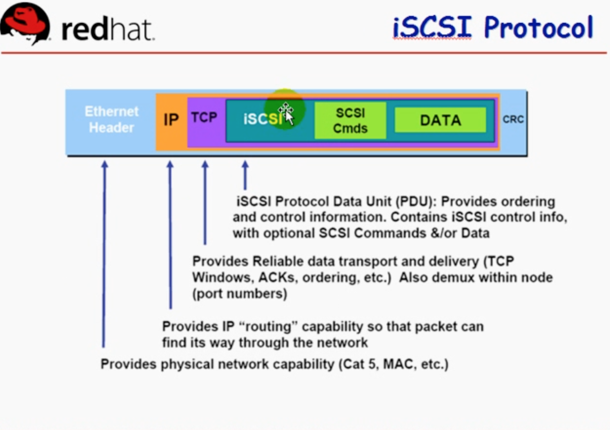

# 41_03_Linux集群系列之二十一——iSCSI、cLVM和gfs2

---

00:44:52

## 笔记

### 协议封装



内核空间工作不能永久有效, 必须借助用户空间的文件进行保存记录.

### iscsi-utils(客户端)

因为`iSCSI`是一个`utils`功能, 因为`iSCSI`本身就是一个内核中的功能.

### scsi-target-utils(服务端)

因为虽然提供`iSCSI`但是最终在服务器端还是还原成`SCSI`协议的报文.

### gfs2文件

* 全局文件
* 集群文件系统之一

挂载

```
mount -t gfs2
```

### cLVM

共享存储做成逻辑卷(LVM).

借用`HA`的机制, 让多个节点同时能被一个`LVM`的物理设备和逻辑设备发起管理操作, 其中某一个节点发起管理操作的时候. 其他节点能够看见能够加锁. 并且可以把这个锁通知给其他节点.

**分布式协作工具**

需要在各节点启动一个服务, 让各节点可以通过这个服务进行通信.

改`lvm`配置文件(`/etc/lvm/lvm.conf`)的`locking_type`, 默认是`1`, 改为`3`.

 

## 整理知识点

---