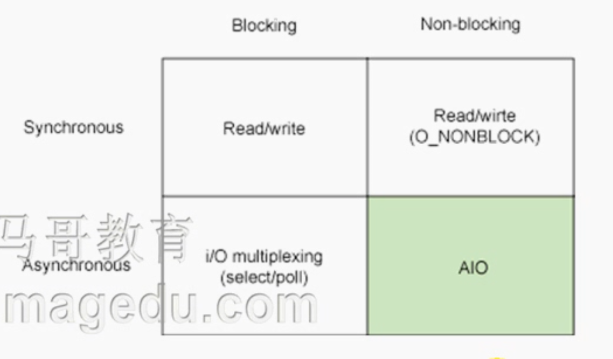
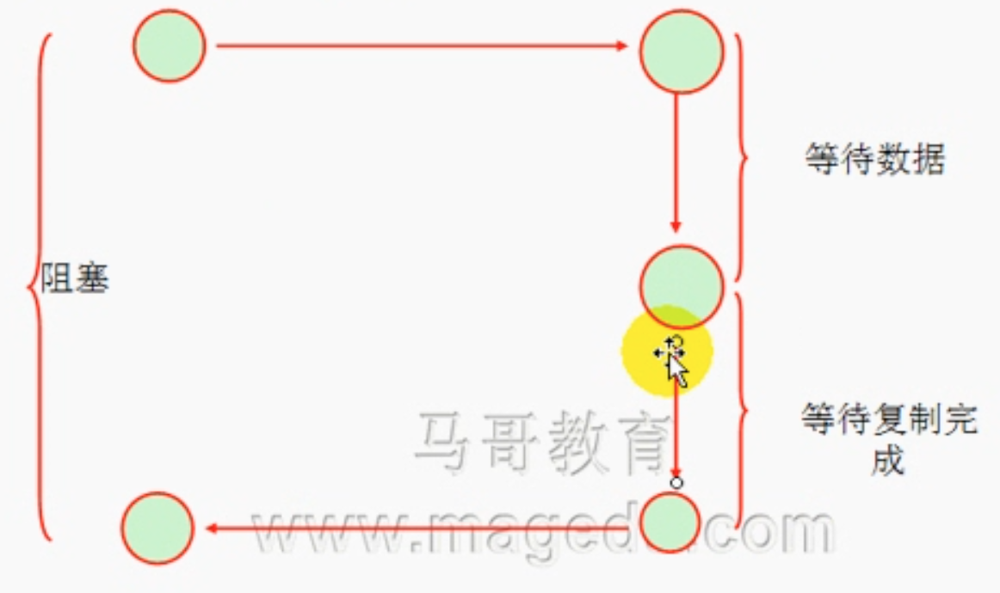
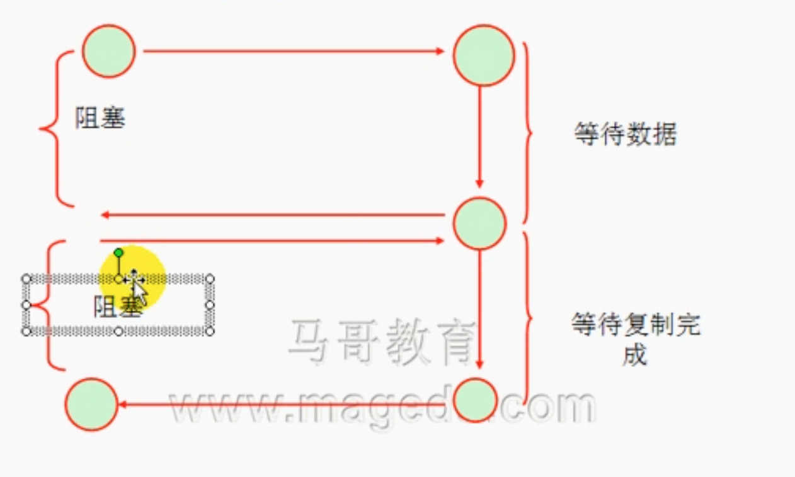
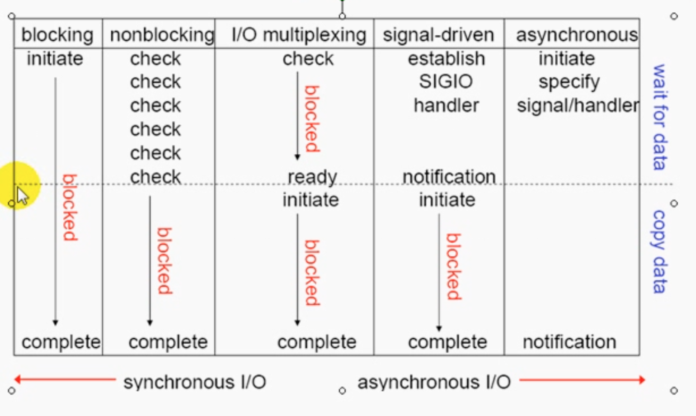

# 43_02_IO复用详解及高并发系统设计初步

---

## 笔记

### I/O动作如何执行?

* 进程无法直接操作I/O设备, 其必须通过系统调用请求`kernel`来协助完成I/O动作.
* 内核会为每个I/O设备维护一个`buffer`.


```
I/O Device  <-- wait -- > Kernel's buffer <-- copy --> Process
```

* 对于输入而言, 等待(wait)数据输入至`buffer`需要时间, 而从`buffer`复制(copy)数据至进程也需要时间.
* 等待需要分成2段
	* `I/O`设备等待`Kernel's buffer`.
	* 进程等到`Kernel's buffer`复制到进程.
* 根据等待模式不同, I/O动作可分为五种模式.
	* blocking I/O: 阻塞I/O
	* nonblocking I/O: 非阻塞I/O
	* I/O multiplexing (select and poll): 
		* I/O复用(一个进程同时处理多个I/O, 必须使用I/O复用).
		* 处理一个请求也需要
			* 交互式I/O(用户输入数据)
			* 网络I/O
	* signal driven I/O(SIGIO): 信号驱动I/O
	* asynchronous I/O(aio_): 异步I/O



* Synchronous I/O: 引起请求进程阻塞, 之道I/O完成.
* Asynchronous I/O: 不导致请求进程阻塞.


### 阻塞模型



blocking I/O.

### 非阻塞模型

```
o--------o
|------->| 
|------等待数据
|------->|
|        |
|      等待复制完成
|        |
o--------
```

* 等待数据过程是**非阻塞**的, 需要一遍一遍的去问.
* 等待复制完成是**阻塞的**

nonblocking I/O.

### I/O复用



发起两次系统调用. 每一段都是阻塞的.

异步, 阻塞.

I/O multiplexing

### 信号通知I/O


### 总结



## 整理知识点

---