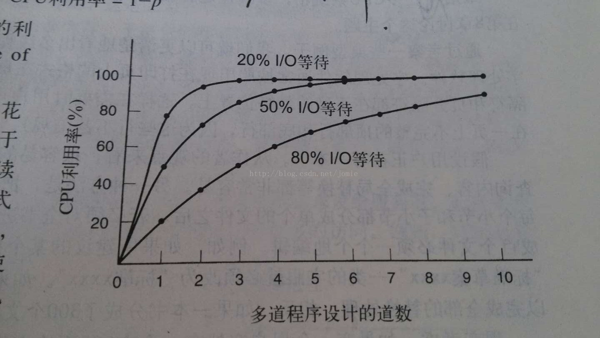

# 多核CPU, 多进程, 多线程

---

## 多进程

进程是操作系统中最重要的抽象概念之一, 使得在即使只有一个`CPU`的机器上, 也支持(伪)并发, 即将一个单独的`CPU`编程多个虚拟的`CPU`.

**多进程是为了CPU的并发产生的**

## 多道程序设计

进程执行过程中常常会因为资源请求或者IO被阻塞或中断, 此时`CPU`便空闲出来, 众所周知, `CPU`是计算机中非常宝贵的资源, 为提供其利用率, 操作系统需通过进程切换, 将`CPU`交给就绪队列的某个进程使用; 等上次被阻塞或者中断的进程再次满足执行条件后(请求的资源得到满足或者`IO`完成等), 操作系统便通过调度算法将`CPU`再次交给该进程执行任务, 其中操作系统的进程调度算法有多种, 具体依赖操作系统.

**这时从用户的角度感觉是多个进程在同时执行, 这得益于操作系统通过进程调度将一个`CPU`变成多个虚拟的`CPU`, 实现多个进程的伪并发**

这种进程间的切换称之为**多道程序设计**

**每个进程在执行过程中表现了不同的形态, `CPU`需要根据进程执行过程中的特性制定`CPU`调度算法从而提供`CPU`利用率**

### 进程切换

由于每个进程的处理任务异样性, 其进程的输入, 输出, 处理过程, 处理状态都不同. 进程切换的过程中也应该考虑这些参数. 一个正在执行的进程包括程序计数器, 寄存器, 变量的当前值等, 而这些数据都是保存在`CPU`的寄存器中的, 且这些寄存器只能是正在使用`CPU`的进程才能享用, 所以在进程切换时:

* 首先保存上一个进程的这些数据, 因为这样下次获得`CPU`的使用权时从上次的中断处开始继续顺序执行, 而不是返回到进程开始, 否则每次进程重新获得`CPU`时锁处理的任务都是上一次的重复, 可能永远也到不了进程的结束处, 因为一个进程几乎不可能执行完所有任务后才释放`CPU`.
* 然后将本次获得`CPU`的进程的这些数据装入`CPU`的寄存器从上次断电出继续执行剩下的任务.

操作系统为了便于管理系统内部进程, 为每个进程创建了一张进程表项.

**CPU的并发需求产生了进程, 进程执行过程中的特性产生了CPU调度算法, CPU调度时需要维护每个进程特有的数据和空间, 因此产生了维护每个进程的进程表项**

#### 进程表项

* 进程管理
	* 程序计数器
	* 程序状态字
	* 堆栈指针
	* 进程状态
	* 优先级
	* 调度参数
	* 进程ID
	* 父进程
	* 进程组
	* 信号
	* 进程开始时间
	* 使用`CPU`的时间
	* 子进程的`CPU`的时间
	* 下次报警时间
* 存储管理
	* 正文段指针
	* 数据段指针
	* 堆栈指针
* 文件管理
	* 根目录
	* 工作目录
	* 文件描述符
	* 用户ID
	* 组ID

### 多道程序设计模型

CPU的利用率 = 1 - pn



从上图可见当进程花`80%`进行`IO`时(`IO`密集型), 需要大约10个进程并发才能使用`CPU`得到充分利用. 而当进程只花20%的时间进行`IO`时(`CPU`密集型), 只需要2个进程就可以使`CPU`的浪费率低于10%.

在实际应用中, 不管一个等待用户从终端输入的交互式进程还是做大量读写磁盘的服务器进程80%甚至更多的IO时间是普遍的.

* 多道程序设计模式可以提高**IO密集型**进程的`CPU`利用率, 从而间接提高了整个系统的吞吐量. 
* 而对于**CPU密集型**进程, 其并发度与`CPU`利用率不一定是成真比例.

进程可以分为:

* IO密集型
* CPU密集型

根据进程的不同特性设置进程的策略, 来提高`CPU`的利用率.

#### 多道程序设计核心

**通过进程调度提高`CPU`的利用率, 将一个`CPU`虚拟成多个, 实现多个进程的并发执行**

## 线程

线程(`thread`)是操作系统能够进行运算调度的最小单位. 它被包含在进程之中, 是进程中的实际运作单位. **一条线程指的是进程中一个单一顺序的控制流**, 一个进程可以并行多个线程, 每条线程并行执行不同的任务. 在Unix System也被称为轻量进程, 但轻量进程更多指内核线程(`kernel thread`), 而把用户线程(`user thread`)称为线程. 

从资源分配角度:

* 进程是资源所有资源分配的基本单位
* 线程是`CPU`调度的基本单位

### 引入线程的原因

1. 一个应用程序中同时存在多个任务, 其中的部分活动会随时间的推移而阻塞, 而另外一部分则不会. 如, 一个文字处理软件, 前台部分需要从终端设备获得输入或者将处理完的部分输出, 而后台线程可以实现对文字的处理. 故对`CPU`密集型进程, 该用多线程其性能不一定能得到的很大提高, 但是对于`IO`密集型进程, 其性能可能得到很大提高.
2. 线程比进程更轻量级, 创建和撤销的代价小, 在许多系统中, 创建一个线程比一个进程要快10~100倍不等
3. 在**多核CPU中**, 真正的并行有了可能. 即在多线程设计中一部分可用来处理前台任务, 一部分可用来处理后台任务, 实现**真正意义上的并行**(注意并发和必行的区别).
4. 线程间的切换代价要比进程切换的代价小.

### 引入多线程的原因

1. 某个操作可能会陷入长时间等待, 等待的线程会进入睡眠状态, 无法继续执行. 多线程执行可以有效利用等待时间. 
2. 某个操作(计算)会消耗大量的时间, 如果只有一个线程, 程序和用户之间的交互会中断. 多线程可以让一个线程负责交互, 另一个线程负责计算.
3. 多`CPU`或者多核计算机, 本身具备同时执行多个线程的能力, 故单线程无法完全发挥计算机的能力.
4. 相对于多进程应用, 多线程在数据共享方面效率要高很多(一个进程的多线程, 共享进程内的信息).
5. 程序逻辑本身就要求并发操作.

比如编辑一个文件, 一个线程负责响应用户交互, 一个线程负责处理格式化文件, 一个负责备份. 这种情况用多进程是无法工作的. 因为这三个线程都需要在同一个文件上进行操作, 通过三个线程, 由于一个进程内的所有线程共享公共内存, 于是便可以在同一文件上进行处理.

## 进程和线程

1. 进程是操作系统的管理单位, 线程则是进程的管理单位
2. 一个进程至少包含一个执行线程.
3. 无论单线程还是多线程, 每个线程都有:
	* 程序计数器(记录要执行的下一条指令)
	* 一组寄存器(保存当前线程的工作变量)
	* 堆栈(记录执行历史, 其中每一帧保存了一个已经调用但未返回的过程).
4. 进程是系统分配资源的基本单位, 线程是调用`CPU`的基本单位

### 多线程是对多进程的模拟

#### 故线程被称为"轻量级进程"的原因.

* 多个线程共享同一个地址空间和其他资源.
* 多个进程共享物理内存, 磁盘, IO等其他资源.

多线程在单`CPU`系统中运行时, 线程轮流运行, 犹如多道程序设计, 制造线程并行运行的假象. 在一个由三个`CPU`密集型的进程中, 实际每个线程在一个`CPU`上得到的真实`CPU`速度的三分之一. 

**线程间不想进程之间那样存在很大的独立性**, 一个进程的多个线程共享进程内部的很多资源, 线程间可以互写对方的堆栈, 而不同的进程则无法对其他进程的地址空间进行写操作.

* 进程的内容
	* 地址空间
	* 全局变量
	* 打开文件
	* 子进程
	* 即将发生的报警
	* 信号与信号处理程序
	* 账户信号
	* 同步,互斥信号量
* 线程中的内容
	* 程序计数器
	* 寄存器
	* 堆栈
	* 状态

**进程的内容是该进程下的所有线程共享的**

## 多线程与并行计算的区别

在单核时代, 多线程就有很广泛的应用, 这时候多线程大多用于降低阻塞.

```
while(1)
{
	if(flag==1)
		break;
	sleep(1);
}
```

这样的代码带来`CPU`资源闲置. 阻塞一般是在等待`IO`操作时发生. 此时单线程效率低下, 例如一个IO操作要耗时10毫秒, CPU就会被阻塞接近10毫秒.

所以这种耗时的IO操作就用一个线程`Thread`去代为执行, 创建这个线程的函数(代码)部分不会被`IO`操作阻塞, 继续干这个程序中其他事情, 而不是干等待(或者去执行其他程序).

同样在这个单核时代, **多线程这个消除足额色的作用也还可以叫做"并发"**,实际上还是一个CPU在执行一切事物,只是切换的太快,我们没法察觉罢了.

### 使用多线程的几种情况

* 多核CPU: 计算密集型任务. 此时要尽量使用多线程, 可以提高任务执行效率, 例如加密解密, 数据压缩解压缩(视频、音频、普通数据), 否则只能使一个核心满载, 而其他核心闲置.
* 单核CPU: 计算密集型任务. 此时的任务已经把CPU资源100%消耗了, 就没必要也不可能使用多线程来提高计算效率了. 相反, 如果要做人机交互, 最好还是要用多线程, 避免用户没法对计算机进行操作.
* 多核CPU: IO密集型任务, 使用多线程还是为了人机交互方便.
* 单核CPU: 同多核CPU.


