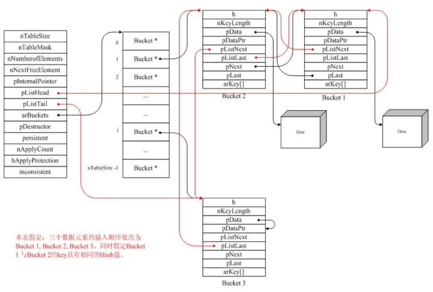
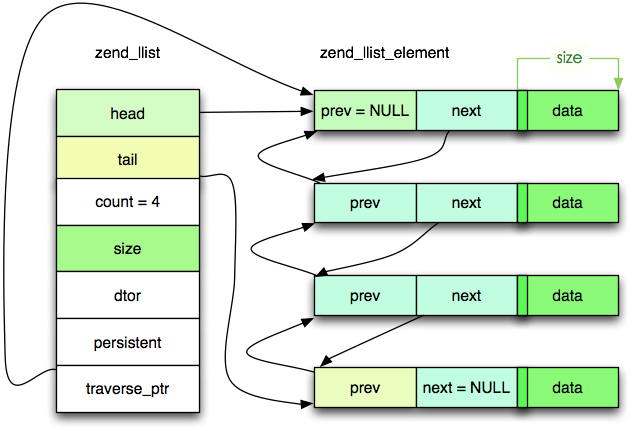

#3.1 变量的结构和类型

---

编程语言的类型系统可以分为`强类型`和`弱类型`两种:

* `强类型`语言是一旦某个变量被申明为某个类型的变量,在程序运行过程中,就不能将该变量的类型以外的值赋予给它(不完全如此,可能会涉及到类型的转换),`C/C++/Java`.
* `弱类型`语言: 一个变量可以表示`任意`的数据类型.(PHP,Ruby,JavaScript).

在官方的PHP实现内部,所有变量使用同一种`数据结构(zval)`来保存,而这个结构同时表示PHP中的各种数据类型.`它不仅仅包含变量的值,也包含变量的类型.这就是PHP弱类型的核心`.

####PHP变量类型及存储结构

PHP在声明或使用变量的时候,并不需要`显式指明其数据类型`.

在PHP中,存在8种变量类型,可以分为三类:

* 标量类型: boolean,integer,float(double),string
* 复合类型: array,object
* 特殊类型: resource,NULL

官方PHP是用C实现的,而C是强类型的语言,那这是怎么实现PHP中的弱类型的呢?

**变量存储结构**

变量的值存储到以下所示zval结构体中,zval结构体定义在`Zend/zend.h`文件,其结构如下:

		typedef struct _zval_struct zval;
		...
		struct _zval_struct {
		    /* Variable information */
		    zvalue_value value;     /* value */
		    zend_uint refcount__gc;
		    zend_uchar type;    /* active type */
		    zend_uchar is_ref__gc;
		};

PHP使用这个结构来存储变量的所有数据.和其他编译性静态语言不同,`PHP在存储变量时将PHP用户空间的变量类型也保存在同一个结构体中`.这样我们就能通过这些信息获取到变量的类型.

zval结构体中有四个字段,其含义分别为:

* `refcount__gc`: 表示引用计数,默认:1
* `is_ref__gc`: 表示是否为引用,默认:0
* `value`: 存储变量的值
* `type`: 变量具体的类型

*在PHP5.3之后,引入了新的垃圾收集机制,引用计数和引用的字段名改为refcount__gc和is_ref__gc.在此之前为refcount和is__ref.*

**变量类型**

`zval`结构体的`type`字段就是实现弱类型最关键的字段了,type的值可以为:

* `IS_NULL`
* `IS_BOOL`
* `IS_LONG`
* `IS_DOUBLE`
* `IS_STRING`
* `IS_ARRAY`
* `IS_OBJECT`
* `IS_RESOURCE`
* `IS_CONSTANT`
* `IS_CONSTANT_ARRAY`

他们只是类型的唯一标示,根据类型的不同将不同的值存储到value字段.

**变量的值存储**

前面提到变量的值存储在`zvalue_value` `联合体`中,定义如下:

		typedef union _zvalue_value {
		    long lval;                  /* long value */
		    double dval;                /* double value */
		    struct {
		        char *val;
		        int len;
		    } str;
		    HashTable *ht;              /* hash table value */
		    zend_object_value obj;
		} zvalue_value;
		
*这里使用联合体而不是用结构体是出于空间利用率的考虑,因为一个变量同时只能属于一种类型.如果使用结构体的话将会不必要的浪费空间,而PHP中的所有逻辑都围绕变量来进行的,这样的话,内存浪费将是十分大的,这种做法成本小但收益非常大.*

各种类型的数据会使用不同的方法来进行变量值的存储,(`zend_API.h`)

`boolean`(变量值存储于(zval).value.lval中,其类型也会以相应的IS_*进行存储):

		#define ZVAL_BOOL(z, b) do {		\
				zval *__z = (z);			\
				Z_LVAL_P(__z) = ((b) != 0);	\
				Z_TYPE_P(__z) = IS_BOOL;	\
			} while (0)

`integer`(变量值存储于(zval).value.lval中,其类型也会以相应的IS_*进行存储):

		#define ZVAL_LONG(z, l) {			\
				zval *__z = (z);			\
				Z_LVAL_P(__z) = l;			\
				Z_TYPE_P(__z) = IS_LONG;	\
			}
			
`float`(变量值存储于(zval).value.lval中,其类型也会以相应的IS_*进行存储):

		#define ZVAL_DOUBLE(z, d) {			\
				zval *__z = (z);			\
				Z_DVAL_P(__z) = d;			\
				Z_TYPE_P(__z) = IS_DOUBLE;	\
			}
			
`null`(NULL值的变量值不需要存储,只需要把(zval).type标为IS_NULL):

		#define ZVAL_NULL(z) {				\
				Z_TYPE_P(z) = IS_NULL;		\
			}			
			
`resource`(资源类型的存储与其他一般变量无异,但其初始化及存取实现则不同):

		#define ZVAL_RESOURCE(z, l) do {	\
				zval *__z = (z);			\
				Z_LVAL_P(__z) = l;			\
				Z_TYPE_P(__z) = IS_RESOURCE;\
			} while (0)

`字符串String`:

字符串的类型标示和其他数据类型一样,不过在存储字符串时多了一个字符串长度的字段.

		struct {
		    char *val;
		    int len;
		} str;
		
*C中字符串是以\0结尾的字符数组,这里多存储了字符串的长度,这和我们在设计数据库时增加的冗余字段异曲同工. 因为要实时获取到字符串的长度的时间复杂度是O(n),而字符串的操作在PHP中是非常频繁的,这样能避免重复计算字符串的长度,这能节省大量的时间,是空间换时间的做法.这么看在PHP中strlen()函数可以在常数时间内获取到字符串的长度. 计算机语言中字符串的操作都非常之多,所以大部分高级语言中都会存储字符串的长度.*

`数组Array`(HashTable表):

数组是PHP中最常用,也是最强大变量类型,它可以存储其他类型的数据,而且提供各种内置操作函数.数组的存储相对于其他变量要复杂一些,数组的值存储在`zvalue_value.ht`字段中,它是一个`HashTable`类型的数据.`PHP的数组使用哈希表来存储关联数据`.哈希表是一种高效的键值对存储结构.PHP的哈希表实现中使用了两个数据结构`HashTable`和`Bucket`.PHP所有的工作都由哈希表实现.(下节介绍)

`对象Object`:

在面向对象语言中,我们能自己定义自己需要的数据类型,包括类的属性,方法等数据.而对象则是类的一个具体实现.对象有自身的状态和所能完成的操作.

PHP的对象是一种`复合型`的数据,使用一种zend_object_value的结构体来存放.其定义如下:

		typedef struct _zend_object_value {
		    zend_object_handle handle;  //  unsigned int类型，EG(objects_store).object_buckets的索引
		    zend_object_handlers *handlers;
		} zend_object_value;
		
PHP的对象只有在运行时才会被创建,前面的章节介绍了`EG宏`,这是`一个全局结构体用于保存在运行时的数据`. 其中就包括了用来保存所有被创建的对象的对象池,`EG(objects_store)`,而object对象值`内容`的`zend_object_handle域`就是`当前对象在对象池中所在的`**`索引`**.

`handlers`(多了一个`s`)字段则是`将对象进行操作时的处理函数保存起来`.这个结构体及对象相关的类的结构_zend_class_entry,后面做详细介绍.

**总结**

PHP的弱变量容器的实现方式是`兼容并包`的形式体现,`针对每种类型的变量都有其对应的标记和存储空间`.使用强类型的语言在`效率上`通常会`比弱类型高`,因为很多信息能在运行之前就能确定,这也能帮助排除程序错误. 而这带来的问题是编写代码相对会受制约.

###哈希表(HashTable)

`按图索骥`

PHP中使用最为频繁的数据类型非字符串和数组莫属,PHP比较容易上手也得益于非常灵活的`数组`类型.哈希表(`HashTable`)是PHP实现中尤为关键的数据结构.

哈希表在实践中使用的非常广泛,例如编译器通常会维护的一个符号表来保存标记,很多高级语言中也显式的支持哈希表.哈希表通常提供查找(Search),插入(Insert),删除(Delete)等操作,这些操作在最坏的情况下和链表的性能一样为O(n).不过通常并不会这么坏,合理设计的哈希算法能有效的避免这类情况,通常哈希表的这些操作时间复杂度为O(1).

####基本概念

哈希表是一种通过`哈希函数`,将特定的键映射到特定值的一种数据结构,它维护键和值之间一一对应关系.

* `键(key)`: 用于`操作`数据的`标示`,例如PHP数组中的索引,或者字符串键等等.
* `槽(slot/bucket)`: 哈希表中用于`保存`数据的一个`单元`,也就是数据真正存放的`容器`.
* `哈希函数(hash function)`: 将key`映射(map)`到数据应该存放的slot所在位置的`函数`.
* `哈希冲突(hash collision)`: 哈希函数将两个不同的key映射到同一个索引的情况.

哈希表可以理解为数组的扩展或者关联数组,数组使用数字下标来`寻址`,如果关键字(key)的范围较小且是数字的话,我们可以直接使用数组来完成哈希表,而如果关键字范围太大,如果直接使用数组我们需要为所有可能的key申请空间.很多情况下这是不现实的.即使空间足够,空间利用率也会很低,这并不理想.同时键也可能并不是数字,在PHP中尤为如此,所以人们使用一种映射函数(哈希函数)来将key映射到特定的域中:

		h(key) -> index
		
通过合理设计的哈希函数,我们就能将key映射到合适的范围,因为我们的key空间可以很大(例如字符串key),在映射到一个较小的空间中时可能会出现两个不同的key映射被到同一个index上的情况,这就是我们所说的出现了冲突.目前解决hash冲突的方法主要有两种:

* `链接法`
* `开放寻址法`

####冲突解决

**链接法**

链接法通过使用一个链表来保存slot值的方式来解决冲突,也就是当不同的key映射到一个槽中的时候使用`链表`来保存这些值.所以使用链接法是在最坏的情况下,也就是所有的key都映射到同一个槽中了,这样哈希表就退化成了一个链表,这样的话操作链表的时间复杂度则成了O(n),这样哈希表的性能优势就没有了,所以`选择一个合适的哈希函数是最为关键`的.

目前`PHP`中HashTable的哈希冲突解决方法就是`链接法`.

PHP语言采取了相应的措施来防止哈希冲突攻击,采用的是一种 治标不治本的做法[限制用户提交数据字段数量 ](http://cn2.php.net/manual/zh/info.configuration.php#ini.max-input-vars "限制用户提交数据字段数量 ").

		 max_input_vars integer 
		 
		 接受多少 输入的变量(限制分别应用于 $_GET、$_POST 和 $_COOKIE 超全局变量)指令的使用减轻了以哈希碰撞来进行拒绝服务攻击的可能性.如有超过指令指定数量的输入变量,将会导致E_WARNING 的产生, 更多的输入变量将会从请求中截断,
		 
**开放寻址法**

使用开放寻址法是槽本身直接存放数据,在插入数据时如果key所映射到的索引已经有数据了,这说明发生了冲突,这是会寻找下一个槽,如果该槽也被占用了则继续寻找下一个槽,直到寻找到没有被占用的槽,在查找时也使用同样的策略来进行.

由于开放寻址法处理冲突的时候占用的是其他槽位的空间,这可能会导致后续的key在插入的时候更加容易出现哈希冲突,所以采用开放寻址法的哈希表的装载因子不能太高,否则容易出现性能下降.

`装载因子`是哈希表`保存的元素数量`和`哈希表容量`的比,通常采用链接法解决冲突的哈希表的装载因子最好不要大于1,而采用开放寻址法的哈希表最好不要大于0.5.

####哈希表的实现

主要需要完成的工作只有三点:

1. 实现哈希函数
2. 冲突的解决
3. 操作接口的实现

**数据结构**

首先我们需要一个容器来保存我们的哈希表,哈希表需要保存的内容主要是保存进来的的数据,同时为了方便的得知哈希表中存储的元素个数,需要保存一个大小字段, 第二个需要的就是保存数据的容器了.作为实例,下面将实现一个简易的哈希表.基本的数据结构主要有两个,`一个用于保存哈希表本身`,另外`一个就是用于实际保存数据的单链表了`,定义如下:

		typedef struct _Bucket
		{
		    char *key;
		    void *value;
		    struct _Bucket *next;
		} Bucket;
		
		typedef struct _HashTable
		{
		    int size;
		    int elem_num;
		    Bucket** buckets;
		} HashTable;
		
`Bucket`结构体是一个`单链表`,这是为了解决多个key哈希冲突的问题,也就是前面所提到的的链接法.`当多个key映射到同一个index的时候将冲突的元素链接起来`.

**哈希函数实现**

哈希函数需要尽可能的将不同的key映射到不同的槽(`slot`或者`bucket`)中,首先我们采用一种最为简单的哈希算法实现:将key字符串的所有字符加起来,然后以结果对哈希表的大小取模,这样索引就能落在数组索引的范围之内了.

		static int hash_str(char *key)
		{
		    int hash = 0;
		 
		    char *cur = key;
		 
		    while(*cur != '\0') {
		        hash += *cur;
		        ++cur;
		    }
		 
		    return hash;
		}
		 
		// 使用这个宏来求得key在哈希表中的索引
		#define HASH_INDEX(ht, key) (hash_str((key)) % (ht)->size)
		
这个哈希算法比较简单,它的效果并不好,在实际场景下不会使用这种哈希算法.

PHP中使用的是称为`DJBX33A`算法.

**操作接口的实现**

为了操作哈希表,实现了如下几个操作接口函数:

		int hash_init(HashTable *ht);                               // 初始化哈希表
		int hash_lookup(HashTable *ht, char *key, void **result);   // 根据key查找内容
		int hash_insert(HashTable *ht, char *key, void *value);     // 将内容插入到哈希表中
		int hash_remove(HashTable *ht, char *key);                  // 删除key所指向的内容
		int hash_destroy(HashTable *ht);
		
`初始化`:

		int hash_init(HashTable *ht)
		{
		    ht->size        = HASH_TABLE_INIT_SIZE;
		    ht->elem_num    = 0;
		    ht->buckets     = (Bucket **)calloc(ht->size, sizeof(Bucket *));
		 
		    if(ht->buckets == NULL) return FAILED;
		 
		    LOG_MSG("[init]\tsize: %i\n", ht->size);
		 
		    return SUCCESS;
		}
		
初始化的主要工作是为哈希表`申请存储空间`,函数中使用calloc函数的目的是确保数据存储的槽为都初始化为0,以便后续在插入和查找时确认该槽为是否被占用.

`malloc`和`calloc`的不同: malloc不初始化分配的内存,calloc初始化已分配的内存为0.calloc返回的一个指向分配`起始地址`的指针(数组),malloc返回的指向被分配内存的指针.

`插入`:

		int hash_insert(HashTable *ht, char *key, void *value)
		{
		    // check if we need to resize the hashtable
		    resize_hash_table_if_needed(ht);
		 
		    int index = HASH_INDEX(ht, key);
		 
		    Bucket *org_bucket = ht->buckets[index];
		    Bucket *tmp_bucket = org_bucket;
		 
		    // check if the key exits already
		    while(tmp_bucket)
		    {
		        if(strcmp(key, tmp_bucket->key) == 0)
		        {
		            LOG_MSG("[update]\tkey: %s\n", key);
		            tmp_bucket->value = value;
		 
		            return SUCCESS;
		        }
		 
		        tmp_bucket = tmp_bucket->next;
		    }
		 
		    Bucket *bucket = (Bucket *)malloc(sizeof(Bucket));
		 
		    bucket->key   = key;
		    bucket->value = value;
		    bucket->next  = NULL;
		 
		    ht->elem_num += 1;
		 
		    if(org_bucket != NULL)
		    {
		        LOG_MSG("[collision]\tindex:%d key:%s\n", index, key);
		        bucket->next = org_bucket;
		    }
		 
		    ht->buckets[index]= bucket;
		 
		    LOG_MSG("[insert]\tindex:%d key:%s\tht(num:%d)\n",
		        index, key, ht->elem_num);
		 
		    return SUCCESS;
		}
		
简单的以key做哈希,找到元素应该存储的位置,并检查该位置是否已经有了内容,如果发生碰撞则将新元素链接到原有元素链表`头部`.

由于在插入过程中可能会导致哈希表的元素个数比较多,如果超过了哈希表的容量,则说明肯定会出现碰撞,出现碰撞则会导致哈希表的性能下降,为此如果出现元素容量达到容量则需要进行扩容.由于所有的key都进行了哈希,扩容后哈希表不能简单的扩容,而需要重新将原有已插入的预算插入到新的容器中.

`resize(扩容)`:

		static void resize_hash_table_if_needed(HashTable *ht)
		{
		    if(ht->size - ht->elem_num < 1)
		    {
		        hash_resize(ht);
		    }
		}
		 
		static int hash_resize(HashTable *ht)
		{
		    // double the size
		    int org_size = ht->size;
		    ht->size = ht->size * 2;
		    ht->elem_num = 0;
		 
		    LOG_MSG("[resize]\torg size: %i\tnew size: %i\n", org_size, ht->size);
		 
		    Bucket **buckets = (Bucket **)calloc(ht->size, sizeof(Bucket *));
		 
		    Bucket **org_buckets = ht->buckets;
		    ht->buckets = buckets;
		 
		    int i = 0;
		    for(i=0; i < org_size; ++i)
		    {
		        Bucket *cur = org_buckets[i];
		        Bucket *tmp;
		        while(cur)
		        {
		            // rehash: insert again
		            hash_insert(ht, cur->key, cur->value);
		 
		            // free the org bucket, but not the element
		            tmp = cur;
		            cur = cur->next;
		            free(tmp);
		        }
		    }
		    free(org_buckets);
		 
		    LOG_MSG("[resize] done\n");
		 
		    return SUCCESS;
		}
		
哈希表的扩容首先申请一块新的内存,大小为原来的2倍,然后重新将元素插入到哈希表中,读者会发现扩容的操作的代价为O(n),不过这个问题不大,因为只有在到达哈希表容量的时候才会进行.

`查找`:

		int hash_lookup(HashTable *ht, char *key, void **result)
		{
		    int index = HASH_INDEX(ht, key);
		    Bucket *bucket = ht->buckets[index];
		 
		    if(bucket == NULL) goto failed;
		 
		    while(bucket)
		    {
		        if(strcmp(bucket->key, key) == 0)
		        { 
		            LOG_MSG("[lookup]\t found %s\tindex:%i value: %p\n",
		                key, index, bucket->value);
		            *result = bucket->value;
		 
		            return SUCCESS;
		        } 
		 
		        bucket = bucket->next;
		    }
		 
		failed:
		    LOG_MSG("[lookup]\t key:%s\tfailed\t\n", key);
		    return FAILED;
		}
		
在查找时也使用插入同样的策略,找到元素所在的位置,如果存在元素,则将该链表的所有元素的key和要查找的key依次对比,直到找到一致的元素,否则说明该值没有匹配的内容.

**总结:PHP中数组是基于哈希表实现的**

`PHP中数组是基于哈希表实现的`,依次给数组添加元素时,元素之间是有先后顺序的,而这里的哈希表在物理位置上显然是接近平均分布的,这样是无法根据插入的先后顺序获取到这些元素的,在PHP的实现中Bucket结构体还维护了另一个指针字段来维护元素之间的关系,下一节具体介绍,上述的列子是PHP实现的一个精简版.

####PHP的哈希表实现

PHP的大部分的语言特性都是基于哈希表实现的,例如:

* 变量的作用域
* 函数表
* 类的属性
* 类的方法
* Zend引擎内部的很多数据

都是保存在哈希表中的.

**数据结构及说明**

Zend为了保存`数据之间的关系`使用了`双向链表`来`链接元素`.

**哈希表结构**

PHP中的哈希表实现在`Zend/zend_hash.c`中,先看看PHP实现中的数据结构,PHP使用如下两个数据结构来实现哈希表:

* `HashTable`结构体用于保存整个`哈希表需要的基本信息`.
* `Bucket`结构体用于保存具体的`数据内容`.

		typedef struct _hashtable { 
		    uint nTableSize;        // hash Bucket的大小,最小为8,以2x增长.
		    uint nTableMask;        // nTableSize-1,索引取值的优化
		    uint nNumOfElements;    // hash Bucket中当前存在的元素个数,count()函数会直接返回此值 
		    ulong nNextFreeElement; // 下一个数字索引的位置
		    Bucket *pInternalPointer;   // 当前遍历的指针(foreach比for快的原因之一)
		    Bucket *pListHead;          // 存储数组头元素指针
		    Bucket *pListTail;          // 存储数组尾元素指针
		    Bucket **arBuckets;         // 存储hash数组
		    dtor_func_t pDestructor;    // 在删除元素时执行的回调函数,用于资源的释放
		    zend_bool persistent;       //指出了Bucket内存分配的方式.如果persisient为TRUE，则使用操作系统本身的内存分配函数为Bucket分配内存,否则使用PHP的内存分配函数。
		    unsigned char nApplyCount; // 标记当前hash Bucket被递归访问的次数(防止多次递归)
		    zend_bool bApplyProtection;// 标记当前hash桶允许不允许多次访问,不允许时,最多只能递归3次
		#if ZEND_DEBUG
		    int inconsistent;
		#endif
		} HashTable;
		
**哈希表结构:nTableSize**		
		
`nTableSize`字段用于标示`哈希表的容量`,哈希表的初始容量最小为8.首先看看`哈希表的初始化函数`:

		ZEND_API int _zend_hash_init(HashTable *ht, uint nSize, hash_func_t pHashFunction,
                    dtor_func_t pDestructor, zend_bool persistent ZEND_FILE_LINE_DC)
		{
		    uint i = 3;
		    //...
		    if (nSize >= 0x80000000) {
		        /* prevent overflow */
		        ht->nTableSize = 0x80000000;
		    } else {
		        while ((1U << i) < nSize) {
		            i++;
		        }
		        ht->nTableSize = 1 << i;
		    }
		    // ...
		    ht->nTableMask = ht->nTableSize - 1;
		 
		    /* Uses ecalloc() so that Bucket* == NULL */
		    if (persistent) {
		        tmp = (Bucket **) calloc(ht->nTableSize, sizeof(Bucket *));
		        if (!tmp) {
		            return FAILURE;
		        }
		        ht->arBuckets = tmp;
		    } else {
		        tmp = (Bucket **) ecalloc_rel(ht->nTableSize, sizeof(Bucket *));
		        if (tmp) {
		            ht->arBuckets = tmp;
		        }
		    }
		 
		    return SUCCESS;
		}
		
例如如果设置初始大小为10,则上面的算法将会将大小调整为16.也就是始终将大小调整为接近`初始大小的2的整数次方`.

**哈希表结构:nTableMask**

在PHP中使用如下的方式计算索引:

		h = zend_inline_hash_func(arKey, nKeyLength);
		nIndex = h & ht->nTableMask;
		
从上面的_zend_hash_init()函数中可知,`ht->nTableMask`的大小为`ht->nTableSize -1`.这里使用`&`操作而不是使用取模,这是因为是相对来说取模操作的消耗和按位与的操作大很多.

`mask`的作用就是: `将哈希值映射到曹伟所能存储的所以范围内`. 如: 某个key的索引值是21,哈希表的大小为8,则mask为7,则求与时的二进制表示为: `10101 & 111 = 101`,也就是10进制的5.因为2的整数次方-1的二进制比较特殊: `后面N位的值都是1`,这样比较`容易能将值进行映射`,如果是`普通数字`进行了`二进制与之后`会`影响哈希值的结果`.那么哈希函数计算的值的平均分布就可能出现影响.

设置好哈希表大小之后就需要为哈希表申请存储数据的空间了,如上面初始化的代码,根据是否需要持久保存而调用了不同的内存申请方法.如前面PHP生命周期里介绍的,`是否需要持久保存`体现在: `持久内容能在多个请求之间访问`,`而非持久存储是会在请求结束时释放占用的空间`. 具体内容将在`内存管理章节`中进行介绍.

**哈希表结构:nNumOfElements**

`HashTable`中的`nNumOfElements`字段很好理解,每插入一个元素或者unset删掉元素时会更新这个字段.这样在进行`count()`函数统计数组元素个数时就能`快速的返回`.

**哈希表结构:nNextFreeElement**

`nNextFreeElement`字段非常有用.示例一段PHP代码:

		<?php
		$a = array(10 => 'Hello');
		$a[] = 'TIPI';
		var_dump($a);
		 
		// ouput
		array(2) {
		  [10]=>
		  string(5) "Hello"
		  [11]=>
		  string(5) "TIPI"
		}
		
PHP中可以不指定索引值向数组中添加元素,这时将`默认`使用`数字`作为索引,和C语言中的枚举类似,而`这个元素的索引到底是多少`就`由nNextFreeElement字段决定`了. 如果数组中存在了数字key,则会`默认`使用`最新使用的key + 1`,例如上例中已经存在了10作为key的元素,这样新插入的默认索引就为11了.

####数据容器:槽位

保存哈希表数据的槽位数据结构体:

		typedef struct bucket {
		    ulong h;            // 对char *key进行hash后的值,或者是用户指定的数字索引值
		    uint nKeyLength;    // hash关键字的长度，如果数组索引为数字，此值为0
		    void *pData;        // 指向value，一般是用户数据的副本，如果是指针数据，则指向pDataPtr
		    void *pDataPtr;     //如果是指针数据，此值会指向真正的value，同时上面pData会指向此值
		    struct bucket *pListNext;   // 整个hash表的下一元素
		    struct bucket *pListLast;   // 整个哈希表该元素的上一个元素
		    struct bucket *pNext;       // 存放在同一个hash Bucket内的下一个元素
		    struct bucket *pLast;       // 同一个哈希bucket的上一个元素
		    // 保存当前值所对于的key字符串，这个字段只能定义在最后，实现变长结构体
		    char arKey[1];              
		} Bucket;
		
`h`字段保存`哈希表key哈希后的值	`.这里保存的哈希值而`不是在哈希表中的索引值`,这是因为`索引值和哈希表的容量有直接关系`,如果哈希表扩容了,那么这些索引还得重新进行哈希在进行索引映射,这也是一种优化手段.

在PHP中可以使用字符串或者数字作为数组的索引.`数字索引直接就可以作为哈希表的索引`,`数字也无需进行哈希处理`.

`nKeyLength`字段是作为`key长度的标示`,如果索引是数字的话,则nKeyLength为0.

PHP数组中`如果索引字符串可以被转换成数字也会被转换成数字索引`.在PHP中例如'10','11'这类的字符索引和数字索引10,11没有区别.

上面结构体的最后一个字段用来保存key的字符串,而这个字段却申明为只有一个字符的数组,其实这里是一种常见的`变长结构体`,主要的目的是增加灵活性.

以下为哈希表插入新元素时申请空间的代码:
	
		/* HashTable中没有key对应的数据，新增一个Bucket　*/
		p = (Bucket *) pemalloc(sizeof(Bucket) - 1 + nKeyLength, ht->persistent);
		if (!p) {
		    return FAILURE;
		}
		memcpy(p->arKey, arKey, nKeyLength);
		
申请的空间大小加上了字符串key的长度,然后把key拷贝到新申请的空间里.在后面比如需要进行hash查找的时候就需要对比key这样就可以通过对比p->arKey和查找的key是否一样来进行数据的查找.申请空间的大小`-1`是因为结构体内本身的那个字节还是可以使用的.

`个人注解上面这段理解`:

`sizeof(Bucket) - 1 + nKeyLength`: 变长结构体使用手法,把增加的key的长度申请进去(`char arKey[1];`),`变长结构体的文档在 /杂记/C语言/变长结构体.md`

`-1`: 因为`char arKey[1]`,本身的字节可用,

在PHP5.4中将这个字段(`char arKey[1]`)定义成`const char* arKey`类型了.

在本机(`5.6.15`):

`Zend/zend_hash.h`:		
		
		typedef struct bucket {
			ulong h;						/* Used for numeric indexing */
			uint nKeyLength;
			void *pData;
			void *pDataPtr;
			struct bucket *pListNext;
			struct bucket *pListLast;
			struct bucket *pNext;
			struct bucket *pLast;
			const char *arKey;
		} Bucket;
		
`Zend/zend_hash.c`:

		ZEND_API int _zend_hash_add_or_update...
		
		...
		
		p = (Bucket *) pemalloc(sizeof(Bucket) + nKeyLength, ht->persistent);
		p->arKey = (const char*)(p + 1);//p+1就是arKey的起始地址,变长结构体声明
		memcpy((char*)p->arKey, arKey, nKeyLength);
		..

`pemalloc`:

pemalloc(buffer_len,1)将映射到malloc(buffer_len),而pemalloc(buffer_len,0)将被使用下列语句映射到emalloc(buffer_len)

		//define in Zend/zend_alloc.h:
		#define pemalloc(size, persistent)	((persistent)?malloc(size): emalloc(size))
		
		//emalloc php内部封装函数	
		
**Zend引擎哈希表结构和关系**

`Bucket`结构体维护了`两个双向链表`:

* `pNext`和`pLast`指针分别`指向本槽位所在的链表的关系`.*存放在同一个hash Bucket内的*
* `pListNext`和`pListLast`指针指向的则是`整个哈希表所有的数据之间的链接关系`.*整个hash表的*

`HashTable`结构体中的`pListHead`和`pListTail`则维护`整个哈希表`的`头`元素指针和`最后一个`元素的指针.

PHP中数组的操作函数非常多,如:`array_shift()`和`array_pop()`函数,分别从数组的头部和尾部弹出元素.哈希表中保存了`头部`和`尾部`指针,这样在执行这些操作时就能在`常数时间内`找到目标.

PHP中还有一些使用的相对不那么多的数组操作函数:`next()`,`prev()`等的循环中,哈希表的另外一个指针就能发挥作用了:`pInternalPointer`,这个用于保存当前哈希表内部的指针. 这在循环时就非常有用.

如图中左下角的假设,假设依次插入了Bucket1,Bucket2,Bucket3三个元素:

1. `插入Bucket1时`,哈希表为空,经过哈希后定位到索引为1的槽位.此时的1槽位只有一个元素Bucket1.其中Bucket1的pData或者pDataPtr指向的是Bucket1所存储的数据.此时由于没有链接关系.pNext,pLast,pListNext,pListLast指针均为空.同时在HashTable结构体中也保存了整个哈希表的第一个元素指针,和最后一个元素指针,此时HashTable的pListHead和pListTail指针均指向Bucket1.

2. `插入Bucket2时`,由于Bucket2的key和Bucket1的key出现`冲突`,此时将Bucket2放在双链表的`前面`.由于Bucket2后插入并`置于链表的前端`,此时Bucket2.`pNext`指向Bucket1,由于Bucket2后插入.Bucket1.`pListNext`指向Bucket2,这时Bucket2就是哈希表的最后一个元素,这是HashTable.`pListTail`指向Bucket2.

3. `插入Bucket3`,该key没有哈希到槽位1,这时Bucket2.pListNext指向Bucket3,因为Bucket3后插入.同时HashTable.pListTail改为指向Bucket3.

简单来说就是`哈希表的Bucket结构`维护了`哈希表中插入元素的先后顺序`,哈希表结构维护了整个哈希表的头和尾.在操作哈希表的过程中始终保持预算之间的关系.

####哈希表的操作接口

* `初始化`操作: 例如`zend_hash_init()`函数,用于初始化哈希表接口,分配空间等.
* `查找,插入`: 删除和更新操作接口
* `迭代和循环`: 用于循环对哈希表进行操作.
* `复制,排序`: 倒置和销毁等操作.

**示例:插入操作**

在PHP中不管是对数组的添加操作(`zend_has_add`),还是对数组的更新操作(`zend_hash_update`),其最终都是调用`_zend_hash_add_or_update`函数完成,代码复用.

				ZEND_API int _zend_hash_add_or_update(HashTable *ht, const char *arKey, uint nKeyLength, void *pData, uint nDataSize, void **pDest, int flag ZEND_FILE_LINE_DC)
		{
		     //...省略变量初始化和nKeyLength <=0 的异常处理
		 
		    h = zend_inline_hash_func(arKey, nKeyLength);
		    nIndex = h & ht->nTableMask;
		 
		    p = ht->arBuckets[nIndex];
		    while (p != NULL) {
		        if ((p->h == h) && (p->nKeyLength == nKeyLength)) {
		            if (!memcmp(p->arKey, arKey, nKeyLength)) { //  更新操作
		                if (flag & HASH_ADD) {
		                    return FAILURE;
		                }
		                HANDLE_BLOCK_INTERRUPTIONS();
		 
		                //..省略debug输出
		                if (ht->pDestructor) {
		                    ht->pDestructor(p->pData);
		                }
		                UPDATE_DATA(ht, p, pData, nDataSize);
		                if (pDest) {
		                    *pDest = p->pData;
		                }
		                HANDLE_UNBLOCK_INTERRUPTIONS();
		                return SUCCESS;
		            }
		        }
		        p = p->pNext;
		    }
		 
		    p = (Bucket *) pemalloc(sizeof(Bucket) - 1 + nKeyLength, ht->persistent);
		    if (!p) {
		        return FAILURE;
		    }
		    memcpy(p->arKey, arKey, nKeyLength);
		    p->nKeyLength = nKeyLength;
		    INIT_DATA(ht, p, pData, nDataSize);
		    p->h = h;
		    CONNECT_TO_BUCKET_DLLIST(p, ht->arBuckets[nIndex]); //Bucket双向链表操作
		    if (pDest) {
		        *pDest = p->pData;
		    }
		 
		    HANDLE_BLOCK_INTERRUPTIONS();
		    CONNECT_TO_GLOBAL_DLLIST(p, ht);    // 将新的Bucket元素添加到数组的链接表的最后面
		    ht->arBuckets[nIndex] = p;
		    HANDLE_UNBLOCK_INTERRUPTIONS();
		 
		    ht->nNumOfElements++;
		    ZEND_HASH_IF_FULL_DO_RESIZE(ht);        /*  如果此时数组的容量满了，则对其进行扩容。*/
		    return SUCCESS;
		}
		

`p = (Bucket *) pemalloc(sizeof(Bucket) - 1 + nKeyLength, ht->persistent)` 和本机源码(`5.6.15`)已经不同,上面已经介绍了.

整个写入或更新的操作流程如下:

1. 生成hash值,通过与nTableMask执行与操作,获取在arBuckets数组中的Bucket.
2. 如果Bucket中已经存在元素,则遍历整个Bucket,查找是否存在相同的key值元素,如果有并且是update调用,则执行update数据操作.
3. 创建新的Bucket元素,初始化数据,并将新元素添加到当前hash值对应的`Bucket链表`的`最前面`.(`CONNECT_TO_BUCKET_DLLIST`).
4. 将新的Bucket元素添加到`数组的链接表`的`最后面`.(`CONNECT_TO_GLOBAL_DLLIST`)
5. 将元素个数加1,如果此时数组的容量满了,则对其进行扩容.这里的判断是依据`nNumOfElements`和`nTableSize`的大小.如果nNumOfElements > nTableSize则会调用zend_hash_do_resize以2X的方式扩容(`nTableSize << 1`).

####链表简介

在Zend引擎中HashTable的使用非常频繁,哈希表会预先分配内容以提高性能,但是某些场景下并不会对数据进行`随机查找`,这时使用哈希表就有点浪费了.

Zend引擎中的链表是`双链表`,通过双链表的`任意节点`都能方便的`对链表进行遍历`.

Zend引擎的哈希表实现是`哈希表和双链表的混合实现`,这也是为了`方便`哈希表的`遍历`.

链表的实现很简单,通常只需要三个关键元素:

1. 指向上个元素的指针
2. 指向下个元素的指针
3. 数据容器

Zend引擎的实现也很简单,如下两个是核心的数据接口:

`元素节点`:

		typedef struct _zend_llist_element {
		    struct _zend_llist_element *next;
		    struct _zend_llist_element *prev;
		    char data[1]; /* Needs to always be last in the struct */
		} zend_llist_element;
		
`链表容器`:

		typedef struct _zend_llist {
		    zend_llist_element *head;
		    zend_llist_element *tail;
		    size_t count;
		    size_t size;
		    llist_dtor_func_t dtor;
		    unsigned char persistent;
		    zend_llist_element *traverse_ptr;
		} zend_llist;
		

`节点元素`只含有前面提到的3个元素,第三个字段data和哈希表的实现一样,是一个柔性结构体(`变长结构体`).

`zend_llist结构`:

		
上图所示,data字段的空间并不是只有一个字节,示例元素插入的实现:

		ZEND_API void zend_llist_add_element(zend_llist *l, void *element)
		{
		    zend_llist_element *tmp = pemalloc(sizeof(zend_llist_element)+l->size-1, l->persistent);
		 
		    tmp->prev = l->tail;
		    tmp->next = NULL;
		    if (l->tail) {
		        l->tail->next = tmp;
		    } else {
		        l->head = tmp;
		    }
		    l->tail = tmp;
		    memcpy(tmp->data, element, l->size);
		 
		    ++l->count;
		}
		
申请空间是额外申请了`l->size - 1`的空间.`l->size`是在链表创建时指定的,`zend_llist_element`结构体最后那个字段的注释提到这个字段必须放到最后也是这个原因,size指的是要插入元素的空间大小,这样不同的链表就可以插入不同大小的元素了.

`个人理解`:

`zend_llist_element`的最后一个字段`char data[1]`意味着变长结构体,而添加元素时申请`sizeof(zend_llist_element)+l->size-1`个大小,则意味着`zise`是这个链表所包含的元素大小. `+sizeof(zend_llist_element)`把结构体大小包含在内. `-1`因为原来结构体有`char data[1]`,减去原来的一个字节.这里使用的也是`变长结构体`的手法.

可以理解为`zend_llist_element:变长结构体申请空间` = `链表元素的大小(size,这样不同的链表可以插入不同大小的元素)`+`zend_llist_element结构体大小` + `(-1)结构体中的char data[1]` 

**操作接口**

如下为基本的链表遍历操作接口:

		/* traversal */
		ZEND_API void *zend_llist_get_first_ex(zend_llist *l, zend_llist_position *pos);
		ZEND_API void *zend_llist_get_last_ex(zend_llist *l, zend_llist_position *pos);
		ZEND_API void *zend_llist_get_next_ex(zend_llist *l, zend_llist_position *pos);
		ZEND_API void *zend_llist_get_prev_ex(zend_llist *l, zend_llist_position *pos);
		 
		#define zend_llist_get_first(l) zend_llist_get_first_ex(l, NULL)
		#define zend_llist_get_last(l) zend_llist_get_last_ex(l, NULL)
		#define zend_llist_get_next(l) zend_llist_get_next_ex(l, NULL)
		#define zend_llist_get_prev(l) zend_llist_get_prev_ex(l, NULL)
		
一般情况下我们遍历只需要使用后面的那组宏定义函数即可,如果不想要改变链表内部指针, 可以主动传递当前指针所指向的位置.

PHP中很多的函数都会有`*_ex()`以及`不带ex`两个版本的函数:

* `ex` 版本的通常是一个功能较全或者可选参数较多的版本.
* `不带ex` 代码中很多地方默认的参数值都一样,为了方便使用,封装的一个普通版本.

之所以`使用宏`而`不是定义另一个函数`是为了`避免函数调用带来的消耗`, 不过有的情况下还要进行其他的操作,也是会再定义一个新的函数的.

