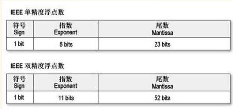
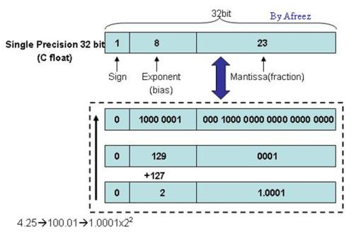

# 浮点数

## IEEE 754 中规定的浮点数的构成

* `指数`相当于小数点的位置.
* `尾数`相当于小数点以下有效数字的部分.
* 最高比特位代表数的符号.
	* `0`: 正数
	* `1`: 负数

### 指数

是`0-255`之间的数, **减去**`127`得到范围`-127-128`.

* `-127`代表了`0`.
* `128`代表了`无限大`.
* `-126-127`代表了小数点的位置.
	* `-126`代表小数点左移动`126`位.
	* `127`代表小数点右移动`127`位.
	
### 尾数

最左边的位表示`1/2`(二进制中的`0.1`), 接下来是`1/4`(二进制中的`0.01`).

### 示例

如上图的`4.25`.

指数计算出来是`129`, 减去`127`为`2`. 向右移动2位.

尾数为`0001`,即`1.0001`. 因为指数需要向右移动2位. 所以为`100.01`. 最后换算:

* `100`为`4`.
* `01`为`1/4`即`0.25`.

再次理解`4.25`在计算机硬盘中存储的实现:

首先把4.25转换成二进制的表达方式,即`100.01`, 在详细点, 变成`1.0001x22`.

* 符号位为`0`.
* 指数为`2`+`127`=`129`.
* 尾数为`1.0001`规格化后为`0001`.小数点前总是整数`1`, 全世界人都知道前面是`1`不是`0`, 所以省略不写了, 即尾数部分不包括整数部分.

## 注意

**最高位的1是要省略的**