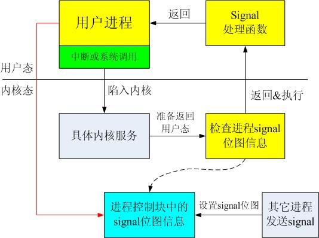

# php 守护进程

### 基本概念

#### 进程

每个进程都有一个父进程,子进程退出,父进程能得到子进程退出的状态.

#### 进程组

每个进程都属于一个进程组,每个进程组都有一个进程组号,该号等于该进程组组长的PID.

进程组是一个或多个进程的集合.每个进程有一个唯一的进程组ID.进程组ID类似于进程ID,它是一个正整数,并可存放在`pid_t`数据类型中.

每个进程组有一个组长进程.组长进程的标识是,其进程组ID等于其进程ID,进程组组长可以创建一个进程组,创建该组中的进程,然后终止,只要在某个进程中有一个进程存在,则该进程就存在,这与其组长进程是否终止无关.从进程组创建开始到其中最后一个进程离开为止的时间区间为进程组的生命周期.某个进程组中的最后一个进程可以终止,也可以参加另一进程组.

#### 会话

当一个用户登陆一次终端时就会产生一个会话,每个会话有一个会话首进程,即创建会话的进程,建立与终端连接的就是这个会话首进程,也被称为控制进程.一个会话可以包括多个进程组,这些进程组可被分为一个前台进程组和一个或多个后台进程组.

前台进程组是指需要与终端进行交互的进程组(只能有一个).当我们键入终端的中断键和退出键时，就会将信号发送到前台进程组中的所有进程. 而后台进程组是指不需要与终端进程交互的进程.

#### 守护进程

守护进程(`Daemon`)是运行在后台的一种特殊进程. 它独立于控制终端并且周期地执行某种任务或等待处理某些发生的事件.

守护进程必须与其运行前的环境隔离开来.这些环境包括:

* 未关闭的文件描述符
* 控制终端
* 会话和进程组
* 工作目录
* 文件创建掩码

这些环境通常是守护进程从执行它的父进程中继承下来的.

守护进程实际上是把一个普通进程按照上述的守护进程的特性改造为守护进程.

##### 特点

**在后台运行**

为避免挂起控制终端将`Deamon`放入后台执行. 方法是在进程中调用`fork`使父进程终止,让`Daemon`在子进程中后台执行.

```php
//是父进程,结束父进程,子进程继续
if ($pid = pcntl_fork()) {
	exit(0);
);
```

**脱离控制终端,登录回话和进程组**

进程属于一个进程组,进程组号(`GID`)就是进程组长的进程号(`PID`).登录会话可以包含多个进程组.这些进程组共享一个控制终端.这个控制终端通常是==创建进程的登录终端==.控制终端,登录会话和进程组通常是从父进程继承下来的.目的就是摆脱他们,使之不受它们的影响.

方法是,在第1点的基础上,调用`setsid()`使进程成为会话组长:

```php
posix_setsid();
```
		
setsid()调用成功后,进程成为新的会话组长和新的进程组长,并与原来的登录会话和进程组脱离.由于会话过程对控制终端的独占性,进程同时与控制终端脱离.

**进制进程重新打开控制终端**

现在,进程已经成为无终端的会话组长.但它可以重新申请打开一个控制终端.可以通过使进程不再成为会话组长来禁止进程重新打开控制终端:

```php	
//结束第一子进程，第二子进程继续（第二子进程不再是会话组长）
if($pid=pcntl_fork()) {
	exit(0);
}
```
		
**关闭打开的文件描述符**

进程从创建它的父进程那里==继承了打开的文件描述符==.如不关闭,将会浪费系统资源,造成进程所在的文件系统无法卸下以及引起无法预料的错误.按如下方法关闭它们:
		
```php
关闭标准输入输出与错误显示
fclose(STDIN);
fclose(STDOUT);
fclose(STDERR);
```

**改变当前工作目录**

进程活动时,其工作目录所在的文件系统不能卸下.一般需要将工作目录改变到根目录.对于需要转储核心,写运行日志的进程将工作目录改变到特定目录如`chdir("/")`.

**重设文件创建掩码**

进程从创建它的父进程那里继承了文件创建掩码.它可能修改守护进程所创建的文件的存取位。为防止这一点，将文件创建掩模清除：

```php
umask(0);
```
**处理`SIGCHLD`信号**

处理`SIGCHLD`信号并不是必须的.但对于某些进程,特别是服务器进程往往在请求到来时生成子进程处理请求.如果父进程不等待子进程结束,子进程将成为僵尸进程(`zombie`)从而占用系统资源.如果父进程等待子进程结束,将增加父进程的负担,影响服务器进程的并发性能.在`Linux`下可以简单地将`SIGCHLD`信号的操作设为`SIG_IGN`.

```php
signal(SIGCHLD,SIG_IGN);
```

这样,内核在子进程结束时不会产生僵尸进程.

#### singal机制



每个进程都会采用一个==进程控制块==对其进行描述,进程控制块中设计了一个`signal`的位图信息,其中的每位与具体的`signal`相对应,这与中断机制保持一致的.

当系统中一个进程 A 通过`signal`系统调用向进程 B 发送`signal`时,设置进程 B 的对应`signal`位图,类似于出发了`signal`对应中断.发送`signal`只是"中断"除法的一个过程,具体执行会在两个阶段发生:

1. `system call`返回.进程 B 由于调用了 `system call`后, 从内核返回用户态时需要检查他用用的 `signal` 位图信息表, 此时是一个执行点.
2. 中断返回. 进程被系统中断打断之后, 系统将 `CPU` 教给进程时, 需要检查即将执行进程所拥有的 `singal` 位图信息表, 测试也是一个执行点.

==signal执行点== 可以理解称从内核态返回用户态时, 在返回时, 如果发现待执行进程存在触发的 `singal`, 那么在离开内核态之后(也就是将 `CPU` 切换到用户模式), 执行用户进程为该 `signal` 绑定的 `signal` 处理函数. `singal` 处理函数是在用户进程上下文中执行的.

当执行 `signal` 处理函数之后, 再返回到用户进程被中断或者 `system call`. 打断的地方.

### 程序设计

#### 信号处理

php 在早期信号执行中使用了 `ticks`.

因为对于 PHP 这样的脚本语言, 一个语句地下可能是 `n` 句==C 语言==执行, 或者 ==n+m==句机器指令, 如果在一条语句的执行过程中运行 php 的 `signal` 函数,可能会引起 php 的崩溃.

所以 `pcntl` 拓展使用 `ticks`, 如果信号来了先做标记, 再等一句完整的 php 语句执行完了, 然后再调用使用 `pcntl_signal` 注册的 php 回调函数, 这样就保证了 php 环境的安全性.

**`pcntl_signal_dispatch`**

捕捉信号

**`pcntl_signal`**

为`signo`指定的信号安装一个新的信号处理器.

```php
bool pcntl_signal(
	int $signo,
	callbac $handler
	[, bool $restart_syscalls = true ]
)
```

* signo: 信号编号
* handler:
	* 信号处理器可以是用户创建的函数或方法的名字.
	* `SIG_IGN`: 忽略信号处理程序.
	* `SIG_DFL`: 默认信号处理程序.
* restart_syscalls：指定当信号到达时系统调用重启是否可用.此参数意为系统调用被信号打断时,系统调用是否从开始处重新开始.

当`handler`为一个对象方法的时候,该对象的引用计数会增加使得它在你改变为其他处理或脚本结束之前是持久存在的.

**`SIGKILL`**

`9`

用来立即结束程序的运行.本信号不能被阻塞、处理和忽略.如果管理员发现某个进程终止不了,可尝试发送这个信号.

**`SIGHUP`**

`1`

本信号在用户终端连接(正常或非正常)结束时发出,通常是在终端的控制进程结束时,通知同一session内的各个作业,这时它们与控制终端不再关联.
  
登录Linux时,系统会分配给登录用户一个终端(Session).在这个终端运行的所有程序,包括前台进程组和后台进程组,一般都属于这个Session.当用户退出Linux登录时,前台进程组和后台有对终端输出的进程将会收到SIGHUP信号.这个信号的默认操作为终止进程,因此前台进程组和后台有终端输出的进程就会中止.不过可以捕获这个信号,比如wget能捕获SIGHUP信号,并忽略它,这样就算退出了Linux登录,wget也能继续下载.
  
此外,==对于与终端脱离关系的守护进程，这个信号用于通知它重新读取配置文件==.

**`SIGTERM`**

`15`

程序结束(terminate)信号,,与SIGKILL不同的是该信号可以被阻塞和处理.通常用来要求程序自己正常退出,==shell命令kill缺省产生这个信号==.如果进程终止不了,我们才会尝试SIGKILL.  

**`SIGINT`**

`2`

程序终止(interrupt)信号,在用户键入INTR字符(通常是Ctrl-C)时发出,用于通知前台进程组终止进程.

**`SIGQUIT`**

`3`

和SIGINT类似,但由QUIT字符(通常是Ctrl-\)来控制.进程在因收到SIGQUIT退出时会产生core文件,在这个意义上类似于一个程序错误信号.

**`SIGUSR1`**

`10`

保留给用户使用的信号.

**`SIGUSR2`**

`12`

同SIGUSR1,保留给用户使用的信号.

#### 进程状态

**`pcntl_waitpid`**

```php
int pcntl_waitpid (
	int $pid,
	int &$status
	[, int $options = 0 ]
)
```
==挂起==当前进程的执行直到参数`pid`指定的进程号的进程退出,或接收到一个信号要求终端当前进程或调用一个信号处理函数.

如果`pid`指定的子进程在此函数调用时已经退出(俗称==僵尸进程==),此函数将立刻返回.

* `pid`
	* `<-1`: 等待任意==进程组ID==等于参数`pid`给定值得==绝对值==的进程.
	* `-1`: 等待任意子进程;与`pcntl_wait`函数行为一致.
	* `0`: 等待任意与==调用进程组ID相同==的子进程.
	* `>0`: 等待进程号等于参数`pid`值得子进程.
* `status`: 函数将会存储状态信息到`status`参数上.`status`参数返回的状态信息可以用以下函数获取具体的值.
	* `bool pcntl_wifexited(int $status)`: 检查状态代码是否代表一个正常的退出.
	* `bool pcntl_wifsignaled(int $status)`: 检查子进程是否是由于某个未捕获的信号退出的.
	* `int pcntl_wexitstatus(int $status)`: 返回一个中断的子进程的返回代码,`pcntl_wifexited()`返回`true`时有效.
	* `int pcntl_wtermsig ( int $status )`: 返回导致子进程中断的信号编号,`pcntl_wifsignaled()`返回`true`时有效.

### 示例

#### 发送信号

`kill -signal pid`

**测试发送信号**

```php
<?php

while(true)
{
	sleep(1);
}

php test.php

```

我们尝试发送信号:

```php
默认信号: kill xxx(进程号)
 
上面的程序返回:
root@250895a360e7:/var/www/html# php test.php
Killed
```

```php
发送信号 SIGKILL
kill -9 xxx(进程号)

上面的程序返回:
root@250895a360e7:/var/www/html# php test.php
Terminated
```

**捕捉信号**

```php
<?php

function sig_handler($signo)
{
    switch($signo) {
        case SIGUSR1:
            echo "SIGUSR1";
            break;
        case SIGUSR2:
            echo "SIGUSR2";
            break;
        case SIGTERM:
            echo "SIGTERM";
            exit();
            break;
        case SIGHUP:
            echo "SIGHUP";
            break;
        default:
        return false;
    }
}

pcntl_signal(SIGTERM, "sig_handler");
pcntl_signal(SIGHUP, "sig_handler");
pcntl_signal(SIGUSR1, "sig_handler");
pcntl_signal(SIGUSR2, "sig_handler");

while(true)
{
    pcntl_signal_dispatch();
    sleep(1);
}
```

开始测试:

```php
发送 SIGUSR1 信号
kill -10 xxx

接收输出:
root@250895a360e7:/var/www/html# php test.php
SIGUSR1

发送 SIGUSR2 信号
kill -12 xxx

接收输出:
root@250895a360e7:/var/www/html# php test.php
SIGUSR1
SIGUSR2

发送 SIGHUP 信号
kill -1 xxx

接收输出
root@250895a360e7:/var/www/html# php test.php
SIGUSR1
SIGUSR2
SIGHUP

发送 SIGTERM 信号
kill -15

接收输出 (中断)
root@250895a360e7:/var/www/html# php test.php
SIGUSR1
SIGUSR2
SIGHUP
SIGTERM
root@250895a360e7:/var/www/html#
```
 
		 