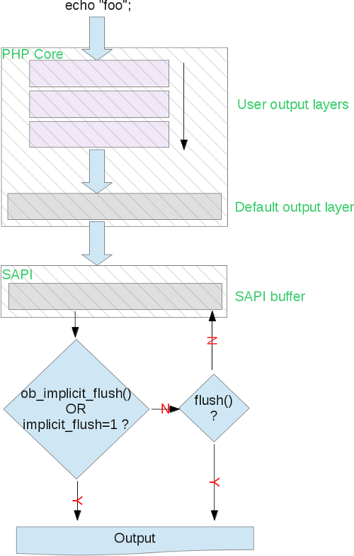

# 深入理解php的输出缓冲区

---

### 什么是输出缓冲区?

PHP的输出流包含很多字节，通常都是程序员要PHP输出的文本，这些文本大多是`echo`语句或者`printf()`函数输出的.

PHP中的输出缓冲区三点内容:

* 任何会输出点什么东西的函数都会用到输出缓冲区,使用的函数(`C`函数)可能会直接将输出写到SAPI缓冲区层,而不需要经过OB层.
* 输出缓冲区层不是唯一用于缓冲输出的层, 它实际上只是很多层中的一个.
* 输出缓冲区层的行为跟你使用的`SAPI`(web或cli)相关, 不同的SAPI可能有不同的行为.



一个软件的很多部分都会先保留信息,然后再把它们传递到下一部分,直到最终把这些信息传递给用户.

`CLI`的`SAPI`, 会将INI配置中的output_buffer选项强制设置为0, 这表示禁用默认PHP输出缓冲区.所以在CLI中,默认情况下你要输出的东西会直接传递到SAPI层,除非你手动调用`ob_()`类函数. 并且在CLI中,`implicit_flush`的值也会被设置为`1`.

`implicit_flush`为`1`, 一旦有任何输出写入到SAPI缓冲区层, 它都会立即刷新(flush，意思是把这些数据写入到更低层，并且缓冲区会被清空). 任何时候当你写入任何数据到`CLI SAP`I中时，CLI SAPI都会立即将这些数据扔到它的下一层去，一般会是标准输出管道.

==echo/print -> php buffer -> tcp buffer -> browser==

### 默认PHP输出缓冲区

如果你使用不同于CLI的SAPI，像PHP-FPM，你会用到下面三个跟缓冲区相关的INI配置选项:

* `output_buffering`
* `implicit_flush`
* `output_handler`

不能在运行时使用ini_set()改这几个选项的值. 这些选项的值会在PHP程序启动的时候，还没有运行任何脚本之前解析，所以也许在运行时可以使用ini_set()改变它们的值，但改变后的值并不会生效，一切都已经太迟了，因为输出缓冲区层已经启动并已激活. 你只能通过编辑php.ini文件或者是在执行PHP程序的时候使用-d选项才能改变它们的值.

#### output_buffering

默认情况下, PHP发行版会在`php.ini`中把`output_buffering`设置为`4096`个字节, 如果你不使用任何php.ini文件(或者也不会在启动PHP的时候使用`-d`选项),它的默认值将为0, 这表示禁用输出缓冲区,

如果你将它的值设置为“`ON`"，那么默认的输出缓冲区的大小将是`16kb`.在web应用环境中对输出的内容使用缓冲区对性能有好处.默认的4k的设置是一个合适的值, 这意味着你可以先写入4096个ASCII字符, 然后再跟下面的SAPI层通信. 并且在web应用环境中, 通过socket一个字节一个字节的传输消息的方式对性能并不好. 更好的方式是把所有内容一次性传输给服务器, 或者至少是一块一块地传输. 层与层之间的数据交换的次数越少, 性能越好. 你应该总是保持输出缓冲区处于可用状, PHP会负责在请求结束后把它们中的内容传输给终端用户, 你不用做任何事情.

#### implicit_flush

上文已经提过. 对于其他的SAPI, `implicit_flush`默认被设置为关闭(`off`), 这是正确的设置, 因为只要有新数据写入就刷新SAPI的做法很可能并非你所希望的. ==对于FastCGI协议，刷新操作(flushing)是每次写入后都发送一个FastCGI数组包(packet)，如果发送数据包之前先把FastCGI的缓冲区写满会更好一些.== 如果你想手动刷新SAPI的缓冲区，使用PHP的`flush()`函数. 如果你想写一次就刷新一次, 你可以设置INI配置中的`implicit_flush`选项, 或者调用一次`ob_implicit_flush()`函数.

#### output_handler 

`output_handler`是一个回调函数, 它可以在缓冲区刷新之前修改缓冲区中的内容.

* `ob_gzhandler`: 使用ext/zlib压缩输出
* `mb_output_handler`: 使用ext/mbstring转换字符编码
* `ob_iconv_handler`: 使用ext/iconv转换字符编码
* `ob_tidyhandler`: 使用ext/tidy整理输出的HTML文本
* `ob_[inflate/deflate]_handler`: 使用ext/http压缩输出
* `ob_etaghandler`: 使用ext/http自动生成HTTP的Etag

缓冲区中的内容会传递给你选择的回调函数(只能用一个)来执行内容转换的工作, 所以如果你想获取PHP传输给web服务器以及用户的内容, 你可以使用输出缓冲区回调. 这里说的“输出”指的是消息头(headers)和消息体(body). HTTP的消息头也是OB层的一部分.

#### 消息头和消息体

当你使用一个输出缓冲区的时候, 你可能想以你希望的方式发送HTTP消息头和内容.任何协议都必须在发送消息体之前发送消息头, 但是如果你使用了输出缓冲区层, 那么PHP会接管这些. 实际上, 任何跟消息头的输出有关的PHP函数(`header()`，`setcookie()`，`session_start()`)都使用了内部的`sapi_header_op()`函数, ==这个函数只会把内容写入到消息头缓冲区中==.然后当你输出内容时, 例如使用`printf()`, 这些内容会写入到输出缓冲区.

当这个输出缓冲区中的内容需要被发送时, ==PHP会先发送消息头, 然后发送消息体==.

### 用户输出缓冲区(`user output buffers`)

```php
启动 php: php -doutput_buffering=32 -dimplicit_flush=1 -S127.0.0.1:8080 -t/var/www

echo str_repeat('a', 31);
sleep(3);
echo 'b';
sleep(3);
echo 'c';
```

启动PHP的时候将默认输出缓冲区的大小设置为32字节, 程序运行后会先向其中写入31个字节, 然后进入睡眠状态. 此时屏幕是空的, 什么都不会输出, 跟预计一样. 2秒之后睡眠结束, 再写入了一个字节, 这个字节填满了缓冲区, 它会立即刷新自身, 把里面的数据传递给SAPI层的缓冲区, 因为我们将implicit_flush设置为1, 以SAPI层的缓冲区也会立即刷新到下一层.字符串`’aaaaaaaaaa{31个a}b’`会出现在屏幕上, 然后脚本再次进入睡眠状态,2秒之后,再输出一个字节,此时缓冲区中有31个空字节,但是PHP脚本已执行完毕,所以包含这1个字节的缓冲区也会立即刷新,从而会在屏幕上输出字符串’c’.

用户输出缓冲区, 它通过调用`ob_start()`创建, 我们可以创建很多这种缓冲区(至到内存耗尽为止), 这些缓冲区组成一个栈结构, 每个新建缓冲区都会堆叠到之前的缓冲区上, 每当它被填满或者溢出, 都会执行刷新操作, 然后==把其中的数据传递给下一个缓冲区==.

```php
ob_start(function($ctc) { static $a = 0; return $a++ . '- ' . $ctc . "\n";}, 10);
ob_start(function($ctc) { return ucfirst($ctc); }, 3);
echo "fo";
sleep(2);
echo 'o';
sleep(2);
echo "barbazz";
sleep(2);
echo "hello";
```

我们假设第一个ob_start创建的用户缓冲区为缓冲区1, 第二个ob_start创建的为缓冲区2. 按照栈的后进先出原则, 任何输出都会先存放到缓冲区2中.

缓冲区2的大小为3个字节, 所以第一个echo语句输出的字符串'fo'(2个字节)会先存放在缓冲区2中, 还差一个字符, 当第二echo语句输出的'o'后, 缓冲区2满了, 所以它会刷新(flush), 在刷新之前会先调用ob_start()的回调函数, 这个函数会将缓冲区内的字符串的首字母转换为大写, 所以输出为'Foo'. 然后它会被保存在缓冲区1中, 缓冲区1的大小为10.

第三个echo语句会输出'barbazz', 它还是会先放到缓冲区2中, 这个字符串有7个字节, 缓冲区2已经溢出了, 所以它会立即刷新, 调用回调函数得到的结果为'Barbazz', 然后被传递到缓冲区1中. 这个时候缓冲区1中保存了'FooBarbazz', 10个字符, 缓冲区1会刷新, 同样的先会调用`ob_start()`的回调函数, 缓冲区1的回调函数会在字符串前面添加行号, 以及在尾部添加一个回车符, 所以输出的第一行是'0- FooBarbazz'.

最后一个echo语句输出了字符串'hello', 它大于3个字符, 所以会触发缓冲区2刷新, 因为此时脚本已执行完毕, 所以也会立即刷新缓冲区1, 最终得到的第二行输出为'1- Hello'.

### 输出缓冲区的内部实现

`C`扩展实现注册一个回调函数来将缓冲区中的字符转换为大写.

```c
#ifdef HAVE_CONFIG_H
#include "config.h"
#endif
#include "php.h"
#include "php_ini.h"
#include "main/php_output.h"
#include "php_myext.h"
static int myext_output_handler(void **nothing, php_output_context *output_context)
{
    char *dup = NULL;
    dup = estrndup(output_context->in.data, output_context->in.used);
    php_strtoupper(dup, output_context->in.used);
    output_context->out.data = dup;
    output_context->out.used = output_context->in.used;
    output_context->out.free = 1;
    return SUCCESS;
}
PHP_RINIT_FUNCTION(myext)
{
    php_output_handler *handler;
    handler = php_output_handler_create_internal("myext handler", sizeof("myext handler") -1, myext_output_handler, /* PHP_OUTPUT_HANDLER_DEFAULT_SIZE */ 128, PHP_OUTPUT_HANDLER_STDFLAGS);
    php_output_handler_start(handler);
    return SUCCESS;
}
zend_module_entry myext_module_entry = {
    STANDARD_MODULE_HEADER,
    "myext",
    NULL, /* Function entries */
    NULL,
    NULL, /* Module shutdown */
    PHP_RINIT(myext), /* Request init */
    NULL, /* Request shutdown */
    NULL, /* Module information */
    "0.1", /* Replace with version number for your extension */
    STANDARD_MODULE_PROPERTIES
};
#ifdef COMPILE_DL_MYEXT
ZEND_GET_MODULE(myext)
#endif
```

### 总结

输出层(`output layer`)就像一个网, 它会把所有从PHP”遗漏“的输出圈起来, 然后把它们保存到一个大小固定的缓冲区中. ==当缓冲区被填满了的时, 里面的内容会刷新(写入)到下一层(如果有的话), 或者是写入到下面的逻辑层:`SAPI`缓冲区==. 开发人员可以控制缓冲区的数量、大小以及在每个缓冲区层可以执行的操作(清除、刷新和删除). 这种方式非常灵活, 它允许库和框架设计者可以完全控制它们自己输出的内容, 并把它们放到一个全局的缓冲区中. 对于输出, 我们需要知道任何输出流的内容和任何HTTP消息头, PHP都会以正确的顺序发送它们.

输出缓冲区也有一个默认缓冲区, 可以通过设置3个INI配置选项来控制它, 它们是为了防止出现过大量的细小的写入操作, 从而造成访问SAPI层过于频繁, 这样网络消耗会很大, 不利于性能. PHP的扩展也可以定义回调函数, 然后在每个缓冲区上执行这个回调, 这种应用已经有很多了, 例如执行数据压缩, HTTP消息头管理以及搞很多其他的事情.

# 备注

---

### ob_flush()和flush()的区别

`ob_flush()` 是把数据从PHP的缓冲中释放出来.

`flush()` 是把不在缓冲中的或者说是被释放出来的数据发送到浏览器.

当缓冲存在的时候, 必须ob_flush()和flush()同时使用.正确使用的顺序是: 先用`ob_flush()`, 后用`flush()`.

### 本机测试

```shell
php 32 -dimplicit_flush=on -S0.0.0.0:8080 -t/var/www

php脚本: 我在ff测试, 需要添加编码输出的头
header( 'Content-type: text/html; charset=utf-8' );
echo str_repeat('a', 31);
sleep(3);
echo 'b';
sleep(3);
echo 'c';
```

```shell
php -doutput_buffering=2 -dimplicit_flush=on -S0.0.0.0:8080 -t/var/www

php程序:
<?php
header( 'Content-type: text/html; charset=utf-8' );
for( $i = 0 ; $i < 10 ; $i++ )
{
    echo 'ac';
    sleep(1);
}
每次刚好输出2个字节, 输出10个ac
```

在`CLI`下测试:

```php
<?php

echo 1;
sleep(1);
echo 2;
sleep(1);
echo 3;
sleep(1);
echo 4;
sleep(1);
echo 5;
sleep(1);
echo 6;

正常每1秒输出1个数字
[root@iZ944l0t308Z ~]# php test.php
123

每2秒输出2个数字
[root@iZ944l0t308Z ~]# php -doutput_buffering=2 test.php
1234
```

