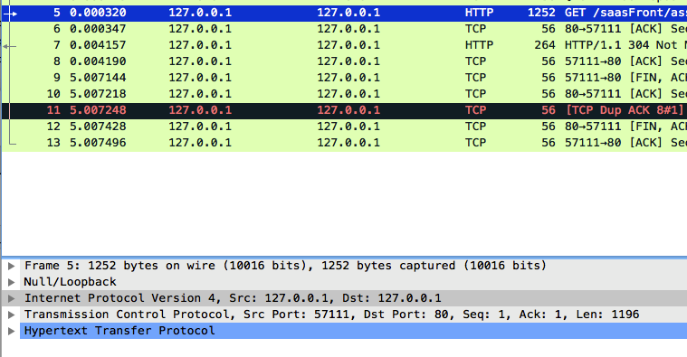

# tcpdump

---

### 默认启动

		tcpdump
		
### 监视指定网络接口的数据包

		tcpdump -i eth1
		
如果不指定网卡,默认tcpdump只会监视第一个网络接口,一般是eth0,下面的例子都没有指定网络接.

### 监视指定主机的数据包
	
		打印所有进入或离开sundown的数据包
		tcpdump host sundown
		
		也可以指定ip,例如截获所有210.27.48.1 的主机收到的和发出的所有的数据包
		tcpdump host 210.27.48.1 
		
		截获主机210.27.48.1 和主机210.27.48.2 或210.27.48.3的通信
		tcpdump host 210.27.48.1 and \ (210.27.48.2 or 210.27.48.3 \) 
		
		截获主机hostname发送的所有数据
		tcpdump -i eth0 src host hostname
		
		监视所有送到主机hostname的数据包
		tcpdump -i eth0 dst host hostname
		
### 示例

访问 `http://127.0.0.1/saasFront/assets/css/appSaas.css`

		
#### 握手

TCP/IP通过三次握手建立一个连接.

SYN，SYN/ACK，ACK

我们可看见前三条链接(1,2,3)是 握手链接

#### 挥手

9,10,12,13 可以看到是挥手的链接

#### 一个链接的具体分析

* Frame: 物理层
* Internet: 网络层
* Transimission: 传输层
* Hypertext: 应用层
* Null/Loopback: 数据链路层
