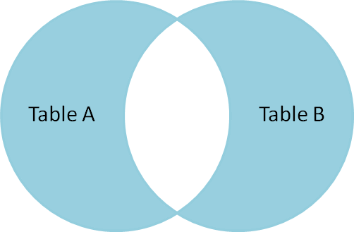

#Mysql Join

###数据准备

---

Table A 

		id name
		-------
		1 Pirate
		2 Monkey
		3 Ninja
		4 Spaghetti
		
 Table B
 
 		id name
 		-------
 		1 Rutabaga
 		2 Pirate
 		3 Darth Vader
 		4 Ninja
 

**INNER JOIN**
 
---

Inner join produces only the set of records that match `in both` Table A and Table B.

		SELECT * FROM TableA INNER JOIN TableB ON TableA.name = TableB.name
		
		id name			id name
		-------			-------
		1 Pirate		2 Pirate
		3 Ninja			4 Ninja

**FULL OUTER JOIN**

---

Full outer join produces the set of all records in Table A and Table B, with matching records from `both sides where available`. If there is no match, the missing side will contain null.

		SELECT * FROM TableA FULL OUTER JOIN TableB ON TableA.name = TableB.name
		
		id name			id name
		-------			-------
		1 Pirate		2 Pirate
		2 Monkey 		null null
		3 Ninja 		4 Ninja
		4 Spaghetti 	null null
		null null 		1 Rutabaga
		null null 		3 Darth Vader

**LEFT OUTER JOIN**

---

Left outer join produces a complete set of records from Table A, with the matching records (where available) in Table B. If there is no match, the right side will contain null.
		
		SELECT * FROM TableA LEFT OUTER JOIN TableB ON TableA.name = TableB.name
	
		id name			id name
		-------			-------
		1 Pirate 		2 Pirate 
		2 Monkey 		null null 
		3 Ninja 		4 Ninja 
		4 Spaghetti 	null null		

		SELECT * FROM TableA LEFT OUTER JOIN TableB ON TableA.name = TableB.name WHERE TableB.id IS null
		

**LEFT OUTER JOIN**

---

To produce the set of records only in Table A, but not in Table B, we perform the same left outer join, then `exclude the records we don't want from the right side via a where clause`.
	
		SELECT * FROM TableA LEFT OUTER JOIN TableB ON TableA.name = TableB.name WHERE TableB.id IS null
		
		id name			id name
		-------			-------
		2 Monkey 		null null
		4 Spaghetti 	null null

		

**FULL OUTER JOIN**

---

To produce the set of records unique to Table A and Table B, we perform the same full outer join, then `exclude the records we don't want from both sides via a where clause`.

		SELECT * FROM TableA FULL OUTER JOIN TableB ON TableA.name = TableB.name WHERE TableA.id IS null OR TableB.id IS null

		id name			id name
		-------			-------
		2 Monkey 		null null 
		4 Spaghetti 	null null 
		null null 		1 Rutabaga 
		null null 		3 Darth Vader

**Cross Join**

This joins "everything to everything", resulting in 4 x 4 = 16 rows, `far more than we had in the original sets`. If you do the math, you can see why this is a very dangerous join to run against large tables.

		SELECT * FROM TableA CROSS JOIN TableB

				