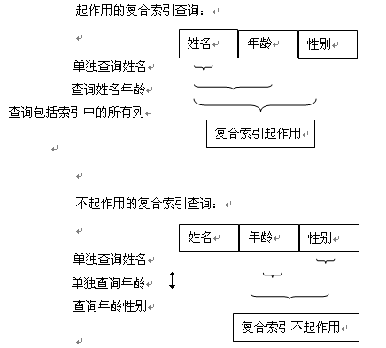
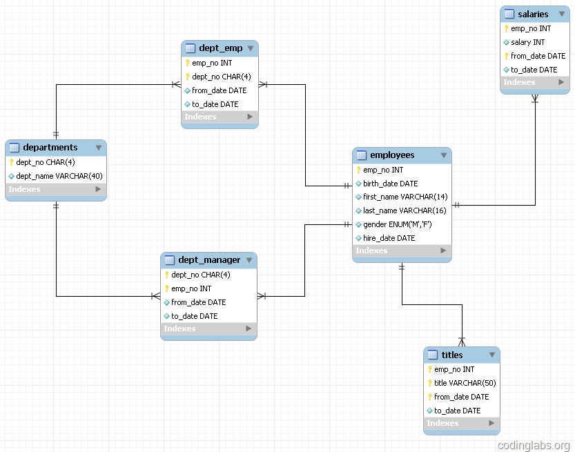

# Mysql复合索引

---

### 复合索引使用条件

**什么是复合索引**

`两个`或`更多个`列上的索引被称作复合索引.利用索引中的附加列,您可以缩小搜索的范围,但使用一个具有两列的索引不同于使用两个单独的索引.

		复合索引的结构与电话簿类似,人名由姓和名构成,电话簿首先按姓氏对进行排序,然后按名字对有相同姓氏的人进行排序.如果您知道姓,电话簿将非常有用;如果您知道姓和名,电话簿则更为有用,但如果您只知道名不姓,电话簿将没有用处.
		
所以说创建复合索引时,`应该仔细考虑列的顺序`.对索引中的所有列执行搜索或仅对前几列执行搜索时,复合索引非常有用;仅对后面的任意列执行搜索时,复合索引则没有用处.

如:建立 姓名、年龄、性别的复合索引.

**复合索引的建立原则**

如果您很可能仅对一个列多次执行搜索,则该列应该是复合索引中的第一列.如果您很可能对一个两列索引中的两个列执行单独的搜索,则应该创建另一个仅包含第二列的索引.
如上图所示,如果查询中需要对年龄和性别做查询,则应当再新建一个包含年龄和性别的复合索引.

包含多个列的主键始终会自动以复合索引的形式创建索引,其列的顺序是它们在表定义中出现的顺序,而不是在主键定义中指定的顺序.在考虑将来通过主键执行的搜索,确定哪一列应该排在最前面.

**索引不要包含太多的列**

请注意,创建复合索引应当包含少数几个列,并且这些列经常在select查询里使用.在复合索引里包含太多的列不仅不会给带来太多好处.而且由于使用相当多的内存来存储复合索引的列的值,其后果是内存溢出和性能降低.
         
**复合索引对排序的优化**

`复合索引只对和索引中排序相同或相反的order by语句优化`.

在创建复合索引时,每一列都定义了升序或者是降序.如定义一个复合索引:

		CREATE INDEX idx_example ON table1 (col1 ASC, col2 DESC, col3 ASC)  
 
其中有三列分别是:col1 升序,col2 降序, col3 升序.现在如果我们执行两个查询

**和索引顺序完全相同或相反可以用到索引**

1. 和索引顺序相同
		
		Select col1, col2, col3 from table1 order by col1 ASC, col2 DESC, col3 ASC
  		
  		
2. 和索引顺序相反 
		
		Select col1, col2, col3 from table1 order by col1 DESC, col2 ASC, col3 DESC
 
查询1，2都可以别复合索引优化.

**和索引顺序呢完全不同不能使用到索引**

如果查询为:

		Select col1, col2, col3 from table1 order by col1 ASC, col2 ASC, col3 ASC
  		
  		`排序结果和索引完全不同时,此时的查询不会被复合索引优化`.

**查询优化器在在where查询中的作用**

如果一个多列索引存在于列Col1和Col2上,则以下语句:

		Select * from table where col1=val1 AND col2=val2
		
查询优化器会试图通过决定哪个索引将找到更少的行.之后用得到的索引去取值.

1. 如果存在一个多列索引,任何最左面的索引前缀能被优化器使用.所以联合索引的顺序不同,影响索引的选择,`尽量将值少的放在前面`.

	如: 一个多列索引为 (col1 ，col2， col3)
    那么在索引在列 (col1) 、(col1 col2) 、(col1 col2 col3) 的搜索会有作用。

 
		SELECT * FROM tb WHERE  col1 = val1  
		SELECT * FROM tb WHERE  col1 = val1 and col2 = val2  
		SELECT * FROM tb WHERE  col1 = val1 and col2 = val2  AND col3 = val3  
 

2. 如果列不构成索引的最左面前缀，则建立的索引将不起作用。
 
		SELECT * FROM  tb WHERE  col3 = val3  
		SELECT * FROM  tb  WHERE  col2 = val2  
		SELECT * FROM  tb  WHERE  col2 = val2  and  col3=val3  
 
3. 如果一个`Like`语句的查询条件`不以通配符起始则使用索引`.

			%车 或 %车%  不使用索引.
    		车% 使用索引.(以通配符起始则使用索引)
    		
**索引的缺点**

1. 占用磁盘空间。
2. 增加了插入和删除的操作时间.一个表拥有的索引越多,插入和删除的速度越慢.如要求快速录入的系统不宜建过多索引.

### 一些常见的索引限制问题

--

#### 使用不等于操作符(<>, !=)

下面这种情况,即使在列dept_id有一个索引,查询语句仍然执行一次全表扫描

		select * from dept where staff_num <> 1000;
		
**解决方案**

通过把用`or`语法替代不等号进行查询,就可以使用索引,以避免全表扫描:上面的语句改成下面这样的,就可以使用索引了.

		select * from dept WHERE staff_num < 1000 or staff_num > 1000;  
 

#### 使用 is null 或 is not null

使用`is null`或`is nuo null`也会限制索引的使用,因为数据库并没有定义null值.如果被索引的列中有很多null,就不会使用这个索引.在sql语句中使用null会造成很多麻烦。
解决这个问题的办法就是:建表时把需要索引的列定义为非空(not null)

`一般会默认null为同一个值,这样这个索引的筛选价值就降低了,影响优化器的判断.当然也可以调整参数,使得null被认为是不同的值`.

“NULL columns require additional space in the row to record whether their values are NULL. For MyISAM tables, each NULL column takes one bit extra, rounded up to the nearest byte.”

Mysql难以优化引用可空列查询,它会使索引、索引统计和值更加复杂.可空列需要更多的存储空间,还需要mysql内部进行特殊处理.可空列被索引后,每条记录都需要一个额外的字节,还能导致MYisam中固定大小的索引变成可变大小的索引.

#### 使用函数

**不能使用索引**

如果没有使用基于函数的索引,那么where子句中对存在索引的列使用函数时,会使优化器忽略掉这些索引.下面的查询就不会使用索引:

		select * from staff where trunc(birthdate) = '01-MAY-82';  

**可以使用索引**

但是把函数应用在条件上,索引是可以生效的,把上面的语句改成下面的语句,就可以通过索引进行查找.

		select * from staff where birthdate < (to_date('01-MAY-82') + 0.9999);  
 

#### 比较不匹配的数据类型

比较不匹配的数据类型也是难于发现的性能问题之一.

下面的例子中,dept_id是一个varchar2型的字段,在这个字段上有索引,但是下面的语句会执行全表扫描.
 
		select * from dept where dept_id = 900198;  
 
这是因为会自动把where子句转换成to_number(dept_id)=900198,就是3所说的情况,这样就限制了索引的使用.
 
		select * from dept where dept_id = '900198';  
 
### MySQL里建立索引应该考虑数据库引擎的类型

比方说有一个文章表,我们要实现某个类别下按时间倒序列表显示功能:

SELECT * FROM articles WHERE category_id = ... ORDER BY created DESC LIMIT ...

这样的查询很常见,基本上不管什么应用里都能找出一大把类似的SQL来,学院派的读者看到上面的SQL,可能会说SELECT *不好,应该仅仅查询需要的字段,那我们就索性彻底点,把SQL改成如下的形式:

SELECT id FROM articles WHERE category_id = ... ORDER BY created DESC LIMIT ...
 

我们假设这里的id是主键,至于文章的具体内容,可以都保存到memcached之类的键值类型的缓存里,如此一来,学院派的读者们应该挑不出什么毛病来了,下面我们就按这条SQL来考虑如何建立索引:

不考虑数据分布之类的特殊情况,任何一个合格的WEB开发人员都知道类似这样的SQL,应该建立一个"category_id, created"复合索引m但这是最佳答案不?不见得,现在是回头看看标题的时候了:MySQL里建立索引应该考虑数据库引擎的类型!

**InnoDB**

如果我们的数据库引擎是InnoDB,那么建立"category_id,created"复合索引是最佳答案.让我们看看InnoDB的索引结构,在InnoDB里,索引结构有一个特殊的地方:`非主键索引在其BTree的叶节点上会额外保存对应主键的值`,这样做一个最直接的好处就是Covering Index,`不用再到数据文件里去取id的值`,可以直接在索引里得到它.

**MyISAM**

如果我们的数据库引擎是MyISAM,那么建立"category_id, created"复合索引就不是最佳答案.因为MyISAM的索引结构里,非主键索引并没有额外保存对应主键的值,此时如果想利用上Covering Index,应该建立"category_id, created, id"复合索引.

**Cardinality**

Cardinality表示唯一值的个数,一般来说,如果唯一值个数在总行数中`所占比例小于20%`的话,则可以认为Cardinality太小,此时索引除了拖慢insert/update/delete的速度之外,不会对select产生太大作用;

**Selectivity**

索引的选择性(Selectivity) = 重复的索引值(也叫基数，Cardinality)与表记录数（#T）的比值.

		Index Selectivity = Cardinality / #T

显然选择性的取值范围为(0, 1],选择性越高的索引价值越大,这是由B+Tree的性质决定的.

		SELECT count(DISTINCT(title))/count(*) AS Selectivity FROM employees.titles;
		
		+
		-------------+
		| Selectivity |
		+
		-------------+
		|      0.0000 |
		+
		-------------+
		
		title的选择性不足0.0001(精确值为0.00001579),所以实在没有什么必要为其单独建索引

**字符集对索引的影响**

还有一个细节是建立索引的时候未考虑字符集的影响,比如说username字段,如果仅仅允许英文,下划线之类的符号,那么就不要用gbk,utf-8之类的字符集,而应该使用latin1或者ascii这种简单的字符集,索引文件会小很多,速度自然就会快很多.

### 索引案例分析

**示例数据库**

以emplyees.titles表为例,drop掉辅助索引,只留下主键索引.

主键索引为:`<emp_no, title, from_date>`

**1.全列匹配**

		EXPLAIN SELECT * FROM employees.titles WHERE emp_no='10001' AND title='Senior Engineer' AND from_date='1986-06-26';
		
		----+-------------+--------+-------+---------------+---------+---------+-------------------+------+-------+
		| id | select_type | table  | type  | possible_keys | key     | key_len | ref               | rows | Extra |
		+
		----+-------------+--------+-------+---------------+---------+---------+-------------------+------+-------+
		|  1 | SIMPLE      | titles | const | PRIMARY       | PRIMARY | 59      | const,const,const |    1 |       |
		+
		----+-------------+--------+-------+---------------+---------+---------+-------------------+------+-------+

当按照索引中所有列进行精确匹配(这里精确匹配指“=”或“IN”匹配)时，索引可以被用到.

理论上索引对顺序是敏感的，但是由于MySQL的查询优化器会自动调整where子句的条件顺序以使用适合的索引，例如我们将where中的条件顺序颠倒:

		EXPLAIN SELECT * FROM employees.titles WHERE from_date='1986-06-26' AND emp_no='10001' AND title='Senior Engineer';
		
		+
		----+-------------+--------+-------+---------------+---------+---------+-------------------+------+-------+
		| id | select_type | table  | type  | possible_keys | key     | key_len | ref               | rows | Extra |
		+
		----+-------------+--------+-------+---------------+---------+---------+-------------------+------+-------+
		|  1 | SIMPLE      | titles | const | PRIMARY       | PRIMARY | 59      | const,const,const |    1 |       |
		+
		----+-------------+--------+-------+---------------+---------+---------+-------------------+------+-------+
		
效果是一样的.

**2.最左前缀匹配**

		EXPLAIN SELECT * FROM employees.titles WHERE emp_no='10001';
		
		+
		----+-------------+--------+------+---------------+---------+---------+-------+------+-------+
		| id | select_type | table  | type | possible_keys | key     | key_len | ref   | rows | Extra |
		+
		----+-------------+--------+------+---------------+---------+---------+-------+------+-------+
		|  1 | SIMPLE      | titles | ref  | PRIMARY       | PRIMARY | 4       | const |    1 |       |
		+
		----+-------------+--------+------+---------------+---------+---------+-------+------+-------+
		
当查询条件精确匹配索引的左边连续一个或几个列时,如<emp_no>或<emp_no, title>,所以`可以被用到`,但是`只能用到一部分`,即`条件所组成的最左前缀`.
上面的查询从分析结果看用到了PRIMARY索引,但是`key_len为4`,说明只用到了索引的第一列前缀.

**3.查询条件用到了索引中列的精确匹配,但是中间某个条件未提供.**
		
		EXPLAIN SELECT * FROM employees.titles WHERE emp_no='10001' AND from_date='1986-06-26';
		
		+
		----+-------------+--------+------+---------------+---------+---------+-------+------+-------------+
		| id | select_type | table  | type | possible_keys | key     | key_len | ref   | rows | Extra       |
		+
		----+-------------+--------+------+---------------+---------+---------+-------+------+-------------+
		|  1 | SIMPLE      | titles | ref  | PRIMARY       | PRIMARY | 4       | const |    1 | Using where |
		----+-------------+--------+------+---------------+---------+---------+-------+------+-------------+
		
此时索引使用情况和情况二相同,因为title未提供,所以查询只用到了索引的第一列,而后面的from_date虽然也在索引中,但是`由于title不存在而无法和左前缀连接`,因此需要对结果进行扫描过滤from_date(这里由于emp_no唯一,所以不存在扫描).如果想让from_date也使用索引而不是where过滤,可以`增加一个辅助索引<emp_no, from_date>`,此时上面的查询会使用这个索引.

解决方案:使用一种称之为"隔离列"的优化方法,将emp_no与from_date之间的"坑"填上.

* 首先我们看下title一共有几种不同的值:
	
		SELECT DISTINCT(title) FROM employees.titles;
		+
		--------------------+
		| title              |
		+
		--------------------+
		| Senior Engineer    |
		| Staff              |
		| Engineer           |
		| Senior Staff       |
		| Assistant Engineer |
		| Technique Leader   |
		| Manager            |
		+
		--------------------+

* 只有7种.在这种成为"坑"的列值比较少的情况下,可以考虑用"IN"来填补这个"坑"从而形成最左前缀:

		EXPLAIN SELECT * FROM employees.titles
		WHERE emp_no='10001'
		AND title IN ('Senior Engineer', 'Staff', 'Engineer', 'Senior Staff', 'Assistant Engineer', 'Technique Leader', 'Manager')
		AND from_date='1986-06-26';
		+
		----+-------------+--------+-------+---------------+---------+---------+------+------+-------------+
		| id | select_type | table  | type  | possible_keys | key     | key_len | ref  | rows | Extra       |
		+
		----+-------------+--------+-------+---------------+---------+---------+------+------+-------------+
		|  1 | SIMPLE      | titles | range | PRIMARY       | PRIMARY | 59      | NULL |    7 | Using where |
		+
		----+-------------+--------+-------+---------------+---------+---------+------+------+-------------+

* 这次key_len为59,说明索引被用全了,但是从type和rows看出IN实际上执行了一个range查询,这里检查了7个key.看下两种查询的性能比较:

		SHOW PROFILES;
		+
		----------+------------+-------------------------------------------------------------------------------+
		| Query_ID | Duration   | Query                                                                         |
		+
		----------+------------+-------------------------------------------------------------------------------+
		|       10 | 0.00058000 | SELECT * FROM employees.titles WHERE emp_no='10001' AND from_date='1986-06-26'|
		|       11 | 0.00052500 | SELECT * FROM employees.titles WHERE emp_no='10001' AND title IN ...          |
		+
		----------+------------+-------------------------------------------------------------------------------+
		
* "填坑"后性能提升了一点.如果经过emp_no筛选后余下很多数据,则后者性能优势会更加明显.当然,如果title的值很多,用填坑就不合适了,必须建立辅助索引.

**4.查询条件没有指定索引第一列**	

		EXPLAIN SELECT * FROM employees.titles WHERE from_date='1986-06-26';
		+
		----+-------------+--------+------+---------------+------+---------+------+--------+-------------+
		| id | select_type | table  | type | possible_keys | key  | key_len | ref  | rows   | Extra       |
		+
		----+-------------+--------+------+---------------+------+---------+------+--------+-------------+
		|  1 | SIMPLE      | titles | ALL  | NULL          | NULL | NULL    | NULL | 443308 | Using where |
		+
		----+-------------+--------+------+---------------+------+---------+------+--------+-------------+

由于不是最左前缀,索引这样的查询显然用不到索引.

**5.匹配某列的前缀字符串**

		EXPLAIN SELECT * FROM employees.titles WHERE emp_no='10001' AND title LIKE 'Senior%
		+
		----+-------------+--------+-------+---------------+---------+---------+------+------+-------------+
		| id | select_type | table  | type  | possible_keys | key     | key_len | ref  | rows | Extra       |
		+
		----+-------------+--------+-------+---------------+---------+---------+------+------+-------------+
		|  1 | SIMPLE      | titles | range | PRIMARY       | PRIMARY | 56      | NULL |    1 | Using where |
		+
		----+-------------+--------+-------+---------------+---------+---------+------+------+-------------+

此时可以用到索引(如果通配符%不出现在开头，则可以用到索引，但根据具体情况不同可能只会用其中一个前缀)

**6.范围查询**

		EXPLAIN SELECT * FROM employees.titles WHERE emp_no < '10010' and title='Senior Engineer
		+
		----+-------------+--------+-------+---------------+---------+---------+------+------+-------------+
		| id | select_type | table  | type  | possible_keys | key     | key_len | ref  | rows | Extra       |
		+
		----+-------------+--------+-------+---------------+---------+---------+------+------+-------------+
		|  1 | SIMPLE      | titles | range | PRIMARY       | PRIMARY | 4       | NULL |   16 | Using where |
		+
		----+-------------+--------+-------+---------------+---------+---------+------+------+-------------+
		
范围列可以用到索引(必须是最左前缀),但是`范围列后面的列无法用到索引`.同时,`索引最多用于一个范围列`,因此`如果查询条件中有两个范围列则无法全用到索引`.

		EXPLAIN SELECT * FROM employees.titles
		WHERE emp_no < 10010'
		AND title='Senior Engineer'
		AND from_date BETWEEN '1986-01-01' AND '1986-12-31';
		
		+
		----+-------------+--------+-------+---------------+---------+---------+------+------+-------------+
		| id | select_type | table  | type  | possible_keys | key     | key_len | ref  | rows | Extra       |
		+
		----+-------------+--------+-------+---------------+---------+---------+------+------+-------------+
		|  1 | SIMPLE      | titles | range | PRIMARY       | PRIMARY | 4       | NULL |   16 | Using where |
		+
		----+-------------+--------+-------+---------------+---------+---------+------+------+-------------+
		
可以看到索引对第二个范围索引无能为力

**explain无法区分范围索引和多值匹配**

用了"between"并不意味着就是范围查询:

		EXPLAIN SELECT * FROM employees.titles
		WHERE emp_no BETWEEN '10001' AND '10010'
		AND title='Senior Engineer'
		AND from_date BETWEEN '1986-01-01' AND '1986-12-31';
		
		+
		----+-------------+--------+-------+---------------+---------+---------+------+------+-------------+
		| id | select_type | table  | type  | possible_keys | key     | key_len | ref  | rows | Extra       |
		+
		----+-------------+--------+-------+---------------+---------+---------+------+------+-------------+
		|  1 | SIMPLE      | titles | range | PRIMARY       | PRIMARY | 59      | NULL |   16 | Using where |
		+
		----+-------------+--------+-------+---------------+---------+---------+------+------+-------------+
		
看起来是用了两个范围查询,但作用于emp_no上的"BETWEEN"际上相当于"IN",也就是说emp_no实际是多值精确匹配.可以看到这个查询用到了索引全部三个列.

**7.查询条件中含有函数或表达式**

如果查询条件中含有函数或表达式,则MySQL`不会为这列使用索引`.

		EXPLAIN SELECT * FROM employees.titles WHERE emp_no='10001' AND left(title, 6)='Senior';
		+
		----+-------------+--------+------+---------------+---------+---------+-------+------+-------------+
		| id | select_type | table  | type | possible_keys | key     | key_len | ref   | rows | Extra       |
		+
		----+-------------+--------+------+---------------+---------+---------+-------+------+-------------+
		|  1 | SIMPLE      | titles | ref  | PRIMARY       | PRIMARY | 4       | const |    1 | Using where |
		+
		----+-------------+--------+------+---------------+---------+---------+-------+------+-------------+
		
这个查询和情况5中功能相同,但是由于使用了函数left,则无法为title列应用索引,而情况五中用LIKE则可以.

		EXPLAIN SELECT * FROM employees.titles WHERE emp_no - 1='10000';
		
		+
		----+-------------+--------+------+---------------+------+---------+------+--------+-------------+
		| id | select_type | table  | type | possible_keys | key  | key_len | ref  | rows   | Extra       |
		+
		----+-------------+--------+------+---------------+------+---------+------+--------+-------------+
		|  1 | SIMPLE      | titles | ALL  | NULL          | NULL | NULL    | NULL | 443308 | Using where |
		+
		----+-------------+--------+------+---------------+------+---------+------+--------+-------------+
		
这个查询等价于查询emp_no为10001的函数,但是由于查询条件是一个表达式,MySQL无法为其使用索引.

**8.前缀索引**

就是用列的前缀代替整个列作为索引key.当前缀长度合适时，可以做到既使得前缀索引的选择性接近全列索引,同时因为索引key变短而减少了索引文件的大小和维护开销.

案例分析:

employees表只有一个索引<emp_no>,那么如果我们想按名字搜索一个人,就只能全表扫描了:

		EXPLAIN SELECT * FROM employees.employees WHERE first_name='Eric' AND last_name='Anido';
		
		+
		----+-------------+-----------+------+---------------+------+---------+------+--------+-------------+
		| id | select_type | table     | type | possible_keys | key  | key_len | ref  | rows   | Extra       |
		+
		----+-------------+-----------+------+---------------+------+---------+------+--------+-------------+
		|  1 | SIMPLE      | employees | ALL  | NULL          | NULL | NULL    | NULL | 300024 | Using where |
		+
		----+-------------+-----------+------+---------------+------+---------+------+--------+-------------+
		
2种选择建立索引<first_name>或<first_name, last_name>,查看2种索引的选择性:

		ELECT count(DISTINCT(first_name))/count(*) AS Selectivity FROM employees.employees;
		+
		-------------+
		| Selectivity |
		+
		-------------+
		|      0.0042 |
		+
		-------------+
		
		SELECT count(DISTINCT(concat(first_name, last_name)))/count(*) AS Selectivity FROM employees.employees;
		+
		-------------+
		| Selectivity |
		+
		-------------+
		|      0.9313 |
		+
		-------------+

<first_name>显然选择性太低,<first_name, last_name>选择性很好,但是first_name和last_name加起来长度为30.`可以考虑用first_name和last_name的前几个字符建立索引，例如<first_name, left(last_name, 3)>`;

		SELECT count(DISTINCT(concat(first_name, left(last_name, 3))))/count(*) AS Selectivity FROM employees.employees;
		+
		-------------+
		| Selectivity |
		+
		-------------+
		|      0.7879 |
		+
		-------------+
		
选择性还不错,但离0.9313还是有点距离,那么把last_name前缀加到4:

		SELECT count(DISTINCT(concat(first_name, left(last_name, 4))))/count(*) AS Selectivity FROM employees.employees;
		+
		-------------+
		| Selectivity |
		+
		-------------+
		|      0.9007 |
		+
		-------------+
		
这时选择性已经很理想了,而这个索引的长度只有18,比<first_name, last_name>短了接近一半,建立索引:

		ALTER TABLE employees.employees
		ADD INDEX `first_name_last_name4` (first_name, last_name(4));
		
此时再执行一遍按名字查询,比较分析一下与建索引前的结果:

		SHOW PROFILES;
		+
		----------+------------+---------------------------------------------------------------------------------+
		| Query_ID | Duration   | Query                                                                           |
		+
		----------+------------+---------------------------------------------------------------------------------+
		|       87 | 0.11941700 | SELECT * FROM employees.employees WHERE first_name='Eric' AND last_name='Anido' |
		|       90 | 0.00092400 | SELECT * FROM employees.employees WHERE first_name='Eric' AND last_name='Anido' |
		+
		----------+------------+---------------------------------------------------------------------------------+
		
性能的提升是显著的,查询速度提高了120多倍.

前缀索引兼顾索引大小和查询速度,但是其缺点是`不能用于ORDER BY和GROUP BY操作`,也`不能用于Covering index(即当索引本身包含查询所需全部数据时,不再访问数据文件本身)`.

