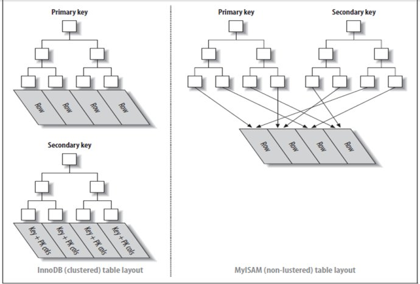

# 索引

### 基础知识

---

**索引**

索引是帮助Mysql高效获取数据的`数据结构`.

		相当于一本书的目录,通过目录就知道要的资料在哪里,不用一页一页查阅找出需要的资料
		
**唯一索引(unique index)**

强调唯一,就是索引值必须唯一.

创建索引:

		create unique index 索引名 on 表名(列名);
		alter table 表名 add unique index 索引名 (列名);
		
删除索引:

		drop index 索引名 on 表名;
		alter table 表名 drop index 索引名;
		
**主键(primary key)**

主键就是唯一索引的一种,主键要求建表时指定,一般用auto_increment列,关键字是primary key

主键创建:

		creat table test2 (id int not null primary key auto_increment);
		
**全文索引**

* InnoDB `不支持`
* MyISAM `支持`
* 一般在 `CHAR`,`VARCHAR` 或 `TEXT` 列上创建

		Create table 表名( 
    		id int not null primary key anto_increment,
   		 	title varchar(100),FULLTEXT(title)
		)type=MyISAM;
		
**单列索引与多列索引**

索引可以是单列索引也可以是多列索引(也叫复合索引)

		create table test3 (
   		 	id int not null primary key auto_increment,
    		uname char(8) not null default '',
   			password char(12) not null,
    		INDEX(uname,password)
		)type=MyISAM;

INDEX(a, b, c)可以当做a或(a, b)的索引来使用,但不能当作b、c或(b,c)的索引来使用.这是一个`最左前缀的`优化方法.

**聚簇索引**

一种索引,该索引中`键值的逻辑顺序决定了表中相应行的物理顺序`.`聚簇索引确定表中数据的物理顺序`.

* MyISAM 没有聚簇索引
* InnoDB 有,(主键就是聚簇索引)

**查看表的索引**

`Show index from 表名`

* Table : 表名
* Key_name : 什么类型的索引
* Column_name: 索引列的字段名
* Cardinality: 索引基数,很关键的一个参数,平均数值组=索引基数/表总数据行,平均数值组越接近1就越有可能利用索引
* Index_type: 如果索引是全文索引,则是fulltext,这里是b+tree索引,b+tree也是这篇文章研究的重点之一

**MyISAM和InnoDB索引区别**

### B+Tree 和 B-Tree

稍后完善

### MyISAM索引实现

MyISAM引擎使用`B+Tree`作为索引结构,叶节点的data域存放的是`数据记录的地址`(注意是`地址`而非`数据`).

**主键索引**

`MyISAM的索引文件仅仅保存数据记录的地址`.

**辅助索引**

在MyISAM中,`主索引和辅助索引(Secondary key)在结构上没有任何区别`,只是主索引要求key是唯一的,而辅助索引的key可以重复.

**总结**

MyISAM中索引检索的算法为首先按照B+Tree搜索算法搜索索引,如果指定的Key存在,则取出其data域的值,然后以data域的值为地址,读取相应数据记录.

MyISAM的索引方式也叫做`"非聚集"`的.

### InnoDB索引实现

InnoDB也使用`B+Tree`作为索引结构,但具体实现方式却与MyISAM截然不同.

**InnoDB的数据文件本身就是索引文件**

* MyISAM`索引文件`和`数据文件`是`分离的`,`索引文件仅保存数据记录的地址`.
* InnoDB中,`表数据文件本身就是按B+Tree组织的一个索引结构`,这棵树的`叶节点data域保存了完整的数据记录`.

叶节点包含了完整的数据记录.这种索引叫做`聚集索引`.

因为InnoDB的数据文件本身要按主键聚集,所以InnoDB要求表必须有主键(MyISAM可以没有),如果没有显式指定,则MySQL系统会自动选择一个可以唯一标识数据记录的列作为主键,如果不存在这种列,则MySQL自动为InnoDB表生成一个隐含字段作为主键,这个字段长度为6个字节,类型为长整形.

**MyISAM索引的不同是InnoDB的辅助索引data域存储相应记录主键的值而不是地址**

InnoDB的所有辅助索引都`引用主键作为data域`.

**聚集索引优点和缺点**

聚集索引这种实现方式使得按主键的搜索十分高效,但是辅助索引搜索需要检索两遍索引:

1. 首先检索辅助索引获得主键
2. 然后用主键到主索引中检索获得记录

**InnoDB不建议使用过长的字段作为主键**

所有辅助索引都引用主索引,过长的主索引会令辅助索引变得过大.

**非单调的字段作为主键在InnoDB中的缺点**

因为InnoDB数据文件本身是一颗B+Tree,非单调的主键会造成在插入新记录时数据文件为了维持B+Tree的特性而频繁的分裂调整,十分低效,而使用自增字段作为主键则是一个很好的选择.

### InnoDB的主键选择与插入优化

在使用InnoDB存储引擎时,如果没有特别的需要,请永远使用一个与业务无关的自增字段作为主键.

InnoDB使用聚集索引,数据记录本身被存于主索引(一颗B+Tree)的叶子节点上.这就要求同一个叶子节点内(大小为一个内存页或磁盘页)的各条数据记录按主键顺序存放,因此每当有一条新的记录插入时,MySQL会根据其主键将其插入适当的节点和位置,如果页面达到装载因子(InnoDB默认为15/16),则开辟一个新的页(节点).

**自增主键**

如果表使用自增主键,那么每次插入新的记录,记录就会顺序添加到当前索引节点的后续位置,当一页写满,就会自动开辟一个新的页.

这样就会形成一个紧凑的索引结构,近似顺序填满.由于每次插入时也不需要移动已有数据,因此效率很高,也不会增加很多开销在维护索引上.

**非自增主键**

如果使用非自增主键(如果身份证号或学号等),由于每次插入主键的值近似于随机,因此每次新纪录都要被插到现有索引页得中间某个位置:

此时MySQL不得不为了将新记录插到合适位置而移动数据,甚至目标页面可能已经被回写到磁盘上而从缓存中清掉,此时又要从磁盘上读回来,这增加了很多开销,同时频繁的移动、分页操作造成了大量的碎片,得到了不够紧凑的索引结构,后续不得不通过OPTIMIZE TABLE来重建表并优化填充页面.

