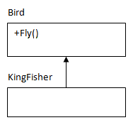
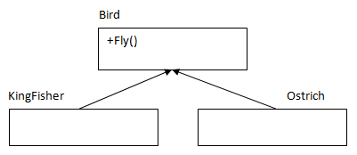
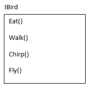
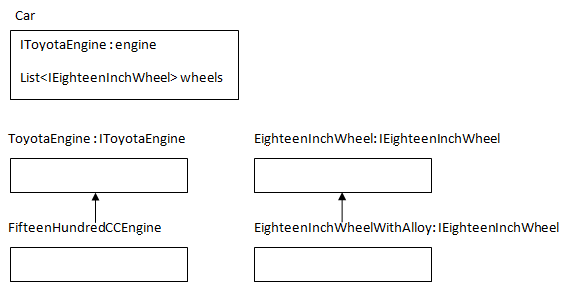
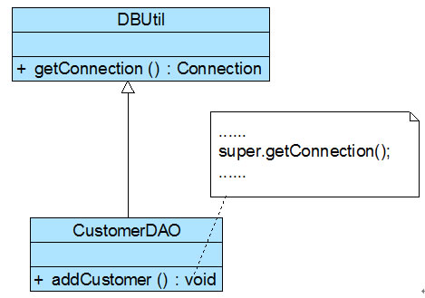
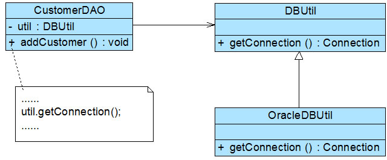
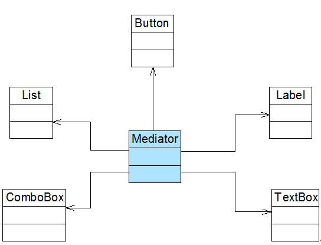

# SOLID原则

---

* **S**RP The Single Responsibility Principle	单一职责原则
* **O**CP The Open Closed Principle 开放封闭原则
* **L**SP The Liskov Substitution Principle  里氏替换原则
* **I**SP The Interface Segregation Principle 接口分离原则
* **D**IP The Dependency Inversion Principle 依赖倒置原则

**`个人`的一些见解**

* **SRP** 一个`类`不要承担过多职责.拥有它该有的功能即可.不要让它无所不能.
* **OCP** `不能`在`修改`一个类的前提下,`扩展`该类的行为.
* **LSP** `子类型`必须能够`替换`它们的`基类型(父类)`,能用`父类`的地方一定要可以替换为`子类`.
* **ISP** 不要做成`胖接口`,一个接口太大时,我们需要将它分割成一些更细小的接口.
* **DIP** `抽象`不应该依赖于`具体`,`具体`应该依赖于`抽象`.
* **CRP** 多使用`has-a`,少使用`is-a`.
* **LoD/LKP** 使用第三方降低耦合,Mediator设计模式.

### 单一职责原则(SRP)

`高内聚`,`一个类只完成它应该的职责`,不能成为`承担职责过多`的上帝类.

**示例**

违反了`单一职责原则`,Rectangle类做了两件事:

1. 计算矩形面积
2. 在界面上绘制矩形

并且,有2个应用使用了Rectangle类

1. Computational Geometry Application
2. Graphical Application

这违反了SRP(单一职责原则).因为Rectangle类做了两件事,在一个方法里它计算了面积,在另外一个方法了它返回一个表示矩形的GUI.

**导致的问题**

在计算几何应用程序中我们必须包含GUI.也就是在开发几何应用时,我们必须引用GUI库.图形应用程序中Rectangle类的变化可能导致计算几何应用程序的变化,编译和测试,反之亦然.

**正确的方法**

拆分职责到两个不同的类:

1. Rectangle:这个类应该只定义Area()方法.
2. RectangleUI:这个类应继承Rectangle类,并定义Draw()方法.

### 开放封闭原则(OCP)

"软件实体(类,模块,函数等等)应当`对扩展开放`,`对修改闭合`.意味着你(或者类的客户)应当能在不修改一个类的前提下扩展这个类的行为.

* 对系统需求的`变化`封装
* 对系统需求的`扩展`抽象.**关键**(state 和 strategy 设计模式)

**示例**

**导致的问题**

违反了OCP,客户端代码直接面向服务器端的具体实现编程,缺乏灵活性.这样如果替换了服务器,则客户端调用服务器的代码就必须做相应的修改和替换.**这是面向实现**的不良设计.

**正确的方法**

抽象!为服务器端的代码(类型)抽象出一个抽象基类(定义一组完成服务职责的最小接口).

你抽象的东西是你系统的核心内容,增加一个新的服务器类型(扩展)只需要添加新类型(继承自AbstractServer即可),因此代码要尽可能以抽象(这里的AbstractServer)为依据,定义一个新的实现而不需要修改任何客户端代码.

**`面向接口编程`，`不要面向实现编程`**

### 里氏替换原则(LSP)

Liskov's 替换原则意思是:"`子类型`必须能够`替换`它们的`基类型`".

优先使用组合(委托has-a)而不是继承(is-a),因为继承经常导致"紧耦合"的设计.

**示例**

`遵循Liskov替换原则的类结构图`

KingFisher(翠鸟)类扩展了Bird基类,并继承了Fly()方法.**没有问题**

`违反Liskov替换原则的类结构图`

**导致的问题**

Ostrich(鸵鸟)是一种鸟，这毋庸置疑,并从Bird类继承,这从概念上说没有问题.但是鸵鸟它能飞吗?不能,那么这个设计就违反了LSP.因为在`使用Bird的地方不一定能用Ostrich代替`.

**正确的方法**

所以,即使在现实中看起来没问题,在类设计中,Ostrich不应该从Bird类继承.这里应该从Bird中分离一个不会飞的类NoFlyBrid,Ostrich应该继承这个不会飞的鸟类NoFlyBrid.

**为什么LSP重要**

* 如果没有LSP,`类继承就会混乱`;如果子类作为一个参数传递给方法,将`会出现未知行为`;
* 如果没有LSP,适用与基类的单元测试将`不能成功用于测试子类`;

### 接口分离原则(ISP)

一个接口太大时,我们需要将它分割成一些更细小的接口,使用该接口的客户端仅需知道与之相关的方法即可.每一个接口应该承担一种相对独立的角色,不干不该干的事,该干的事都要干.

`接口`包含太多的方法会降低其可用性,像这种包含了无用方法的"胖接口"会增加类之间的耦合.如果一个类想实现该接口,那么它需要实现所有的方法,尽管有些对它来说可能完全没用,所以这样做会在系统中引入不必要的复杂度,降低代码的可维护性或鲁棒性.

接口分离原则确保实现的接口有它们共同的职责,它们是明确的,易理解的,可复用的.

`如果一个接口包含了过多的方法,应该通过分离接口将其拆分.`

**示例**

`违反接口分离原则`

注意到IBird接口包含很多鸟类的行为,包括Fly()行为.现在如果一个Bird类(如Ostrich)实现了这个接口,那么它需要实现不必要的Fly()行为(Ostrich不会飞).

**正确的方法**

因此,这个"胖接口"应该拆分成两个不同的接口,IBird和IFlyingBird,而IFlyingBird继承自IBird.

这样的话,重用将变得非常灵活:如果一种鸟不会飞(如Ostrich),那它实现IBird接口.如果一种鸟会飞(如KingFisher),那么它实现IFlyingBird.

**为什么ISP重要**

因此,如果我们想要获得可重用的方案,就应当遵循接口分离原则,把`接口定义成仅包含必要的部分`,以便在任何需要该接口功能的地方`复用这个接口`.

### 依赖倒置原则(DIP)

高层模块不应该依赖底层模块,两者都应该依赖其抽象.`抽象`不应该依赖于`具体`,`具体`应该依赖于`抽象`.

其实又是"`面向接口编程`,`不要面向实现编程`"的内在要求.

**示例**

这里的 Car 就是高层模块;它依赖于抽象接口IToyotaEngine 和 IEighteenInchWheel.

而具体的引擎FifteenHundredCCEngine 属于底层模块,也依赖于抽象接口IToyotaEngine.

具体的车轮 EighteenInchWheelWithAlloy同样属于底层模块,也依赖于抽象接口IEighteenInchWheel.

上面Car类有两个属性(引擎和车轮列表),它们都是抽象类型(接口).引擎和车轮是可插拔的,因为汽车能接受任何实现了声明接口的对象,并且`Car类不需要做任何改动`.

### 合成复用原则(CRP）

**定义**

合成复用原则就是在一个新的对象里通过关联关系(包括组合关系和聚合关系)来使用一些已有的对象,使之成为新对象的一部分;新对象通过委派调用已有对象的方法达到复用功能的目的.简言之:复用时要尽量使用组合/聚合关系(关联关系),少用继承.

**为什么使用CRP**

在面向对象设计中,可以通过两种方法在不同的环境中复用已有的设计和实现,即通过`组合/聚合`关系或通过`继承`,但首先应该考虑使用组合/聚合.组合/聚合可以使系统更加灵活,`降低类与类之间的耦合度`.一个类的变化对其他类造成的影响相对较少;其次才考虑继承.在使用继承时.需要严格`遵循里氏代换原则`.有效使用继承会有助于对问题的理解.降低复杂度.而`滥用继承`反而会`增加`系统构建和维护的难度以及系统的`复杂度`,因此需要慎重使用继承复用.

**继承所引发的问题(白箱复用)**

通过继承来进行复用的主要问题在于继承复用`会破坏系统的封装性`,因为继承会将基类的实现`细节暴露给子类`,由于基类的内部细节通常对子类来说是可见的,所以这种复用又称`"白箱"`复用,如果基类发生改变,那么子类的实现也不得不发生改变;从基类继承而来的实现是`静态的`,不可能在运行时发生改变,没有足够的灵活性.

**CRP(黑箱复用)**

由于组合或聚合关系可以将已有的对象(也可称为成员对象)纳入到新对象中,使之成为新对象的一部分,因此新对象可以调用已有对象的功能,这样做可以使得成员对象的内部实现细节对于新对象`不可见`,所以这种复用又称为`"黑箱"`复用，相对继承关系而言,其耦合度相对较低,成员对象的变化对新对象的影响不大,可以在新对象中根据实际需要有选择性地调用成员对象的操作;合成复用可以在运行时动态进行,新对象可以`动态地`引用与成员对象类型相同的其他对象.

**示例**

Sunny软件公司开发人员在初期的CRM系统设计中,考虑到客户数量不多,系统采用MySQL作为数据库,与数据库操作有关的类如CustomerDAO类等都需要连接数据库,连接数据库的方法getConnection()封装在DBUtil类中,由于需要重用DBUtil类的getConnection()方法,设计人员将CustomerDAO作为DBUtil类的子类,初始设计方案结构如图所示:

随着客户数量的增加,系统决定升级为Oracle数据库,因此需要增加一个新的OracleDBUtil类来连接Oracle数据库,由于在初始设计方案中CustomerDAO和DBUtil之间是继承关系,因此在更换数据库连接方式时需要修改CustomerDAO类的源代码,将CustomerDAO作为OracleDBUtil的子类,这将`违反开闭原则`.

**正确的方法**

CustomerDAO和DBUtil之间的关系由继承关系变为关联关系,采用依赖注入的方式将DBUtil对象注入到CustomerDAO中,可以使用构造注入,也可以使用Setter注入.如果需要对DBUtil的功能进行扩展,可以通过其子类来实现,如通过子类OracleDBUtil来连接Oracle数据库.由于CustomerDAO针对DBUtil编程,根据`里氏代换原则`,DBUtil子类的对象可以覆盖DBUtil对象,只需在CustomerDAO中注入子类对象即可使用子类所扩展的方法.例如在CustomerDAO中注入OracleDBUtil对象,即可实现Oracle数据库连接,原有代码无须进行修改,而且还可以很灵活地增加新的数据库连接方式.

### 迪米特法则(LoD/LKP)

一个软件实体应当尽可能少地与其他实体发生相互作用.

如果一个系统符合迪米特法则,那么当其中某一个模块发生修改时,就会尽量少地影响其他模块,扩展会相对容易,这是对软件实体之间`通信的限制`,迪米特法则要求限制软件实体之间通信的宽度和深度.迪米特法则可降低系统的耦合度,使类与类之间保持松散的耦合关系.

**不要和"陌生人"说话,只与你的直接朋友通信**

`朋友`:

1. 当前对象本身(this).
2. 以参数形式传入到当前对象方法中的对象.
3. 当前对象的成员对象.
4. 如果当前对象的成员对象是一个集合,那么集合中的元素也都是朋友.
5. 当前对象所创建的对象.

应该尽量减少对象之间的交互,如果两个对象之间不必彼此直接通信,那么这两个对象就不应当发生任何直接的相互作用,如果其中的一个对象需要调用另一个对象的某一个方法的话,可以`通过第三者转发这个调用`.简言之,就是通过`引入一个合理的第三者`来`降低现有对象之间的耦合度`.

**示例**

Sunny软件公司所开发CRM系统包含很多业务操作窗口,在这些窗口中,某些界面控件之间存在复杂的交互关系,一个控件事件的触发将导致多个其他界面控件产生响应,例如,当一个按钮(Button)被单击时,对应的列表框(List)、组合框(ComboBox)、文本框(TextBox)、文本标签(Label)等都将发生改变,在初始设计方案中,界面控件之间的交互关系可简化为如图所示结构:

由于界面控件之间的交互关系复杂,导致在该窗口中增加新的界面控件时需要修改与之交互的其他控件的源代码,系统扩展性较差,也不便于增加和删除新控件.

**正确的方法**

可以通过引入一个专门用于控制界面控件交互的中间类(Mediator)来降低界面控件之间的耦合度.引入中间类之后,界面控件之间`不再发生直接引用`,而是将请求先转发给中间类,再由中间类来完成对其他控件的调用.当需要增加或删除新的控件时,只需修改中间类即可,无须修改新增控件或已有控件的源代码.

*Mediator设计模式*

### 一些其他的原则

**共同封闭原则**

相关类应该打包在一起.

**稳定抽象原则**

越稳定,越应该由抽象类组成.

