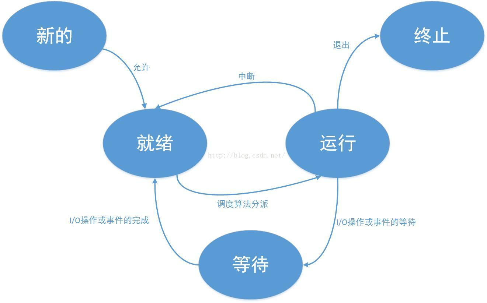

#进程,线程以及CPU调度

---

###进程概念

进程是执行中的程序,形成所有计算的基础.**更完整的解释是一个具有独立功能的程序关于某个数据集合的一次运行活动**.它可以申请和拥有系统资源,是一个动态的概念,是一个活动的实体.它不只是程序的代码,还包括当前的活动,通过`程序计数器的值`和`处理寄存器的内容`来表示.

###进程状态

进程有五种状态,分别是:

* `新的`: 进程正在被创建
* `运行`: 指令正在被执行
* `等待`: 进程等待某个事件的发生(如I/O完成或收到信号)
* `就绪`: 进程等待分配处理器
* `终止`: 进程完成执行

###线程

线程由线程ID,程序计数器,寄存器集合和栈组成.它与属于同一个进程的其他线程**共享**代码段,数据段和其他操作系统资源.

**线程是CPU调度的基本单元,进程是系统资源分配的基本单元,一个进程中可能包含多个线程**(进程和线程的区别).

多线程编程具有响应度高,资源共享,经济和多处理器体系结构的利用四个优点.虽然我们用户进程中可以有很多线程可以执行,但实际上这些用户线程都是映射到内核线程上来执行的.用户线程和内核线程之间的映射关系模型包含有:

* 多对一
* 一对一
* 多对多

###CPU调度

我们通常说的CPU调度是讲进程调度,实际上现在支持一个进程包含多线程的操作系统中CPU的调度对象都是针对的内核线程,不过调度算法是一样的.

每个进程的执行都是若干个CPU区间和I/O区间组成,I/O约束程序通常具有很短的CPU区间,CPU约束程序可能有少量的长CPU区间.