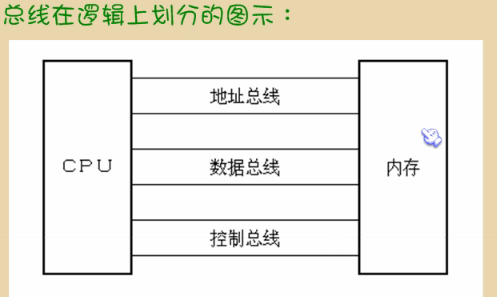
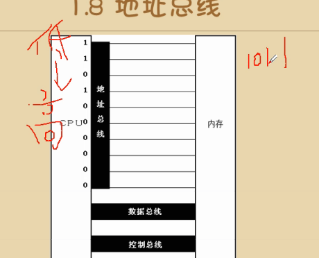

#第一章基础知识

---

###笔记

---

####汇编

汇编是直接在硬件上工作的编程语言.

####机器语言

机器语言是机器指令(一堆 `0` 和 `1`)的集合.

机器质量展开来就是一台机器可以正确执行的命令.

		01010000 (PUSH AX) 
		电平脉冲(CPU工作原理):
		0: 波谷
		1: 波峰
		
		CPU 打洞是始祖
		
####汇编语言的产生

电脑只认识`1`和`0`.

汇编语言的主题是汇编指令.

汇编指令是机器指令便于记忆的书写格式.

汇编指令和机器指令是一一对应的。

汇编指令是机器指令的助记符.一般都是三个英文的缩写.
		
		机器指令 1000100111011000
		
		寄存器 BX 的内容送到 AX中
		MOV AX,BX
		
		汇编的移动是 后向前, 所以 BX 在后, AX 在前
		
####寄存器

是CPU中可以存储数据的器件,一个CPU中有多个寄存器.

寄存器 比 一级缓存, 二级缓存 要低一级,更接近 CPU.

####程序到汇编语言

程序 --> 汇编指令 --> 编译器 --> 机器码 --> 计算器

####汇编语言的组成

* 汇编指令 (机器码的助记符)
* 伪指令 (由编译器执行)
* 其它符号 (由编译器识别), `+-*/`

####存储器

想让CPU工作,就必须向它提供`指令`和`数据`.

指令和数据在存储器中存放, 也就是平时所说的`内存`.(显卡的内存是显存)

磁盘上的数据或程序如果不读到内存,就无法被cpu使用.

`cpu` --> `内存` --> `磁盘`

程序运行时从磁盘加载到内存.

**内存不单指是内存条,包括显卡的内存,网卡的内存等等**

####指令和数据

指令和数据是应用上的概念.

指令和数据都是二进制信息.

		1000100111011000
		
		
		转换为数据16进制是 89D8H (H表示16进制)
		转换为指令时 MOV AX,BX (程序)
		
一段二进制码既可以是数据,也可以是指令.

####存储单元

存储器被划分为若干个存储单元,每个存储单元从0开始顺序编号.

* 1KB = 1024B
* 1MB = 1024KB
* 1GB = 1024MB
* 1TB = 1024GB

####CPU对存储器的读写

必须和外部器件(芯片)进行三类的信息交互:

1. 存储单元的地址(地址信息).
2. 器件的选择,读或写命令(控制信息). (是读还是写)
3. 读或写的数据. (读什么,写什么)

**CPU是通过什么将地址,数据和控制信息"传"到存储芯片中的呢?**

电子计算器处理传输的信息都是电信号,电信号当然要用导线传输.

计算机中专门有链接CPU和其他芯片的导线,通常称为总线(BUS).

物理上: 一根根导线的集合
逻辑上: 

* 地址总线(数据在这个总线上就代表是地址)
* 数据总线
* 控制总线

和上面CPU对芯片三类的信息交互一一对应.

####地址总线

CPU是通过地址总线来指定存储单元的.

地址总线上能传送多少个不同的信息, CPU就可以对多少个存储单元进行寻址.

高位到低位, 所以地址是`1011`(自下而上).

一个CPU有N根地址总新概念,这个CPU的地址总线的宽度为N(多少位CPU,`32位`,`64位`).

这样的CPU最多可以寻找`2的N次方`个内存单元.

**一个地址总线可以索引一个内存单元,一个内存单元也就是一个字节(8个bit)**

####数据总线

CPU与内存或其它器件之间的数据传送是通过数据总线来进行的.

数据总线的宽度决定了CPU和外界的数据传输速度.

####控制总线

CPU对外部器件的控制是通过控制总线来进行的.这里只是一个总称,控制总线是一些不同控制线的集合.

有多少种控制总线,就意味着CPU提供了对外部器件的多少种控制.

所以,控制总线的宽度(越多控制线)决定了CPU对外部器件的控制能力.		
每条线对应一个东西.

###整理知识点

---