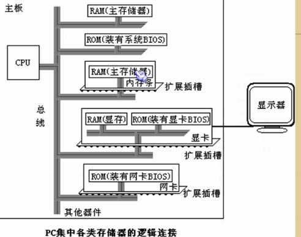
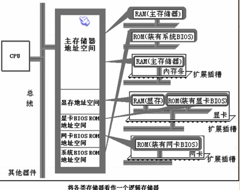
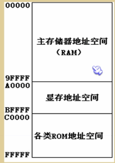

#第一章基础知识

---

###笔记

---

####汇编

汇编是直接在硬件上工作的编程语言.

####机器语言

机器语言是机器指令(一堆 `0` 和 `1`)的集合.

机器质量展开来就是一台机器可以正确执行的命令.

		01010000 (PUSH AX) 
		电平脉冲(CPU工作原理):
		0: 波谷
		1: 波峰
		
		CPU 打洞是始祖
		
####汇编语言的产生

电脑只认识`1`和`0`.

汇编语言的主题是汇编指令.

汇编指令是机器指令便于记忆的书写格式.

汇编指令和机器指令是一一对应的。

汇编指令是机器指令的助记符.一般都是三个英文的缩写.
		
		机器指令 1000100111011000
		
		寄存器 BX 的内容送到 AX中
		MOV AX,BX
		
		汇编的移动是 后向前, 所以 BX 在后, AX 在前
		
####寄存器

是CPU中可以存储数据的器件,一个CPU中有多个寄存器.

寄存器 比 一级缓存, 二级缓存 要低一级,更接近 CPU.

####程序到汇编语言

程序 --> 汇编指令 --> 编译器 --> 机器码 --> 计算器

####汇编语言的组成

* 汇编指令 (机器码的助记符)
* 伪指令 (由编译器执行)
* 其它符号 (由编译器识别), `+-*/`

####存储器

想让CPU工作,就必须向它提供`指令`和`数据`.

指令和数据在存储器中存放, 也就是平时所说的`内存`.(显卡的内存是显存)

磁盘上的数据或程序如果不读到内存,就无法被cpu使用.

`cpu` --> `内存` --> `磁盘`

程序运行时从磁盘加载到内存.

**内存不单指是内存条,包括显卡的内存,网卡的内存等等**

####指令和数据

指令和数据是应用上的概念.

指令和数据都是二进制信息.

		1000100111011000
		
		
		转换为数据16进制是 89D8H (H表示16进制)
		转换为指令时 MOV AX,BX (程序)
		
一段二进制码既可以是数据,也可以是指令.

####存储单元

一个存储单元可以存储8个bit(用作单位写"`b`"),即`8`位二进制数.

8个bit组成一个Byte,也就是字节.一个存储单元可以存储一个字节,也就是8个二进制位.计算机的存储器容量是以字节为最小单元来计算的,对于一个有128个存储单元的存储器,可以说它的容量为128字节.1KB的存储器有1024个存储单元,编号为 0 - 1023.

存储器被划分为若干个存储单元,每个存储单元从0开始顺序编号,如一个存储器有128个存储单元,则它的编号就是从0-127

* 1KB = 1024B
* 1MB = 1024KB
* 1GB = 1024MB
* 1TB = 1024GB

####CPU对存储器的读写

必须和外部器件(芯片)进行三类的信息交互:

1. 存储单元的地址(地址信息).
2. 器件的选择,读或写命令(控制信息). (是读还是写)
3. 读或写的数据. (读什么,写什么)

**CPU是通过什么将地址,数据和控制信息"传"到存储芯片中的呢?**

电子计算器处理传输的信息都是电信号,电信号当然要用导线传输.

计算机中专门有链接CPU和其他芯片的导线,通常称为总线(BUS).

物理上: 一根根导线的集合
逻辑上: 

* 地址总线(数据在这个总线上就代表是地址)
* 数据总线
* 控制总线

和上面CPU对芯片三类的信息交互一一对应.

####地址总线

CPU是通过地址总线来指定存储单元的.

地址总线上能传送多少个不同的信息, CPU就可以对多少个存储单元进行寻址.

高位到低位, 所以地址是`1011`(自下而上).

一个CPU有N根地址总新概念,这个CPU的地址总线的宽度为N(多少位CPU,`32位`,`64位`).

这样的CPU最多可以寻找`2的N次方`个内存单元.

**一个地址总线可以索引一个内存单元,一个内存单元也就是一个字节(8个bit)**

####数据总线

CPU与内存或其它器件之间的数据传送是通过数据总线来进行的.

数据总线的宽度决定了CPU和外界的数据传输速度.

####控制总线

CPU对外部器件的控制是通过控制总线来进行的.这里只是一个总称,控制总线是一些不同控制线的集合.

有多少种控制总线,就意味着CPU提供了对外部器件的多少种控制.

所以,控制总线的宽度(越多控制线)决定了CPU对外部器件的控制能力.		
每条线对应一个东西.

####总结

每一个CPU芯片都有许多管脚,这些管脚和总线相连.也可以说,这些管脚引出总线.一个CPU可以引出三种总线的宽度标志了这个CPU的不同方面的性能.

* 地址总线的宽度决定了CPU的寻址能力.

		有10跟地址总线(10种不同的1,0组合,则为2^10),可以有2^10=1024个内存单元,如果插入一个4G的内存,只能看见前面1KB的
		
		10根地址总线就是2^10=1024byte=1KB
		一个内存单元是8bit也就是一个字节
		寻址就是用一个数字表示一个字节存储单元的地址,而不是表示这个存储单元中的内容
		一根地址总线的寻址能力是一个内存单元,一个内在单元应该是1Byte
		
* 数据总线的宽度决定了CPU与其他期间进行数据传送时`一次`数据传送量.
* 控制总线宽度决定了CPU对系统中其它期间的控制能力.（控制总线越多,越能控制很多东西）

####内存地址空间

一个CPU的地址线宽度为10, 那么可以寻址1024个内存单元, 这1024个可寻到的内存单元就构成这个CPU的内存地址空间.

####主板

主板上有核心器件和一些主要器件.

这些器件通过总线(地址总线,数组总线,控制总线)相连.

**接口卡**

计算机系统中,所有可用程序控制其工作的设备,必须受到CPU的控制.

CPU对外部设置不能直接控制,如显示器,音箱,打印机等.直接控制这些涉笔进行工作的是插在扩展卡槽上的接口卡.(显卡,声卡等等)

**各类存储芯片**

* `RAM`: 随机存储器,`内存`,断了电数据将会遗失.
* `ROM`: 只读存储器,只能读,数据永远保存.

从上至下:

1. RAM(主存储器): 二级缓存
2. ROM(BIOS): 装有BIOS的主板
3. RAM(主存储器): 内存条
4. 显卡
	* 显存,随便刷新,图片不停的改变不停的刷新数据.
	* ROM,图片怎么呈现通过ROM的计算程序计算
5. 网卡

**存地址空间**

上述的那些存储器在`物理上是独立`的器件.

但是它们在以下两点上相同:

1. 都和CPU总线相连.从CPU来看在一个逻辑存储单元.
2. CPU对它们进行读或写的时候都通过控制总线发出内存读写命令.

**将各类存储器看做一个逻辑存储器**

假设,上图中的内存空间地址段分配如下:

* 地址`0~7FFFH`的32KB孔建伟主随机存储器的地址空间.写到该地址空间即写到内存.
* 地址`8000H~9FFFH`的8KB空间为显存地址.
* 地址`A000H~FFFFH`的24KB空阿金为各个ROM的地址空间.

**8086PC机内存地址空间分配**

**内存地址空间**

对CPU来讲,系统中的所有存储器重的存储单元都处于一个统一的逻辑存储器中,它的容量受CPU寻址能力限制.这个逻辑存储器既是我们所说的内存地址空间.

###整理知识点

---