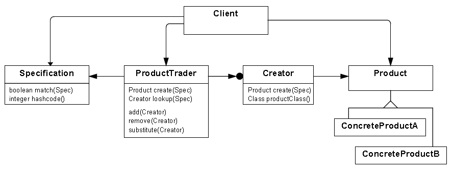

# Product Trader 

操盘手设计模式,第一次看见是在"重构"这本书当中看见.

### 意图

客户程序可以通过明明抽象超类和给定的规约来创建对象.

### 机构



### 分解

#### Client

* 为 `ConcreateProduct` 类创建 `Specification`.

* 为 `Product Trader` 提供 `Specitifcation` 以初始化构建过程.

#### Product

定义类层次的接口

#### ConcreteProduct

* `Product`抽象类的具体类.
* 提供足够的信息以判定是否满足 `Specification`.

#### ProductTrader

* 从 `Client` 接收一个 `ConcreteProduct` 对应的 `Specification`.
* 映射 `Specification` 和 `Creator`.
* 提供映射配置机制.
* 调用 `Creator` 以生成符合 `Specification` 的 `ConcreteProduct`

#### Creator

* 定义创建 `ConcreteProduct` 实例的接口
* 知道如何根据 `Specification` 创建合适的 `ConcreteProduct`

#### Specification

* 一个 `Specification` 代表着一个 `ConcreteProduct` 类.
* 作为映射和查询 `Creator` 的条件参数.

### 适用性

* 当你想让客户程序完全独立于 `Product` 实体类的实现时.
* 需要在运行时根据可用的规约条件动态的生成 `Product` 对象时.
* 需要为给定的规约条件配置相应的 `Product` 类对象.
* 需要在不影响客户代码的条件下修改和演进 `Product` 类的层次.

### 我自己的理解

该模式使用 `Specitication` 来制定条件约束, 对应不同的 `Creator` 来创建具体的不同.

而 `ProductTrader` 来负责 `Specification`和`Creator`的整体调度.

不同的`Creator`可以根据相同的`Specification`创建不同的`Product`.

不同的`Specification`可以使用相同的`Creator`创建不同的`Product`.

也就是制定`Specification`不必考虑映射`Product`.

而`Creator`需要根据`Specification`来创建不同的`Product`.

在运行时可以根据需求给入不同的`Specification`和`Creator`来组合不同的应用场景用于创建`Product`.

### 代码

```php
<?php

class Specification
{
    private $critera;

    public function setCritera(string $critera)
    {
        $this->critera = $critera;
    }

    public function getCritera(): string
    {
        return $this->critera;
    }

    public function isSatisfiedBy(Product $product) : bool
    {
        return $product->getCritera() == $this->getCritera();
    }
}

abstract class Product
{
    public abstract function getCritera() : string;
}

class ConcreteProductA extends Product
{
    public function getCritera() : string
    {
        return "SpecForConcreateProductA";
    }
}

class ConcreteProductB extends Product
{
    public function getCritera() : string
    {
        return "SpecForConcreateProductB";
    }
}

abstract class ProductCreator
{
    public abstract function create(Specification $spec) : Product;
}

class ConcreteProductCreator extends ProductCreator
{
    public function create(Specification $spec) : Product
    {
        if ($spec->getCritera() == "SpecForConcreateProductA") {
            return new ConcreteProductA();
        }
        else if ($spec->getCritera() == "SpecForConcreateProductB") {
            return new ConcreteProductB();
        }
    }
}

class ProductTrader
{
    private $dict;

    public function createFor(Specification $spec) : Product
    {
        $creator = $this->lookUpCreator($spec);
        $product = $creator->create($spec);

        return $product;
    }

    private function encryptObj($obj)
    {
        return md5(serialize($obj));
    }

    public function lookUpCreator(Specification $spec)
    {
        return $this->dict[$this->encryptObj($spec)];
    }

    public function addCreator(Specification $spec, ProductCreator $creator)
    {
        $this->dict[$this->encryptObj($spec)] = $creator;
    }

    public function removeCreatro(Specification $spec)
    {
        unset($this->dict[$this->encryptObj($spec)]);
    }
}

class Client
{
    public function testCase1()
    {
        $specOne = new Specification();
        $specOne->setCritera("SpecForConcreateProductA");

        $specTwo = new Specification();
        $specTwo->setCritera("SpecForConcreateProductB");

        $creator = new ConcreteProductCreator();

        $trader = new ProductTrader();
        $trader->addCreator($specOne, $creator);
        $trader->addCreator($specTwo, $creator);

        $specThree = new Specification();
        $specThree->setCritera("SpecForConcreateProductA");

        $product = $trader->createFor($specThree);
        var_dump($product);
    }
}

$client = new Client();
$client->testCase1();
```
