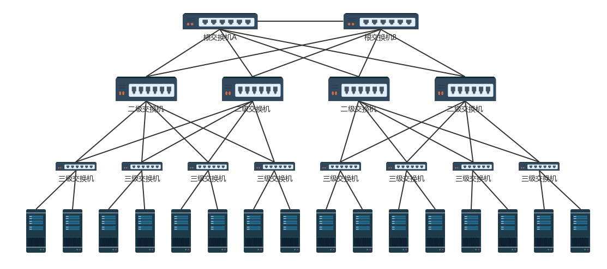
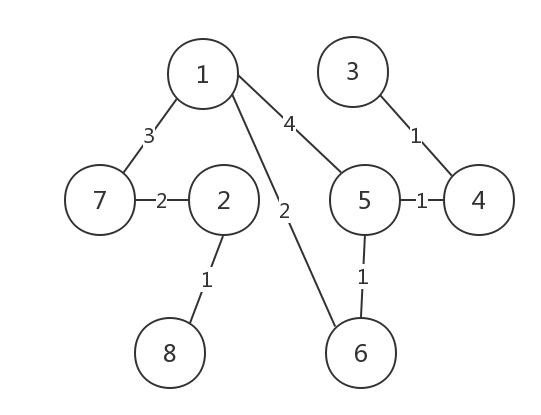
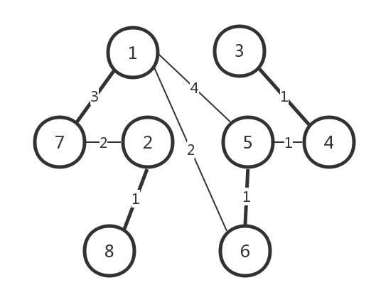
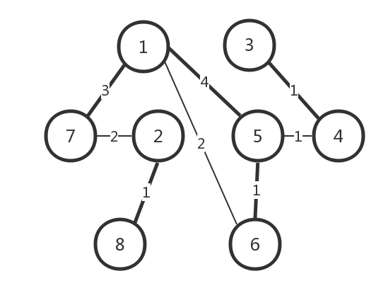
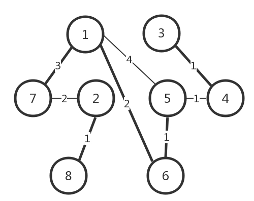
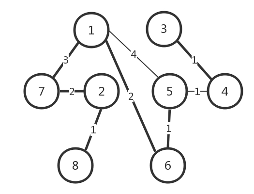
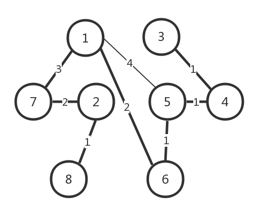

# 第六章 交换机与VLAN: 办公室太复杂, 我要回学校

## 知识点

### 拓扑结构

多台交换机之间连接起来, 形成一个拓扑结构.

 

#### 机器1知道机器4的IP地址, 需要访问机器4(需要知道MAC地址):

* 机器1发起广播
	* 机器2收到这个广播, 不是找它的**不处理** 
	* 交换机A一开始**不知道任何拓扑信息**, 收到这个广播后, 除了广播包来的方向外还要**转发**给其他所有的网口
		* 机器3也收到广播信息, 不是找它的**不处理**
		* 交换机B收到广播信息**不知道任何拓扑信息**, **转发**到局域网三
			* 机器4收到广播信息, **主动响应, ARP请求完成**
			* 机器5收到广播信息, 不是找它的**不处理**

这次请求的结果:

交换机A和交换机B学习到这样的信息: **机器1是在左边这个网口的**.

#### 机器2找机器1

机器2发起广播(ARP请求)

* 机器1,收到这个广播**主动响应, ARP请求完成**
* 交换机A收到这个广播, 已经知道机器1是不可能在右边的网口的, **不转发**

#### 机器3访问机器1

机器3发起广播(ARP请求)

* 交换机A收到广播请求
	* 知道机器1是在左边这个网口, **转发**到局域网一
* 交换机B收到广播请求
	* 已经知道机器1是不可能在右边的网口的, **不转发**

### 环路问题

 

#### 机器1访问机器2

* 机器1发起广播(ARP请求)
	* 机器2收到广播请求, **主动响应, ARP请求完成**
	* 交换机A收到广播请求, **转发**到局域网二
		* 交换机B**右边**这网口收到广播消息, **转发**到局域网一
			* 交换机A还是不知道机器2在哪个局域网,  **转发**到局域网二
				* ...(环路)

问题? 是当两台叫混迹都能够逐渐学习到拓扑结构之后, 是不是就可以了

**不行**

* 机器1的广播包到达交换机A和交换机B的时候
	* 两个交换机**学会**了机器1是在局域网一
	* 当交换机A将包广播到局域网二之后, 交换机B右边的网口收到来自交换机A的广播包
		* 根据学习机制, (因为机器1的广播出现在右边的网口)**清理**上次学习记录, **学会了**机器1在右边的网口(局域网二)
		* (同理)交换机A右边的网口, 也能收到交换机B转发过来的广播包, 也会**误会**重新学习机器1是从右边的网口来的, 不是左边
		* 重复...

产生问题: 根据共享道路算法, 路会越来越堵.

### STP

解决**环路**方案.

**最小生成树**.

有**环**的我们常称为**图**, 将图中的环**破**了, 就生成了树.

生成树的算法叫做**STP**, `Spanning Tree Protocol`.

 

* `Root Bridge`, **根交换机**. 比喻: 掌门交换机, 某棵树的老大.
* `Designated Bridges`, **指定交换机**. 是一棵树的树枝. **指定**的意思是, 我拜谁做大哥, 其他交换机通过这个交换机到达根交换机. **不是叶子, 叶子往往是主机**.
* `Bridge Protocol Data Units (BPDU)`, **网桥协议数据单元**, 比喻: "相互比较实力的"协议. `BPDU`只有掌门能发. 已经隶属于某个掌门的交换机只能传达掌门的指示。
* `Priority Vector`, **优先级向量**, 比喻为"实力"**值越小越厉害**
	* 实力:  
		* `Root Bridge ID`
		* `Root Path Cost`
		* `Bridge ID`
		* `Port ID`
	* 比较:
		* 先比较`Root Bridge ID`, 越小越厉害
			* 如果一样, 比较`Root Path Cost`(距离老大的距离), 越小越厉害
				* 如果一样, 比较`Bridge ID`. 比自己的ID.

#### STP 工作过程

##### 开始

* 混乱
* 每个交换机分配一个ID, 由管理员分配的优先级.
* 交换机分配优先级, 由管理员分配.
* 交换之间连接的数字是交换机之间的距离.

 

##### 互相发送`BPDU`来比

 

数字表示优先级:

* 5(掌门)-6(小弟)
* 3(掌门)-4(小弟)
* 1(掌门)-7(小弟)
* 2(掌门)-8(小弟)

**图中的粗线表示已经形成的门派**

##### 合并过程: 情形一：掌门遇到掌门

 

* `5`遇见`1`
	* `1`胜出
	* `5`率领所有的小弟归顺

门派结果:

* `1`-`7`-`5`-`6`
* `2`-`8`
* `3`-`4`

##### 合并过程: 情形二：同门相遇

 

掌门与自己的小弟相遇(`1`和`6`), 说明存在**环**. `6`已经通过其他门路拜在`1`的下面. 结果

* `1`和`6`不认识(`6`原来是在`5`下面)
	* `1`和`6`PK
		* `6`到`1`的距离只有`2`, 比从`5`过来(`4+1`)要小. **`Root Path Cost`**
		* `6`直接汇报给`1`

小弟相遇, 就是比和掌门的关系**`Root Path Cost`**, 距离近的是大哥.

* `5`和`6`PK
	* `5`到`1`的距离是`4`
	* `6`到`1`的距离是`2`
	* `5`->`6`->`1`的距离是`3`
		* `5`拜`6`为大哥

门派结果:

* `1`-`7`-`6`-`5`
* `2`-`8`
* `3`-`4`

##### 合并过程: 情形三: 掌门与其他帮派小弟相遇

小弟用本帮掌门和整个掌门比较:

* 赢了, 这个掌门拜入门来
* 输了, 会拜入新掌门, 并且逐渐拉拢和自己连接的兄弟一起弃暗投明.

 

* `2`和`7`PK
	* `7`的掌门是`1`, 比`2`小
	* `2`连同自己的小弟一起拜入`7`的门派.

门派结果:

* `1`-`7`-`2`-`8`-`6`-`5`
* `3`-`4`

##### 合并过程: 情形四: 不同门派小弟相遇

 

各自拿掌门比较, 输了的拜入赢的门派, 并且逐渐拉拢和自己连接的兄弟一起弃暗投明.

* `5`和`4`PK
	* `5`的掌门是`1`, `4`的掌门是`3`. `5`比`4`厉害.
		* `4`拜入`5`的门派
		* `3`和`4`相遇, `4`已经叛变了.
			* `4`的掌门是`1`比`3`厉害
				* `3`也拜入了`1`

门派结果:

* `1`-`7`-`2`-`8`-`6`-`5`-`4`-`3`

##### 最终

生成一棵树

### 广播问题和安全问题

* 一大堆机器广播, 性能下降
* 有的需要保密, 所有包都会在一个局域网传输, 如果没有加密会有安全问题.

#### 解决方案一: 物理隔离

每个部门都有单独的交换机, 配置单独的子网, 部门之间的沟通就需要路由器. 有可能会浪费资源.

#### 解决方案二: 虚拟隔离

`VLAN`, **虚拟局域网**.

使用`VLAN`, 一个交换机会连属于多个局域网的机器, 怎么区分?

`VLAN`包的格式:

 

在原来的二层的头上加一个`TAG`, 里面有一个`VLAN ID`.

如果交换机是支持`VLAN`的, 当这个交换机把二层的头取下来的时候, 就能够识别这个`VLAN ID`. 这样:

* 只有相同的`VLAN`的包, 才会互相转发.
* 不同`VLAN`的包, 是看不到的.

问题: 

* `VLAN ID`有`12`位, 可以划分`4096`个用户.
* 每个用户需要一个`VLAN`
* 不够用.

 

#### Trunk 口

交换机之间连接. 对应支持`VLAN`的交换机, 有一种口叫做`Trunk`口. 可以转发属于任何`VLAN`的口. **交换机之间可以通过这种口互相连接**
	