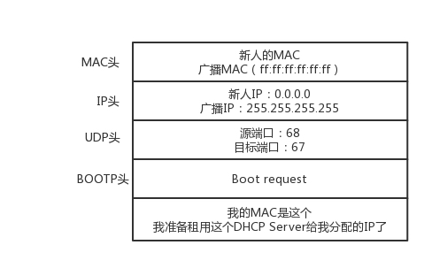

# 第四章 ifconfig: 最熟悉又陌生的命令行

## Liunx发包逻辑

Linux首先会判断, 要去的这个地址和我是一个网段的吗, 或者和我的一个网卡是同一网段的吗? **只有是一个网段的, 它才会发送`ARP`请求**, 获取`MAC`地址.

**Linux默认的逻辑是**, 如果这是一个跨网段的调用, 它便不会直接将包发送到网络上, 而是企图将包发送到网关. 如果配置了网关, `Linux`会获取网关的`MAC`地址, 让后将包发出去.

只要是网络上跑的包, 都是完整的, **可以**有下层没上层, **不能**有上层没下层.

网关要和当前的网络至少一个网卡是**同一个网段**的.

## DHCP

Dynamic Host Configuration Protocol. 动态主机配置协议.

网络管理员配置一段共享的`IP`地址. 每一台新接入的机器都通过`DHCP`协议, 来这个共享的`IP`地址里申请, 然后自动配置好就可以了. 等人走了, 或者用完了, 还回去, 这样其他的机器也能用.

数据中心里面的服务器, IP一旦配置好, 基本不会变, 这就相当于买房自己装修. `DHCP`的方式就相当于租房. 你不用装修, 都是帮你配置好的. 暂时用一下, 用完退租就可以了.

### DHCP的工作方式

* [新机器]**发现**新加入的机器只知道自己的`MAC`地址.
* [新机器]`DHCP Discover` -> 吼一句,我来啦, 有人吗?
	* 使用`IP`为`0.0.0.0`发送了一个广播包, 目的`IP`地址为`255.255.255.255`
	* 广播包封装在`UDP`里面, `UDP`封装在`BOOTP`里面.
* [DHCP SERVER]**Offer**只有`MAC`唯一，IP 管理员才能知道这是一个新人，需要租给它一个 IP 地址，这个过程我们称为`DHCP Offer`. 同时, `DHCP Server`为此客户保留为它提供的`IP`地址, 从而不会为其他`DHCP`客户分配此`IP`地址.
	* 使用广播地址作为目标地址.
	* 发送
		* 子网掩码
		* 网关
		* IP地址租用期等信息
* [新机器]**Request**选择最先到达的`DHCP Offer`(如果有多个)
	* 发送一个`DHCP Request`广播数据包
		* 客户端的`MAC`地址
		* 接收的租约中的`IP`地址
		* 提供此租约的`DHCP`服务器地址.
		* 告诉所有`DHCP Server`它将接受哪一台服务器提供的`IP`地址, 告诉其他 DHCP 服务器, 并请求撤销它们提供的`IP`地址，以便提供给下一个`IP`租用.
	* 此时, 由于还没有得到 DHCP Server 的最后确认, 客户端仍然使用
		* `0.0.0.0`为**源IP**地址.
		* `255.255.255.255`为**目标地址**进行广播
		* 在 BOOTP 里面，接受某个 DHCP Server 的分配的 IP.
* [DHCP SERVER]**确认ack**
	* 接收到客户登记的`DHCP request`之后, 广播返回给客户机一个`DHCP ACK`消息包, 表明已经接受客户机的选择.
		* 并将这一 IP 地址的合法租用信息和其他的配置信息都放入该**广播包**, 发给客户机, 欢迎它加入网络. **最终租约达成的时候, 需要广播, 让其他机器知道**


#### DHCP Discover


#### DHCP Offer


#### DHCP Request



#### DHCP Ack


### IP 地址的收回和续租

客户机会在租期过去`50%`的时候, 直接向为其提供 IP 地地址的`DHCP Server`发送 `DHCP request`消息包. 客户机接收到该服务器回应的`DHCP ACK`消息包, 会根据包中所提供的新的租期以及其他已经更新的`TCP/IP`参数, 更新自己的配置. 这样, `IP`租用更新就完成了.

### PXE(预启动执行环境 Pre-boot Execution Environment)

#### 操作系统启动

* 启动`BIOS`
* 读取盘的`MBR`启动扇区.
* 启动`GRUB`, 权利交给`GRUB`
* `GRUB`
	* 加载内核
	* 加载作为根文件系统的`initramfs`文件
	* 权利交给内核
* 内核启动
* 初始化整个操作系统

#### DHCP Server 样例配置

```
ddns-update-style interim; 
ignore client-updates;
allow booting;
allow bootp;

subnet 192.168.1.0 netmask 255.255.255.0
{
option routers 192.168.1.1;
option subnet-mask 255.255.255.0
option time-offset -18000;
default-lease-time 21600;
max-lease-time 43200;
range dynamic-bootp 192.168.1.240 192.168.1.250;

# 启动PXE的参数
filename "pxelinux.0";
next-server 192.168.1.180;
}
```

#### PXE 工作原理


## 知识点

### CIDR

### BOOTP

### `0.0.0.0`