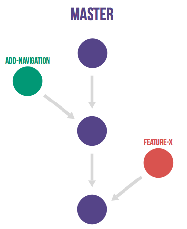
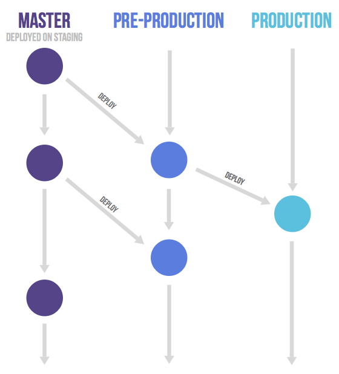

#Git 协作流程

---

####协作

协作必须有一个规范的流程,让大家有效地合作,使得项目井井有条地发展下去."协作流程"在英语里,叫做"workflow"或者"`flow`",原意是水流,比喻项目像水流那样,顺畅,自然地向前流动,不会发生冲击,对撞,甚至漩涡.

**三种广泛的协议流程**

* `Git flow`
* `Github flow`
* `Gitlab flow`

####功能驱动

三种协议流程都采用"功能驱动开发"(`Feature-driven development`,简称`FDD`).

需求是开发的起点,先有需求再有功能分支(`feature branch`)或者补丁分支(`hotfix branch`).完成开发后,该分支就合并到主分支,然后被删除.

####Git flow

**特点**

首先,项目存在两个长期分支:

* 主分支`master`
* 开发分支`develop`

`master`: 用于存放对外发布的版本,任何时候在这个分支拿到的,都是`稳定`的分布版.  
`develop`: 后者用于日常开发,存放`最新`的开发版.

其次,项目存在三种短期分支:

* 功能分支`feature branch`
* 补丁分支`hotfix branch`
* 预发分支`release branch`

一旦完成开发,它们就会被合并进`develop`或`master`,然后被删除.

**总结**

这也是我在`1youku`项目使用的协议流程.但是这个模式是基于`版本发布`的,但是如果使用`持续发布`,代码一有变动,就部署一次.这时,`master`分支和`develop`分支的差别不大,没必要维护两个长期分支.

####Github flow

`Github flow`是`Git flow`的简化版,专门配合`持续发布`.它是`Github.com`使用的协作流程.

**流程**

它只有一个长期分支,就是`master`.

官方推荐流程如下:

1. 根据需求,从`master`拉出新分支,`不区分功能分支和补丁分支`.
2. 新分支开发完成后,或者需要讨论的时候,就向`master`发起一个`pull request`(简称`pr`)
3. `Pull Request`既是一个通知,让别人注意到你的请求,又是一种对话机制,大家一起评审和讨论你的代码.对话过程中,你还可以不断提交代码.
4. 你的`Pull Request`被接受,合并进`master`,重新部署后,来你拉出来的那个分支就被删除.

**总结**

`Github flow`假设: `master`分支的更新与产品的发布是一致的.也就是说,`master`分支的`最新`代码,默认就是`当前的线上代码`.

`可是`,有些时候并不如此,代码合并进入`master`分支,并不代表它就能立刻发布.会导致线上版本落后于`master`分支.通常,另外新建一个`production`分支.

####Gitlab flow

**上游优先**

`Gitlab flow`的最大原则叫做"`上游优先`"(`upsteam first`),即只存在一个主分支`master`,它是所有其他分支的"`上游`".只有上游分支采纳的代码变化,才能应用到其他分支.

**持续发布**

`Gitlab flow`分成两种情况,适应不同的开发流程.

对于"持续发布"的项目,它建议在`master`分支以外,再建立不同的环境分支.比如,"`开发环境`"的分支是`master`,"`预发环境`"的分支是`pre-production`,"`生产环境`"的分支是`production`.

开发分支是预发分支的"上游",预发分支又是生产分支的"上游".代码的变化,必须由"上游"向"下游"发展.比如,生产环境出现了bug,这时就要新建一个功能分支,先把它合并到`master`,确认没有问题,再`cherry-pick`到`pre-production`,这一步也没有问题,才进入`production`.

只有紧急情况,才允许跳过上游,直接合并到下游分支.

**版本发布**

对于"版本发布"的项目,建议的做法是每一个稳定版本,都要从`master`分支拉出一个分支,比如2-3-stable,2-4-stable等等.

以后,只有修补bug,才允许将代码合并到这些分支,并且此时要更新小版本号.

####使用技巧

**`commit`模板**

		Present-tense summary under 50 characters

		* More information about commit (under 72 characters).
		* More information about commit (under 72 characters).
		
		http://redmine.com/xxxx
		
第一行是不超过50个字的提要,然后空一行,罗列出改动原因,主要变动,以及需要注意的问题.最后,提供对应的网址.

