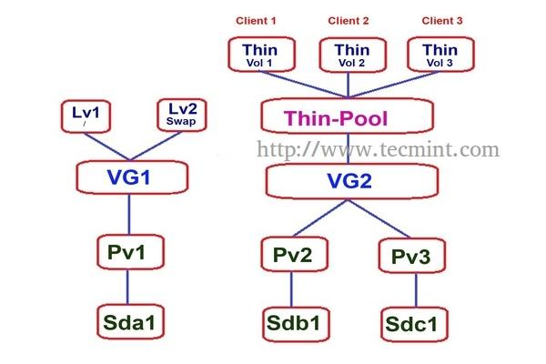

#LVM 精简资源调配卷

---

###精简资源调配是什么

精简资源调配用于LVM以在精简池中创建虚拟磁盘.

原先的做法: 我们假定我服务器上有15GB的存储容量,而我已经有2个客户各自占去了5GB存储空间.你是第三个客户,你也请求5GB的存储空间.在以前,我们会提供整个5GB的空间(富卷).然而,你可能只使用5GB中的2GB,其它3GB以后再去填满它.

精简资源调配中我们所做的是: 在其中一个大卷组中定义一个精简池,再在精简池中定义一个精简卷.这样,不管你写入什么文件,它都会保存进去,而你的存储空间看上去就是5GB.然而,这所有5GB空间不会全部铺满整个硬盘.对其它客户也进行同样的操作.我到底为客户分配了总计多少GB的空间呢?所有15GB的空间已经全部分配完了,如果现在有某个人来问我是否能提供5GB空间,我还可以分配给他么?答案是"可以".在精简资源调配中,我可以为第四位客户分配5GB空间,即使我已经把那15GB的空间分配完了.

**从那15GB空间中m如果我们对资源调配超过15GB了,那就是过度资源调配了**

在标准的逻辑卷中磁盘空间在创建时就会占用卷组的空间,但是在精简资源调配卷中只有在写入时才会占有存储池中的空间.

一个`thin`逻辑卷创建前必须创建`thin pool LV`, 一个`thin pool LV`由两部分组成:

* 一个大的`data LV(数据卷)`: 用来储存数据块.
* 一个`metadata LV(元数据卷)`: `metadat`中记录了`thin`卷中的每个块数据的所属关系.

metadata中储存索引,data中储存真实数据,当你访问数据时,先通过索引再访问数据,因为你每次首先访问的不是真实数据.

###它是怎么工作的?我们又是怎样为客户提供存储空间的?

我已经提供给你5GB空间,但是你可能只用了2GB,而其它3GB还空闲着.在富资源调配中,我们不能这么做,因为它一开始就分配了整个空间.

在精简资源调配中,如果我为你定义了5GB空间,它就不会在定义卷时就将整个磁盘空间全部分配,它会根据你的数据写入而增长,所以还是有机会为一个新客户分配5GB空间的,**这称之为过度资源调配**.

**重要**:但是,必须对各个卷的增长情况进行监控,否则结局会是个灾难.在过度资源调配完成后,如果所有4个客户都尽量写入数据到磁盘,你将碰到问题了.因为这个动作会填满15GB的存储空间,甚至溢出,从而导致这些卷下线.

###术语讲解

**thinDataLV: thin数据卷**

从卷组中创建的一个比较大的卷,在`thin`池中来储存`thin`卷的数据块.

**thinMetaLV: thin元数据卷**

从卷组中创建的一个比较小的卷.在`thin`池来储存快数据的`映射关系`.

**thinPoolLV: thin池卷,精简池**

由`ThinDataLV`和`ThinMetaLV`组成,包括`ThinLVs`和`SnapLV`.

**ThinLV: thinLV精简卷**

由`ThinPoolILV`创建,刚开始创建时为空,不实际占有空间.

###后续代码示例

`--thinpool`,创建精简池

https://linux.cn/article-4288-1.html,后续补充自己的案例