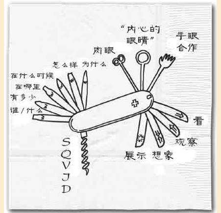

# 餐巾纸的背面

---

### 功能,品牌和内容

**功能**

人们想`做`什么(我们认为他们想做什么)决定`'功能'`.

**内容**

人们想`知道`什么(我们想让它们知道什么)决定`'内容'`.

**品牌**

人们会`记得`什么(我们想让它们记住什么)决定`'品牌'`.

### SQVID

**`S`imple**

简单

**`Q`uality**

定型

**`V`ision**

愿景

**`I`ndividual attributes**

个别

**`D`elta**

变化

### 通过画图来解决问题

* 什么问题 
* 什么图
* `我们`是谁?

#### 关注的问题

* 如何让一个团队的人理解一个系统运作方式以及他们在系统中的位置
* 如何帮助决策者明确其想法并改进他们的表达方式
* 如何帮助他们理解一个市场及一个产品的变化对想法可能产生的影响

### 视觉化思考六要素

#### 谁/什么

* 我身边正在发生什么?我如何参与其中?
* 由谁负责,还有谁与之有关?责任在谁

##### 有多少

* 数量
* 计算

#### 在什么时候

* 计划
* 安排

#### 在哪里

* 方向
* 事情如何批次配合挑战

#### 怎么样

* 事情怎样互相影响

#### 为什么

* 展望全景

### 视觉化思考导向绳

#### 4个步骤

* 看
* 观察
* 想象
* 展示

#### 3种工具

* 肉眼
* 内心的眼睛
* 手眼合作

#### 六种看的方式

* 谁\什么
* 有多少
* 在哪里
* 在什么时候
* 怎么样
* 为什么

### 现场旧货出清原则

当我们能够一眼看到所有东西时,它们看起来就不太一样了.

可以这样理解, 当我们看见我们的储物柜(里面叠放了很多东西),我们感觉很杂乱.但是当我们全部理清出来后,看到的就不一样了(清晰,分门别类存放).

### **看**和**观**察

"看"是一个相对开放的过程,它主要在于收集各种视觉信息;而"观察"则是一个逐渐聚焦的过程,为了弄清楚手机来的视觉信息,它会把需要的视觉片段放在一起好好研究.简单来说,"看"是在手机信息,而"观察"则是在选择信息并最终确定要研究的部分到底在哪里."观察"其实是找到了真正的问题所在.

#### 怎么样

怎么样 = 谁/什么, 有多少, 在哪里, 在什么时候

### SQVID 拆解

* `S`: 简单 -> 精细
* `Q`: 定性 -> 定量
* `V`: 愿景 -> 执行
* `I`: 个别 -> 比较
* `D`: 变化 -> 现状

* 左边的属性是暖性的,或者说与右脑密切先关的.强调简单,定性,形象化等特征.`创造`
* 右边的属性是冷性的,或者说是与左脑联系在一起的,强调周密,定量,可操作等特征.`理性分析`

### 简单 的反面不是 复杂, 而是 精细

### 选择展示框架(六六法则)

#### 我们"观察"的东西

1. 谁/什么?
2. 有多少?
3. 在哪里?
4. 在什么时候?
5. 怎么样?
6. 为什么?

#### 我们"展示"的东西

* 画像 -> 谁/什么 -> 定性
* 图表 -> 有多少 -> 定量
* 布局图 -> 在哪里 -> 空间中的位置
* 时间轴 -> 在什么时候 -> 时间中的位置
* 流程图 -> 怎么样 -> 原因 + 效果
* 多重变量图 -> 为什么 -> 演绎 + 推测

#### 六六法则 和 SQVID

坐标y轴为六六法则的框架,具体选择哪一种框架可以根据六六法则.

坐标x轴位`SQVID`.

		
				S	Q	V	I	D
		谁/什么?
		有多少?
		在哪里?
		在什么时候?
		怎么样?
		为什么?
		
### 视觉化思考

#### 电脑和paper work?

过分依赖电脑,似乎更容易削弱我们视觉化思考的能力,而不是帮助我们把这种能力充分发挥出来.

#### 画像(谁/什么): 基本绘画方法与要求

* 构思的简单一点
* 丰富你的内容清单
* 用形象化的方式向别人描述

#### 图片(有多少): 基本绘画方法与要求

* 数据才是最重要的,所以我们要把它清楚地标识出来
* 选一个最简单的图示来陈述自己的观点
* 如果你开始用了某一种画图模型,就要坚持用下去

要把数量通过形象化的方式展示出来,要让人们能够一目了然.

**柱状图**

用于比较某件事物的绝对数量

**曲线图**

按照两种不同的标准比较事物的绝对数量,或者比较他们在不同时间的绝对数量.

**饼状图**

用于比较不同事物所占的比例,展示它们之间的相对数量.

**泡泡图**

当要比较的标准超过两种时.

#### 布局(在哪里): 基本绘画方法与要求

说明`在哪里`的问题细的说明性内容: 包括各部分的界限在哪里,它们之间相差多远,彼此之间有什么联系,又有什么共同的特征等等.

* 每个事物都有自己的脉络.所有事物都由许多独特的要素构成,它们都可以用"布局图"表现出来,哪怕构成它们的要素有些是城市和河流,有些是概念和创意.
* "坐标"就是创意驰骋的国度.
	* 东西南本
	* 好,次,低廉,昂贵
	* 上下左右
	* ...
* 突破显而易见的等级结构,会看到更多.

#### 时间轴(在什么时候): 基本绘画方法与要求

* 时间是条单行道
* 重复的时间形成生命循环
* 环形vs线性
	* 循环性的时间轴在很多方卖弄都可以更精确地表示重复的生命循环圈.
	
#### 流程图(怎么样): 基本绘画方法与要求

#### 多重变量图(为什么): 基本绘画方法与要求

* 重点突出
* 稀稠适度. 变量太少,不足以让我们发掘出问题的关键. 变量太多,就回到了起点,要考虑的事情太多,最后一件也完不成.
* 任何东西都可以叠加在别的东西上,但是...
	* 将`关联`(即不同变量的相似趋向这种假象)与`因果作用`(一个变量对另一个变量的直接影响)区别开.

#### 结论

		